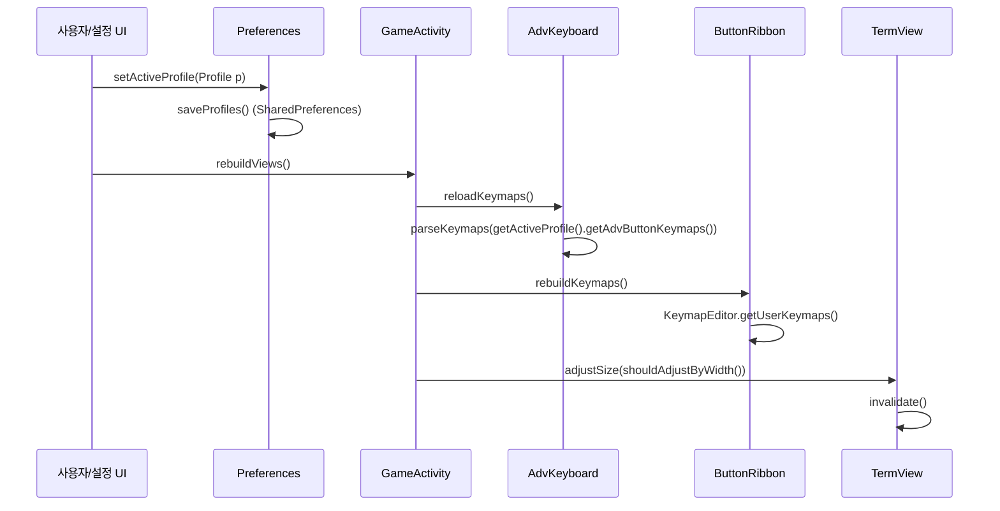

# Angbandroid 가상 키보드 & 뷰포트 피트인(Fit-to-Screen) 시스템 역공학 및 웹 구현 사양서

## 1. 개요 및 분석 배경

본 문서는 `https://github.com/Cuboideb/angbandroid`의 핵심 안드로이드 모바일 UX/엔진 계층을 역공학(Reverse Engineering)하여, 터치스크린 환경에서 정밀한 터미널 기반 로그라이크(80x24 표준) 조작을 가능하게 하는 **가상 키보드 프로필 시스템**, **가로/세로 화면 적응형 레이아웃**, **뷰포트 자동 피팅(Fit-to-Screen) 수학적 알고리즘**, 그리고 이를 **웹 프론트엔드(xterm.js + CSS Grid/Flexbox)** 상에서 현대적으로 구현하기 위한 정량 사양을 기술한다.

---

## 2. 다중 키보드 프로필 & 온스크린 커스터마이징 구조

Angbandroid는 다양한 캐릭터 클래스, 모드, 플레이어 선호도에 대응하기 위해 다중 프로필(`Profile`, `ProfileList`) 및 온스크린 커스텀 키맵(`AdvKeyboard`, `AdvButton`, `ButtonRibbon`) 직렬화 구조를 채택하고 있다.

### 2.1 프로필 데이터 모델 및 직렬화 파이프라인

Angbandroid의 프로필 직렬화는 별도의 중량 JSON 라이브러리 대신 경량 텍스트 구분자 파이프라인(Delimiter-based serialization)을 사용한다.

```
+--------------------------------------------------------------------------+
| ProfileList Serialization: Profile_1 | Profile_2 | ... | Profile_N       |
|   (ProfileList.dl = "|")                                                 |
+--------------------------------------------------------------------------+
                                    │
                                    ▼
+--------------------------------------------------------------------------+
| Individual Profile Fields (Profile.dl = "~", Escaped "~" -> "¿@?"):      |
| id ~ name ~ saveFile ~ flags ~ plugin ~ keymaps ~ advBtnKeymaps ~ fab    |
+--------------------------------------------------------------------------+
       │                                     │
       ▼                                     ▼
+-----------------------+     +--------------------------------------------+
| Ribbon Keymaps        |     | AdvButton Keymaps (On-Screen Grid)         |
| Row1 #rowsep# Row2    |     | trigger:prop:action:prop:alwaysVisible     |
| (items: btn1###btn2)  |     | (:sep: 로 복수 키 연결)                      |
+-----------------------+     +--------------------------------------------+
```

#### 직렬화 포맷 상세
1. **프로필 목록 계층 (`ProfileList.java`)**:
   - 구분자: `dl = "|"`
   - 직렬화:
     ```java
     public String serialize() {
         StringBuffer s = new StringBuffer();
         for(int i = 0; i < this.size(); i++) {
             if (s.length() > 0) s.append(dl);
             s.append(this.get(i).serialize());
         }
         return s.toString();
     }
     ```
   - 역직렬화: `value.split("\\" + dl)`로 분할 후 각 토큰을 `Profile.deserialize(tk[i])`로 복원.

2. **개별 프로필 계층 (`Profile.java`)**:
   - 구분자: `dl = "~"`, 충돌 방지 이스케이프: `dlEscaped = "¿@?"`
   - 필드 배치 (8개 튜플):
     1. `id` (정수): 프로필 고유 식별자.
     2. `name` (문자열): 사용자 정의 프로필 이름 (예: "Warrior", "Mage").
     3. `saveFile` (문자열): 바인딩된 세이브 파일 경로.
     4. `flags` (정수 비트마스크): 프로필 플래그.
     5. `plugin` (정수): 게임 변종(플러그인) ID.
     6. `keymaps` (문자열, escaped): 리본(Ribbon) 버튼 키맵.
     7. `advBtnKeymaps` (문자열, escaped): 고급 가상 키패드 버튼 키맵.
     8. `fab` (문자열): 플로팅 액션 버튼(Floating Action Button) 상태.

3. **리본 사용자 키맵 (`ButtonRibbon` / `KeymapEditor.java`)**:
   - 상단/하단 2개 행 구분자: `#rowsep#`
   - 행 내부의 버튼 구분자: `###`
   - 포맷: `row1_btn1###row1_btn2###...#rowsep#row2_btn1###row2_btn2...`

4. **온스크린 가상 키패드 (`AdvKeyboard.java` / `AdvButton.java`)**:
   - 키 정보 구분자: `:sep:`
   - 키 속성 구분자: `:prop:`
   - 포맷: `<trigger>:prop:<action>:prop:<alwaysVisible>`
   - `alwaysVisible`: `"yes"` 또는 `"no"`
   - 직렬화 코드:
     ```java
     txt += info.trigger + ":prop:" + info.action + ":prop:" + (info.alwaysVisible ? "yes": "no");
     ```

### 2.2 런타임 프로필 전환 메커니즘

런타임에 사용자가 프로필을 전환하거나 편집할 때 전체 게임 엔진 상태를 유지하면서 UI 레이어만 즉시 갱신하는 핫스왑(Hot-swap) 구조를 갖춘다.



1. **활성 프로필 갱신**: `Preferences.setActiveProfile(newProfile)` 호출.
2. **영속화**: `Preferences.saveProfiles()`를 통해 `SharedPreferences`에 직렬화 문자열 저장.
3. **UI 컴포넌트 리빌드 트리거**:
   - `GameActivity.rebuildViews()`: 메인 화면 뷰 계층 재구성.
   - `AdvKeyboard.reloadKeymaps()`: 키 맵 해시맵 재구축.
   - `ButtonRibbon.rebuildKeymaps()`: 2개 행의 동적 커맨드 버튼 재생성.
   - `TermView.adjustSize()`: 새 키보드 크기에 맞추어 뷰포트 재계산.

### 2.3 액션 매핑 및 이스케이프 파싱 (`InputUtils.java`)

온스크린 키보드와 리본에서 발생한 액션 문자열은 `InputUtils.processAction` 및 `InputUtils.parseCodeKeys`를 거쳐 게임 엔진 코어 키스트로크 또는 매크로 시퀀스로 변환된다.

```java
public static List<Integer> parseCodeKeys(String txt) {
    int i = 0;
    int n = txt.length();
    ArrayList<Integer> lst = new ArrayList<>();

    while (i < n) {
        int ch0 = txt.charAt(i);
        char next = ((i + 1) < n) ? txt.charAt(i + 1) : 0;

        if (ch0 == '^' && Character.isAlphabetic(next)) {
            // Control Sequence: ^A -> 0x01, ^Z -> 0x1A
            ch0 = (Character.toUpperCase(next) - 'A' + 1);
            i += 1;
        } else if (ch0 == '\\' && Character.toLowerCase(next) == 'n') {
            ch0 = 13; // KC_ENTER
            i += 1;
        } else if (ch0 == '\\' && Character.toLowerCase(next) == 't') {
            ch0 = 9;  // KC_TAB
            i += 1;
        } else if (ch0 == '\\' && Character.toLowerCase(next) == 's') {
            ch0 = 32; // Space (' ')
            i += 1;
        } else if (ch0 == '\\' && Character.toLowerCase(next) == 'e') {
            ch0 = 27; // KC_ESCAPE
            i += 1;
        }
        if (ch0 > 0) lst.add(ch0);
        i += 1;
    }
    return lst;
}
```

- **단일 키 입력**: 파싱된 리스트의 길이가 1이면 `state.addKey(keycode)`를 통해 엔진 이벤트 큐로 즉시 전달.
- **매크로 시퀀스(Macro)**: 파싱된 리스트 길이가 2 이상이고 플러그인이 키맵을 지원하면 `state.addSpecialCommand("macro:" + txt)`로 일괄 주입되어 키 지연 없이 단일 턴/복합 커맨드로 처리됨.

---

## 3. Portrait vs Landscape 적응형 레이아웃 및 갭/오버랩 처리

모바일 화면의 종횡비는 가로(Landscape)일 때와 세로(Portrait)일 때 극단적으로 달라진다. Angbandroid는 단순 화면 회전에 그치지 않고 가상 키패드의 차원(Dimension), 키 그리드 분할, 서브윈도우 배치, 뷰포트 여백(Gap)을 완전히 재구성한다.

### 3.1 화면 방향 분기 및 가상 키보드 그리드 전환

| 항목 | Landscape (가로 모드) | Portrait (세로 모드) |
| :--- | :--- | :--- |
| **방향 판별** | `landscapeNow() == true` | `landscapeNow() == false` |
| **가상 키보드 그리드** | **5행 × 10열** (numRows=5, numCols=10) | **10행 × 5열** (numRows=10, numCols=5) |
| **총 키 슬롯 수** | 50개 (QWERTY + 우측 3x3 Numpad) | 50개 (수직 집약형 키패드) |
| **서브윈도우 배치** | 메인 터미널 우측 또는 분할 배치 | 메인 터미널 하단 수평 스택 배치 |
| **동적 팝업 열 수** | `maxRowItems = 6` | `maxRowItems = 3` |
| **자동 리스트 폭 비율** | 화면 너비의 `65%` (`screenPct = 0.65f`) | 화면 너비의 `50%` (`screenPct = 0.50f`) |

#### 가상 키보드 기본 높이 자동 계산 수식 (`resetAdvKeyboardHeight`)
가로/세로 변경 시 가상 키보드가 차지할 적정 높이(백분율)는 단말기 픽셀 너비를 기준으로 버튼이 정사각형에 가깝게 유지되도록 동적 계산된다.

$$\text{keyWidth} = \frac{\text{screenWidth}}{10}$$

$$\text{requiredKbdHeight} = 5 \times \text{keyWidth} = \frac{5 \times \text{screenWidth}}{10} = 0.5 \times \text{screenWidth}$$

$$\text{heightPct} = \operatorname{clamp}\left( \frac{\text{requiredKbdHeight}}{\text{screenHeight}} \times 100,\; 20\%,\; 100\% \right)$$

```java
Point size = GxUtils.getWinSize(this);
float pct = 0f;
if (size.x > 0 && size.y > 0) {
    pct = (size.x / 10.0f) * (5.0f / size.y) * 100.0f;
}
pct = Math.max(20f, pct);
pct = Math.min(100f, pct);
Preferences.setKeyboardHeight((int)pct);
```

### 3.2 Overlap(오버레이) vs Docked(도킹) 뷰포트 모드

Angbandroid는 두 가지 뷰포트 점유 방식을 지원한다:

```
[ Docked Mode (Overlap = false) ]          [ Overlap Mode (Overlap = true) ]
+------------------------------------+    +------------------------------------+
| Top Bar                            |    | Top Bar                            |
+------------------------------------+    +------------------------------------+
|                                    |    |                                    |
| Terminal Viewport                  |    | Terminal Viewport (Full Screen)    |
| (Resized & Reduced to fit)         |    |                                    |
|                                    |    |   +----------------------------+   |
+------------------------------------+    |   | Floating Semi-Transparent  |   |
| Virtual Keyboard / Ribbon (Docked) |    |   | Virtual Keyboard Overlay   |   |
| (Height = KeyboardHeight)          |    |   +----------------------------+   |
+------------------------------------+    +------------------------------------+
```

1. **도킹 모드 (`keyboardOverlap == false`)**:
   - 가상 키보드가 화면 하단 또는 좌/우측 공간을 물리적으로 점유함.
   - `TermView`는 사용 가능한 나머지 공간만을 전달받아 폰트 크기 및 터미널 행/열을 타이트하게 재계산함.
   - 키보드가 터미널 화면의 텍스트나 플레이어 캐릭터를 전혀 가리지 않음.

2. **오버랩 모드 (`keyboardOverlap == true`)**:
   - 가상 키보드가 터미널 뷰 상단에 반투명 레이어로 부유(Floating Overlay).
   - 터미널 뷰는 전체 화면 해상도를 모두 활용하여 최대 폰트 크기 및 확장 행/열을 렌더링.
   - 유휴 타이머(`TIMER_AUTO_HIDE = 5000`ms): 터치 입력이 5초 동안 없으면 알파값을 30% 이하로 낮추거나 페이드아웃하여 시야를 확보.
   - 특정 위치 플래그에 따라 `getVerticalGap()` 또는 `getLeftGap()`/`getRightGap()`을 반환하여 터미널 중심부를 키보드 영역 밖으로 밀어냄.

#### 뷰포트 여백(Gap) 계산 공식 (`TermView.java`)
- **수직 여백 (`getVerticalGap`)**:
  ```java
  public int getVerticalGap() {
      if (!Preferences.getEnableSoftInput()) return 0;
      if (!Preferences.getKeyboardOverlap()) return 0;
      int position = Preferences.getInputWidgetPosition();
      if (position == Preferences.KBD_CENTER) {
          return game_context.getKeyboardHeight();
      }
      return 0;
  }
  ```
- **좌우 여백 (`getLeftGap`, `getRightGap`)**:
  ```java
  public int getLeftGap() {
      if (!Preferences.getEnableSoftInput() || !Preferences.getKeyboardOverlap()) return 0;
      int position = Preferences.getInputWidgetPosition();
      if (position == Preferences.KBD_TOP_LEFT || position == Preferences.KBD_BOTTOM_LEFT) {
          return game_context.getKeyboardWidth();
      }
      return 0;
  }
  ```

---

## 4. `TermView` 뷰포트 피트인(Fit-to-Screen) 수학적 알고리즘 & 폰트 오토스케일링

Angbandroid 터미널 디스플레이의 핵심은 **최소 80열 × 24행**의 고전 Roguelike 표준 비율을 강제하면서, 다양한 모바일 화면 비율(16:9, 18:9, 20:9 등)에서 여백(Letterbox/Pillarbox)을 최소화하도록 폰트 크기와 터미널 그리드를 2단계로 최적화하는 알고리즘이다.

### 4.1 방향별 바운드 판별 논리 (`shouldAdjustByWidth`)

폰트 크기 결정 시 기준이 되는 축(Dimension)은 현재 화면 방향과 서브윈도우 활성화 상태에 따라 결정된다:

```java
public boolean shouldAdjustByWidth() {
    boolean byWidth = true;
    if (!Preferences.getActivePlugin().enableSubWindows() ||
        Preferences.getNumberSubWindows() == 0 ||
        Preferences.getHorizontalSubWindows()) {
        byWidth = !landscapeNow();
    }
    return byWidth;
}
```

- **Portrait (세로 모드)**: `!landscapeNow() == true` $\rightarrow$ **Width-bound (너비 기준)**.
  - 세로 화면에서는 폭이 극도로 좁으므로, 80개 문자가 화면 폭 안에 들어갈 수 있도록 `char_width`가 병목이 됨.
- **Landscape (가로 모드)**: `!landscapeNow() == false` $\rightarrow$ **Height-bound (높이 기준)**.
  - 가로 화면에서는 높이가 병목이 되므로, 24개 행이 화면 높이 안에 들어갈 수 있도록 `char_height`가 병목이 됨.

### 4.2 폰트 크기 증분 탐색 알고리즘

`autoSizeFontByHeight` 및 `autoSizeFontByWidth`는 `MIN_FONT`(최소 폰트)에서 시작하여 사용 가능 영역을 초과하기 직전까지 1픽셀 단위로 폰트 크기를 증가시키는 선형 경계 탐색(Linear Boundary Search)을 수행한다.

```
       [ MIN_FONT ]
            │
            ▼
    +---------------+
--->│ font_size += 1│
    +---------------+
            │
            ▼
   char_dim = Measure(font_size)
            │
            ▼
    [ 조건 검사 ]
    Height-bound: (char_height * 24) <= (H_avail)
    Width-bound:  (char_width * 80)  <= (W_avail)
            │
       Pass ├───────────────┐
            │               │ Fail
            ▼               ▼
        (루프 계속)     font_size -= 1 (최적 폰트 확정)
```

#### 1) 높이 기준 오토사이징 (`autoSizeFontByHeight`)
$$\text{availableHeight} = \text{maxHeight} - \text{topBarHeight} - \text{subWindowsHeight} - \text{verticalGap}$$

$$\text{font\_size}^* = \max \left\{ s \in [\text{MIN\_FONT}, \text{MAX\_FONT}] \;\middle|\; \text{char\_height}(s) \times 24 \le \text{availableHeight} \right\}$$

#### 2) 너비 기준 오토사이징 (`autoSizeFontByWidth`)
$$\text{availableWidth} = \text{maxWidth} - \text{subWindowsWidth} - \text{horizontalGap}$$

$$\text{font\_size}^* = \max \left\{ s \in [\text{MIN\_FONT}, \text{MAX\_FONT}] \;\middle|\; \text{char\_width}(s) \times 80 \le \text{availableWidth} \right\}$$

### 4.3 잉여 공간 제거를 위한 동적 그리드 확장 (`adjustTermSize`)

폰트 크기(`font_size`)가 정수 단위로 고정되면 화면 가장자리에 남는 자투리 픽셀(Pillarbox / Letterbox)이 발생한다. Angbandroid는 고정 80x24에 갇히지 않고, 남는 픽셀을 추가 행/열로 흡수하여 시야(FOV)를 넓히고 완벽한 꽉 찬 화면을 달성한다.

$$\text{rows} = \min\left( \max\left( \left\lfloor \frac{\text{availableHeight}}{\text{char\_height}} \right\rfloor,\; 24 \right),\; \text{max\_rows} \right)$$

$$\text{cols} = \min\left( \max\left( \left\lfloor \frac{\text{availableWidth}}{\text{char\_width}} \right\rfloor,\; 80 \right),\; \text{max\_cols} \right)$$

```java
public void adjustTermSize(int maxWidth, int maxHeight) {
    this.rows = Preferences.rows; // 24
    this.cols = Preferences.cols; // 80

    maxHeight = maxHeight - getTopBarHeight() - getSubWindowsHeight();
    maxWidth = maxWidth - getSubWindowsWidth();

    // 남는 세로 공간을 행으로 확장
    while ((maxHeight > 0) && ((this.rows + 1) * this.char_height < maxHeight)) {
        ++this.rows;
    }
    // 남는 가로 공간을 열로 확장
    while ((maxWidth > 0) && ((this.cols + 1) * this.char_width < maxWidth)) {
        ++this.cols;
    }

    // 클램핑: 최소 80x24, 최대 max_cols x max_rows
    this.rows = Math.max(this.rows, Preferences.rows);
    this.cols = Math.max(this.cols, Preferences.cols);
    this.rows = Math.min(this.rows, Preferences.max_rows);
    this.cols = Math.min(this.cols, Preferences.max_cols);

    Preferences.setSize(this.cols, this.rows);
    state.nativew.resizeToCore(this.cols, this.rows);
}
```

---

## 5. 웹 프론트엔드(xterm.js + CSS Grid/Flexbox) 구현 사양서

Angbandroid의 검증된 가상 키보드 프로필 및 반응형 뷰포트 피팅 메커니즘을 현대 웹 표준(`xterm.js`, CSS Grid, Flexbox, TypeScript)으로 재구성한 구현 명세이다.

### 5.1 JSON 가상 키보드 프로필 스키마 (`KeyboardProfile.json`)

```typescript
export interface VirtualKeyDefinition {
  id: string;               // 고유 키 ID
  label: string;            // 버튼 표시 텍스트 or 아이콘 ("5", "y", "Esc", "✦")
  action: string;           // 전송할 액션/이스케이프 ("5", "\e", "m1a", "^P")
  type?: 'char' | 'macro' | 'control' | 'special';
  gridArea?: string;        // CSS Grid Area 또는 특정 좌표 지정
  alwaysVisible?: boolean;  // 오버레이 축소 시 항상 표시 여부
  color?: string;           // 커스텀 강조 색상
}

export interface KeyboardProfile {
  id: string;
  name: string;
  version: number;
  layout: {
    portrait: {
      rows: number;         // 10
      cols: number;         // 5
      keys: VirtualKeyDefinition[];
    };
    landscape: {
      rows: number;         // 5
      cols: number;         // 10
      keys: VirtualKeyDefinition[];
    };
  };
  ribbon: {
    row1: VirtualKeyDefinition[];
    row2: VirtualKeyDefinition[];
  };
  settings: {
    overlap: boolean;       // 오버레이 모드 여부
    opacity: number;        // 불투명도 (0.0 ~ 1.0)
    autoHideDelayMs: number;// 미사용 시 페이드 딜레이 (기본 5000ms)
    heightPercentPortrait: number;  // Portrait 높이 비율 (기본 40%)
    heightPercentLandscape: number; // Landscape 높이 비율 (기본 35%)
  };
}
```

#### JSON 프로필 예시 (`warrior_default.json`)
```json
{
  "id": "profile_warrior",
  "name": "Warrior Heavy",
  "version": 1,
  "layout": {
    "portrait": {
      "rows": 10,
      "cols": 5,
      "keys": [
        { "id": "esc", "label": "ESC", "action": "\\e", "type": "special" },
        { "id": "tab", "label": "TAB", "action": "\\t", "type": "special" },
        { "id": "run", "label": "RUN", "action": "RUN", "type": "special" },
        { "id": "spc", "label": "SPC", "action": "\\s", "type": "special" },
        { "id": "ent", "label": "RET", "action": "\\n", "type": "special" },
        { "id": "y", "label": "7 ↖", "action": "7", "type": "char" },
        { "id": "k", "label": "8 ↑", "action": "8", "type": "char" },
        { "id": "u", "label": "9 ↗", "action": "9", "type": "char" },
        { "id": "open", "label": "open", "action": "o", "type": "char" },
        { "id": "search", "label": "srch", "action": "s", "type": "char" },
        { "id": "h", "label": "4 ←", "action": "4", "type": "char" },
        { "id": "rest", "label": "5 ·", "action": "5", "type": "char" },
        { "id": "l", "label": "6 →", "action": "6", "type": "char" },
        { "id": "inven", "label": "inv", "action": "i", "type": "char" },
        { "id": "equip", "label": "eq", "action": "e", "type": "char" },
        { "id": "b", "label": "1 ↙", "action": "1", "type": "char" },
        { "id": "j", "label": "2 ↓", "action": "2", "type": "char" },
        { "id": "n", "label": "3 ↘", "action": "3", "type": "char" },
        { "id": "fire", "label": "fire", "action": "f", "type": "char" },
        { "id": "quaff", "label": "pot", "action": "q", "type": "char" }
      ]
    },
    "landscape": {
      "rows": 5,
      "cols": 10,
      "keys": [
        { "id": "esc", "label": "ESC", "action": "\\e" },
        { "id": "k1", "label": "1", "action": "1" },
        { "id": "k2", "label": "2", "action": "2" },
        { "id": "k3", "label": "3", "action": "3" },
        { "id": "k4", "label": "4", "action": "4" },
        { "id": "k5", "label": "5", "action": "5" },
        { "id": "y", "label": "7 ↖", "action": "7" },
        { "id": "k", "label": "8 ↑", "action": "8" },
        { "id": "u", "label": "9 ↗", "action": "9" },
        { "id": "ret", "label": "RET", "action": "\\n" }
      ]
    }
  },
  "ribbon": {
    "row1": [
      { "id": "r1", "label": "Rest*", "action": "R*\\n" },
      { "id": "r2", "label": "Phase", "action": "m1a" },
      { "id": "r3", "label": "Heal", "action": "q1" }
    ],
    "row2": [
      { "id": "r4", "label": "Map", "action": "M" },
      { "id": "r5", "label": "Target", "action": "*" },
      { "id": "r6", "label": "Fire", "action": "f*t" }
    ]
  },
  "settings": {
    "overlap": false,
    "opacity": 0.9,
    "autoHideDelayMs": 5000,
    "heightPercentPortrait": 42,
    "heightPercentLandscape": 36
  }
}
```

### 5.2 반응형 CSS Grid / Flexbox 레이아웃

```css
/* App Container: 전체 뷰포트 고정 (모바일 바운스 스크롤 방지) */
.app-container {
  position: fixed;
  inset: 0;
  display: flex;
  flex-direction: column;
  background-color: #000;
  overflow: hidden;
  touch-action: none;
  user-select: none;
  -webkit-user-select: none;
}

/* 상단 정보 바 */
.top-bar {
  height: 28px;
  background: #111;
  color: #aaa;
  display: flex;
  align-items: center;
  padding: 0 8px;
  font-family: monospace;
  font-size: 13px;
  flex-shrink: 0;
}

/* 터미널 뷰포트 컨테이너 */
.terminal-container {
  flex: 1 1 auto;
  position: relative;
  overflow: hidden;
  background: #000;
}

/* xterm 캔버스 요소 타이트 피팅 */
.terminal-container .xterm {
  height: 100%;
  width: 100%;
  padding: 0;
}

/* 가상 키보드 컨테이너 (Docked Mode 기본) */
.virtual-keyboard-container {
  display: flex;
  flex-direction: column;
  background: rgba(18, 18, 20, 0.95);
  box-shadow: 0 -2px 10px rgba(0, 0, 0, 0.5);
  flex-shrink: 0;
  transition: opacity 0.3s ease;
}

/* Overlap Mode 클래스 활성화 시 Floating */
.virtual-keyboard-container.overlap-mode {
  position: absolute;
  bottom: 0;
  left: 0;
  right: 0;
  z-index: 100;
  background: rgba(18, 18, 20, 0.75);
  backdrop-filter: blur(4px);
}

.virtual-keyboard-container.idle-dim {
  opacity: 0.25;
}

/* 빠른 명령 리본 바 (Horizontal Scroll) */
.ribbon-bar {
  display: flex;
  overflow-x: auto;
  white-space: nowrap;
  gap: 4px;
  padding: 4px 6px;
  scrollbar-width: none;
  border-bottom: 1px solid #333;
}
.ribbon-bar::-webkit-scrollbar {
  display: none;
}

/* 키패드 그리드 (Portrait: 10행 5열) */
@media (orientation: portrait) {
  .keyboard-grid {
    display: grid;
    grid-template-columns: repeat(5, 1fr);
    grid-template-rows: repeat(10, 1fr);
    gap: 3px;
    padding: 4px;
    height: 42vh;
  }
}

/* 키패드 그리드 (Landscape: 5행 10열) */
@media (orientation: landscape) {
  .keyboard-grid {
    display: grid;
    grid-template-columns: repeat(10, 1fr);
    grid-template-rows: repeat(5, 1fr);
    gap: 4px;
    padding: 4px;
    height: 36vh;
  }
}

/* 개별 가상 키 버튼 스타일 */
.vkey-btn {
  background: #2a2a30;
  color: #e0e0e0;
  border: 1px solid #444;
  border-radius: 4px;
  font-family: monospace;
  font-size: 15px;
  font-weight: bold;
  display: flex;
  align-items: center;
  justify-content: center;
  touch-action: manipulation;
  cursor: pointer;
}

.vkey-btn:active, .vkey-btn.pressed {
  background: #4f5b66;
  color: #fff;
  transform: translateY(1px);
}

.vkey-btn.dir-key {
  background: #1e3a5f;
  border-color: #2b5c8f;
}
```

### 5.3 xterm.js 뷰포트 동적 폰트 오토스케일러 (`TerminalAutoFitter.ts`)

Angbandroid의 `autoSizeFontByHeight`/`autoSizeFontByWidth` 및 `adjustTermSize`를 온전히 xterm.js 환경으로 이식한 고정밀 오토스케일러 모듈이다.

```typescript
import { Terminal } from 'xterm';

export interface FitterOptions {
  minCols: number;          // 기본 80
  minRows: number;          // 기본 24
  maxCols?: number;         // 상한 (예: 132)
  maxRows?: number;         // 상한 (예: 50)
  minFontSize?: number;     // 8
  maxFontSize?: number;     // 32
  fontFamily?: string;
  charAspect?: number;      // 폰트 가로/세로 비 (보통 0.5 ~ 0.6)
  lineHeight?: number;      // 1.0 ~ 1.2
}

export class TerminalAutoFitter {
  private term: Terminal;
  private container: HTMLElement;
  private resizeObserver: ResizeObserver;
  private options: Required<FitterOptions>;

  constructor(term: Terminal, container: HTMLElement, opts?: FitterOptions) {
    this.term = term;
    this.container = container;
    this.options = {
      minCols: opts?.minCols ?? 80,
      minRows: opts?.minRows ?? 24,
      maxCols: opts?.maxCols ?? 120,
      maxRows: opts?.maxRows ?? 45,
      minFontSize: opts?.minFontSize ?? 9,
      maxFontSize: opts?.maxFontSize ?? 28,
      fontFamily: opts?.fontFamily ?? 'Courier New, monospace',
      charAspect: opts?.charAspect ?? 0.55,
      lineHeight: opts?.lineHeight ?? 1.15
    };

    this.resizeObserver = new ResizeObserver(() => this.fitToScreen());
    this.resizeObserver.observe(this.container);
  }

  /**
   * 화면 크기 변화에 대응하여 폰트 크기 및 터미널 행/열을 재계산
   */
  public fitToScreen(): void {
    const rect = this.container.getBoundingClientRect();
    const W_avail = Math.floor(rect.width);
    const H_avail = Math.floor(rect.height);

    if (W_avail <= 0 || H_avail <= 0) return;

    const isPortrait = window.innerHeight > window.innerWidth;

    // 1단계: 폰트 크기 경계 탐색 (Binary Search 또는 수식 클램프)
    let bestFontSize = this.options.minFontSize;

    if (isPortrait) {
      // 너비 기준 (Width-bound): 80열이 화면 폭에 꼭 맞게 설정
      // W_avail >= 80 * (fontSize * charAspect)
      const maxFontW = Math.floor(W_avail / (this.options.minCols * this.options.charAspect));
      bestFontSize = Math.min(maxFontW, this.options.maxFontSize);
    } else {
      // 높이 기준 (Height-bound): 24행이 화면 높이에 꼭 맞게 설정
      // H_avail >= 24 * (fontSize * lineHeight)
      const maxFontH = Math.floor(H_avail / (this.options.minRows * this.options.lineHeight));
      bestFontSize = Math.min(maxFontH, this.options.maxFontSize);
    }

    bestFontSize = Math.max(bestFontSize, this.options.minFontSize);

    // xterm.js 폰트 옵션 반영
    if (this.term.options.fontSize !== bestFontSize) {
      this.term.options.fontSize = bestFontSize;
    }

    // 2단계: 실제 렌더링된 문자 메트릭 측정 (DOM 기반)
    const cellWidth = (this.term as any)._core?._renderService?.dimensions?.css?.cell?.width 
                      || (bestFontSize * this.options.charAspect);
    const cellHeight = (this.term as any)._core?._renderService?.dimensions?.css?.cell?.height 
                      || (bestFontSize * this.options.lineHeight);

    // 3단계: adjustTermSize 잉여 공간 확장 (Letterbox/Pillarbox 완화)
    let cols = Math.floor(W_avail / cellWidth);
    let rows = Math.floor(H_avail / cellHeight);

    cols = Math.max(cols, this.options.minCols);
    cols = Math.min(cols, this.options.maxCols);

    rows = Math.max(rows, this.options.minRows);
    rows = Math.min(rows, this.options.maxRows);

    if (this.term.cols !== cols || this.term.rows !== rows) {
      this.term.resize(cols, rows);
    }
  }

  public dispose(): void {
    this.resizeObserver.disconnect();
  }
}
```

### 5.4 터치 제스처 & 가상 키패드 액션 핸들러 (`VirtualInputManager.ts`)

```typescript
export class VirtualInputManager {
  private onCommandCallback: (input: string) => void;
  private repeatTimer: number | null = null;
  private isRunningMode: boolean = false;
  private isCtrlActive: boolean = false;

  constructor(onCommand: (input: string) => void) {
    this.onCommandCallback = onCommand;
  }

  /**
   * Angbandroid 방식의 액션 이스케이프 파싱 및 디스패치
   */
  public handleKeyAction(rawAction: string): void {
    // 특수 시스템 토글
    if (rawAction === 'RUN') {
      this.isRunningMode = !this.isRunningMode;
      return;
    }

    if (rawAction === 'CTRL') {
      this.isCtrlActive = !this.isCtrlActive;
      return;
    }

    const sequence = this.parseActionString(rawAction);

    for (const char of sequence) {
      let finalCode = char.charCodeAt(0);

      // Control 토글 활성화 시 ASCII Control Code로 변환 (^A -> 0x01)
      if (this.isCtrlActive && char >= 'a' && char <= 'z') {
        finalCode = char.charCodeAt(0) - 96; // 1 ~ 26
        this.isCtrlActive = false; // 일회성 소비
      } else if (this.isCtrlActive && char >= 'A' && char <= 'Z') {
        finalCode = char.charCodeAt(0) - 64;
        this.isCtrlActive = false;
      }

      // Running 모드(Shift + 방향키 / .) 활성화 처리
      if (this.isRunningMode && char >= '1' && char <= '9') {
        // Angband/ToME에서 Run은 Shift+방향키 또는 . + 방향키
        this.onCommandCallback('.');
        this.onCommandCallback(char);
        this.isRunningMode = false;
        continue;
      }

      this.onCommandCallback(String.fromCharCode(finalCode));
    }
  }

  /**
   * 문자열 내 이스케이프 시퀀스 파싱: \n, \e, \t, \s, ^X
   */
  private parseActionString(txt: string): string[] {
    const result: string[] = [];
    let i = 0;
    const n = txt.length;

    while (i < n) {
      const c = txt[i];
      const next = i + 1 < n ? txt[i + 1] : '';

      if (c === '^' && /[a-zA-Z]/.test(next)) {
        const code = next.toUpperCase().charCodeAt(0) - 64;
        result.push(String.fromCharCode(code));
        i += 2;
      } else if (c === '\\') {
        switch (next.toLowerCase()) {
          case 'n': result.push('\r'); break; // Enter
          case 'e': result.push('\x1b'); break; // Escape
          case 't': result.push('\t'); break;   // Tab
          case 's': result.push(' '); break;    // Space
          default: result.push(next); break;
        }
        i += 2;
      } else {
        result.push(c);
        i += 1;
      }
    }
    return result;
  }

  /**
   * 방향키 연속 이동을 위한 롱프레스 터치 바인딩
   */
  public bindRepeatKey(element: HTMLElement, action: string): void {
    const startRepeat = () => {
      this.handleKeyAction(action);
      this.repeatTimer = window.setInterval(() => {
        this.handleKeyAction(action);
      }, 120);
    };

    const stopRepeat = () => {
      if (this.repeatTimer !== null) {
        clearInterval(this.repeatTimer);
        this.repeatTimer = null;
      }
    };

    element.addEventListener('pointerdown', (e) => {
      e.preventDefault();
      startRepeat();
    });

    element.addEventListener('pointerup', stopRepeat);
    element.addEventListener('pointercancel', stopRepeat);
    element.addEventListener('pointerleave', stopRepeat);
  }
}
```

---

## 6. 결론 및 ToME 2.3.8 모바일 웹 적용 지침

1. **프로필 기반 입력 분리**:
   - 도적/전사는 1~9 방향키 + `o`(문 열기), `s`(수색), `f`(발사) 중심의 그리드 배치.
   - 마법사/룬크래프터는 룬 조합 전용 단축키 매크로(예: `m1a`, `m2b`, 타겟 매크로 `*t`)를 상단 리본에 배치하고, 가상 키패드 2페이지에 마법서/스펠 번호 매핑.
2. **반응형 뷰포트 피팅**:
   - 고정 폰트 크기 대신 `TerminalAutoFitter`를 적용하여 사용자의 화면 비율과 회전 상태에 맞게 실시간 폰트 크기를 $1\text{px}$ 단위로 조정.
   - 모바일 키보드가 나타날 때 `ResizeObserver`가 발동되어 터미널 행을 24행으로 축소하고, 키보드가 닫히면 전체 30~40행으로 즉시 자동 확장.
3. **입력 지연 0ms 달성**:
   - 모바일 브라우저의 기본 더블탭 줌 및 제스처 딜레이(300ms)를 제거하기 위해 모든 버튼 및 터미널 영역에 `touch-action: manipulation; user-select: none;`을 적용하고 `pointerdown` 즉각 트리거링을 보장.
