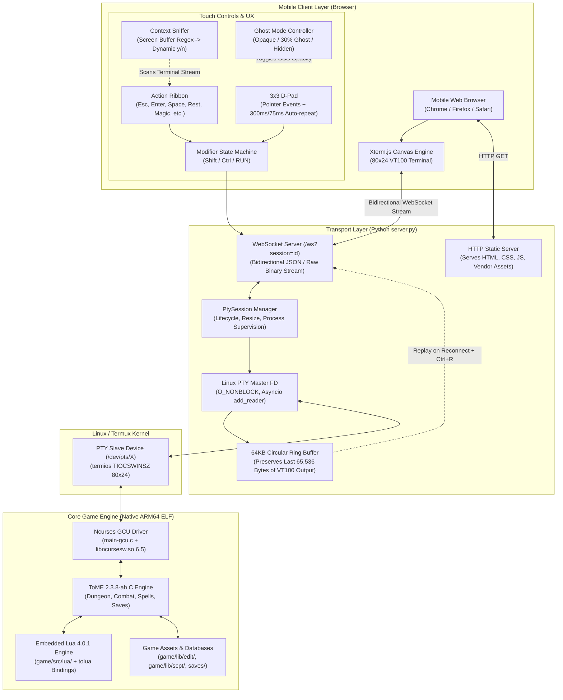
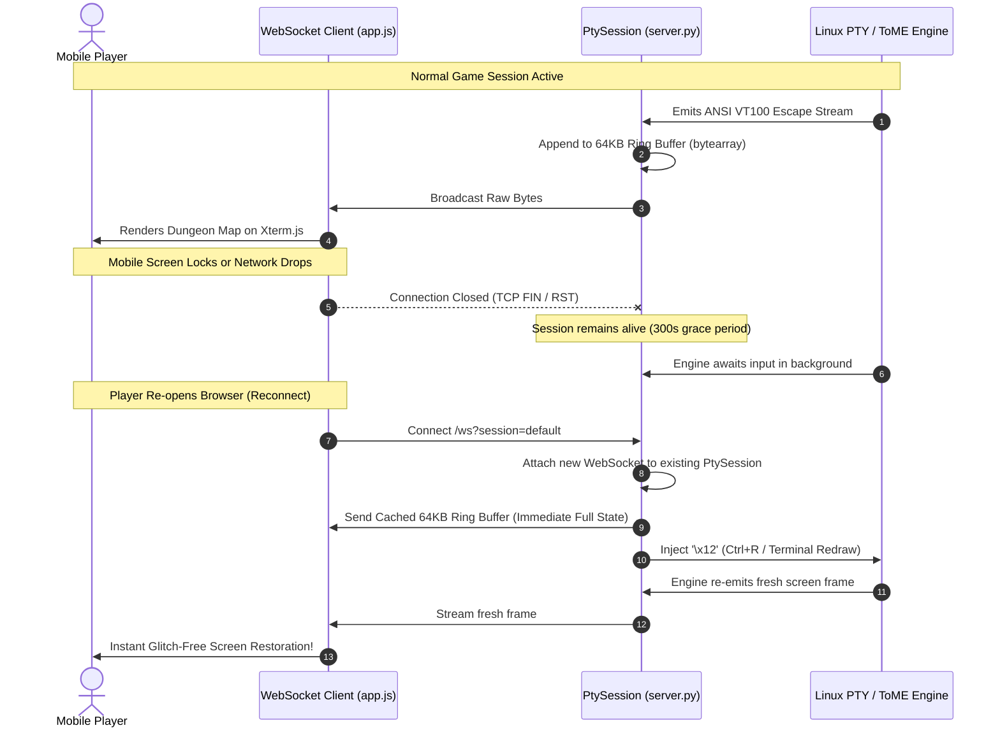

# ToME 2.3.8-ah Mobile Web Terminal Architecture Specification

> **Core Philosophy**:  
> «Preserve the game. Keep the transport thin. Make iteration cheap.»  
> 
> - **Preserve the game**: The ToME 2.3.8-ah C core engine remains an unadulterated ANSI/VT100 curses application. Game mechanics, RNG, savefile formats, and dungeon logic remain pure.
> - **Keep the transport thin**: A decoupled asynchronous transport bridges the OS pseudo-terminal (PTY) to modern WebSockets without bloating either side.
> - **Make iteration cheap**: Zero native Android compilation (no Android Studio, Gradle, NDK, or APK signing). Any changes to UI, touch layout, or server logic can be tested in seconds via browser refresh.

---

## 1. System Full Architecture Diagram



---

## 2. Asynchronous PTY-WebSocket Transport Layer

The transport layer is implemented in [`web/server.py`](file:///data/data/com.termux/files/home/tome238-mobile/web/server.py) using Python's standard `asyncio` and the `websockets` library.

### 2.1 PTY Spawning and Terminal Supervision
1. **Pseudo-Terminal Pair**: `pty.openpty()` creates a master/slave file descriptor pair.
2. **Window Geometry Pinned**: The slave FD is configured to 80 columns by 24 rows using `termios.TIOCSWINSZ`:
   ```python
   fcntl.ioctl(slave_fd, termios.TIOCSWINSZ, struct.pack("HHHH", 24, 80, 0, 0))
   ```
3. **Child Process Isolation**: A `fork()` executes `game/tome -mgcu -MToME` in the child process after duplicating `slave_fd` onto standard file descriptors (0, 1, 2) and invoking `os.setsid()`.
4. **Non-Blocking Asynchronous Read**: The parent process closes `slave_fd` and configures `master_fd` with `O_NONBLOCK`. Python's `asyncio.get_running_loop().add_reader(master_fd, self._on_pty_read)` notifies the event loop whenever raw ANSI escape bytes are ready to be read.

### 2.2 64KB Circular Ring Buffer & Seamless Reconnection
Mobile environments suffer from frequent connection dropouts caused by screen locks, app switching, or cellular/Wi-Fi transitions. A naive terminal bridge would either drop the game process or present a blank screen upon reconnect.



- **Ring Buffer Sizing**: `max_buffer_size = 65536` bytes (64KB). Since an 80x24 ASCII terminal screen contains 1,920 cells plus color attributes (~4 to 8KB per full frame), 64KB retains 8 to 15 full historical screen redraws.
- **Reconnection Sequence**:
  1. Client connects to `/ws?session=<id>`.
  2. If the session exists and is alive, the server immediately sends the entire cached `bytearray`.
  3. The server immediately writes `\x12` (`Ctrl+R`, the universal Roguelike terminal redraw keystroke) to the PTY master.
  4. The ToME curses driver redraws the entire window canvas, synchronizing the client without user intervention.
- **Session Lifecycle & Cleanup**: If all clients disconnect, a delayed cleanup task waits 300 seconds (5 minutes). If no client reconnects within that window, the game process is gracefully terminated with `SIGTERM` followed by `SIGKILL`.

---

## 3. Mobile Touch UI & Input Subsystems

The client frontend in [`web/app.js`](file:///data/data/com.termux/files/home/tome238-mobile/web/app.js) and [`web/style.css`](file:///data/data/com.termux/files/home/tome238-mobile/web/style.css) translates mobile touch interactions into precise terminal keystrokes, adapting design patterns from `Cuboideb/angbandroid`.

### 3.1 3x3 Tactile D-Pad with Dual-Stage Auto-Repeat
Traditional roguelikes require diagonal movement (8 directions) and resting. Virtual on-screen joysticks lack accuracy on small touchscreens. We implement a fixed 3x3 tactile button grid:

```
┌───────┬───────┬───────┐
│ ↖ (7) │ ↑ (8) │ ↗ (9) │
├───────┼───────┼───────┤
│ ← (4) │ · (5) │ → (6) │
├───────┼───────┼───────┤
│ ↙ (1) │ ↓ (2) │ ↘ (3) │
└───────┴───────┴───────┘
```

- **Pointer Events**: Uses `pointerdown`, `pointerup`, `pointercancel`, and `pointerleave` for instant touch response without 300ms mobile browser click latency.
- **Haptic Feedback**: Fires `navigator.vibrate(8)` on touch start for tactile confirmation.
- **Dual-Stage Repeat Timing**:
  - `Initial Delay`: 300ms hold required before repeating begins.
  - `Repeat Interval`: Fires repeated directional keystrokes every 75ms (~13 steps/sec) for smooth corridor running.
- **Center Button (`5`)**: Serves as single-turn rest/wait. Long-press repeat is intentionally disabled for safety.

### 3.2 Dynamic Context Sniffer
Text roguelikes frequently prompt the player with binary or directional questions (e.g., `"Die? (y/n)"`, `"Are you sure? (y/n/esc)"`, `"Direction?"`). On a mobile screen, typing `y` or `n` usually requires opening the full OS keyboard, obscuring the prompt.

The **Context Sniffer** solves this:
1. It maintains a sliding buffer of the last 500 characters streamed to the terminal:
   ```javascript
   state.recentScreenText = (state.recentScreenText + chunk).slice(-500);
   ```
2. A regex evaluates incoming text:
   ```javascript
   const isYesNo = /\((y\/n|y\/n\/esc|\[y\/n\])\)/i.test(state.recentScreenText);
   ```
3. When detected, the dynamic ribbon swaps out standard action keys and injects high-contrast, large touch targets:
   - `[✔ Yes (y)]` (Green accent)
   - `[✖ No (n)]` (Red accent)
   - `[⎋ Esc]` (Neutral accent)
4. Once the prompt is resolved and cleared from the terminal buffer, the ribbon automatically restores default roguelike actions.

### 3.3 Modifier State Machine & Movement Prefixing
- **RUN Mode**: In ToME and Angband, prepending a period (`.`) to a directional key activates continuous sprint until an obstacle or monster appears (e.g., `.6` runs east). The `RUN` toggle button sets an active state so touching any D-Pad direction automatically prefixes `.` to the command.
- **Shift / Ctrl Modifiers**: Latching toggles that uppercase the subsequent action keystroke or convert it to ASCII control characters (`Ctrl+A` through `Ctrl+Z`).
- **Ghost Opacity Mode**:
  - `Normal` (State 0): Fully opaque high-contrast keyboard.
  - `Ghost` (State 1): 30% semi-transparent overlay allowing the player to inspect map tiles and messages located underneath the control panel.
  - `Hidden` (State 2): Keyboard slides off-screen, granting 100% full-screen terminal view for long reads or external Bluetooth keyboards.

---

## 4. Responsiveness & Monospace Scaling

ToME 2.3.8-ah requires an exact 80-column by 24-row grid. Partial character clipping breaks alignment of the dungeon map and stats sidebar.

[`adjustTerminalScale()`](file:///data/data/com.termux/files/home/tome238-mobile/web/app.js#L88-L115) dynamically computes optimal font sizing based on available viewport dimensions:
```javascript
const maxFontW = containerWidth / (80 * 0.62);
const maxFontH = containerHeight / (24 * 1.18);
const optimalSize = Math.max(9, Math.floor(Math.min(maxFontW, maxFontH)));
```
This guarantees that whether viewed on a compact 5.8-inch smartphone in portrait mode, a 10-inch tablet, or a desktop browser, the 80x24 grid scales to fit with zero horizontal or vertical clipping.

---

## 5. Architectural Cross-References

- **Mobile Keyboard Detailed Specification**: [`docs/mobile_keyboard_spec.md`](file:///data/data/com.termux/files/home/tome238-mobile/docs/mobile_keyboard_spec.md)
- **TomeNET Runecraft Archeology & Bitmask Mechanics**: [`docs/tomenet_runecraft_spec.md`](file:///data/data/com.termux/files/home/tome238-mobile/docs/tomenet_runecraft_spec.md)
- **Semantic Mapping of Runecraft into ToME 2.3.8-ah**: [`docs/runecraft_mapping.md`](file:///data/data/com.termux/files/home/tome238-mobile/docs/runecraft_mapping.md)
- **Runecraft Vertical Slice Prototype (Lua MVP)**: [`docs/runecraft_vertical_slice_spec.md`](file:///data/data/com.termux/files/home/tome238-mobile/docs/runecraft_vertical_slice_spec.md)
- **Gameplay Changes & Adventurer Class Specification**: [`docs/gameplay_changes.md`](file:///data/data/com.termux/files/home/tome238-mobile/docs/gameplay_changes.md)
- **Native Termux Build Guide**: [`docs/build_guide.md`](file:///data/data/com.termux/files/home/tome238-mobile/docs/build_guide.md)
- **Operational Guidelines for AI Agents**: [`AGENTS.md`](file:///data/data/com.termux/files/home/tome238-mobile/AGENTS.md)

