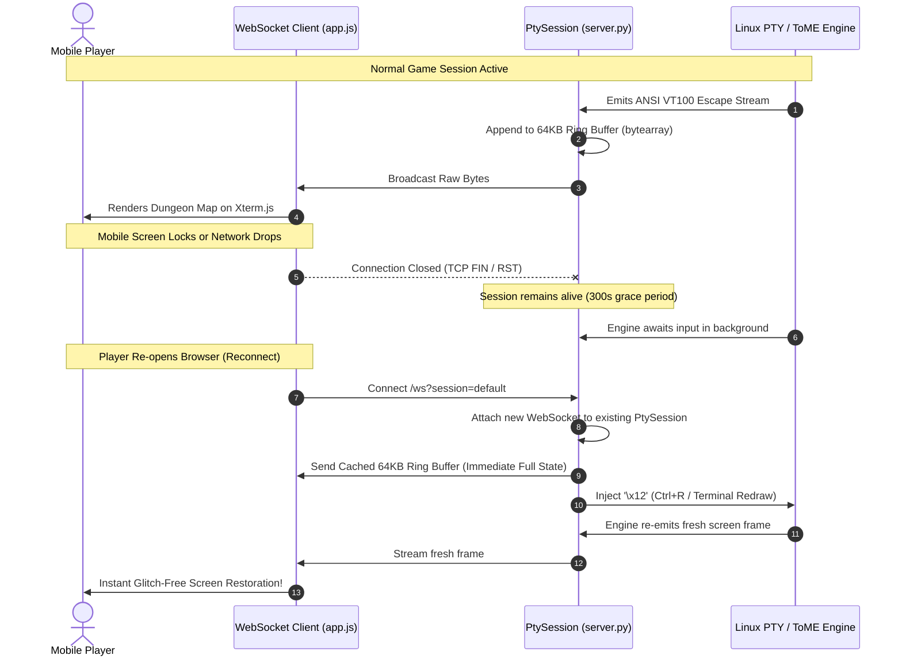
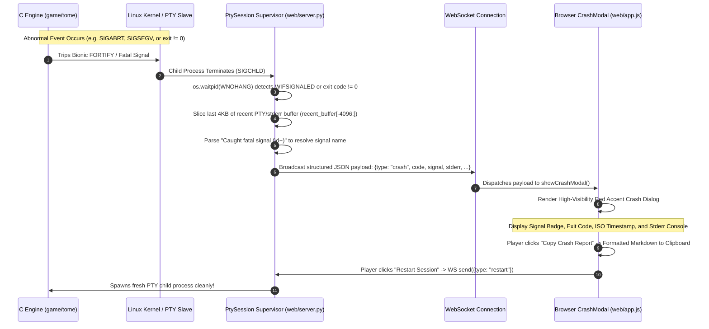

# ToME 2.3.8-ah Mobile Web Terminal Architecture Specification

> **Core Philosophy**:  
> «Preserve the game. Keep the transport thin. Make iteration cheap.»  
> 
> - **Preserve the game**: The ToME 2.3.8-ah C core engine remains an unadulterated ANSI/VT100 curses application. Game mechanics, RNG, savefile formats, and dungeon logic remain pure.
> - **Keep the transport thin**: A decoupled asynchronous transport bridges the OS pseudo-terminal (PTY) to modern WebSockets without bloating either side.
> - **Make iteration cheap**: Zero native Android compilation (no Android Studio, Gradle, NDK, or APK signing). Any changes to UI, touch layout, or server logic can be tested in seconds via browser refresh.

---

## 1. System Full Architecture Diagram

```mermaid
flowchart TD
    subgraph Client_Layer["Mobile Client Layer (Browser)"]
        Browser["Mobile Web Browser<br>(Chrome / Firefox / Safari)"]
        Xterm["Xterm.js Canvas Engine<br>(80x24 VT100 Terminal)"]
        
        subgraph Touch_UI["Angbandroid Mobile Touch UI & Modals"]
            AdvKeyboard["AdvKeyboard 5x10 Virtual Pad<br>(Neon Cyan Glassmorphism #00e5ff)"]
            FloatingDPad["3x3 Draggable Floating D-Pad<br>(Center '5' Drag Anchor & Persistence)"]
            QuickSettings["Quick Settings Modal (16 Items)<br>(Fit Width/Height, Opacity, Layout)"]
            PrefsModal["Preferences Modal<br>(Game / Display / Control)"]
            KeymapEditor["Inline Keymap Editor (OptionPopup)<br>(LocalStorage Macro Binding)"]
            ActionRibbon["Action Ribbon<br>(Fixed + Dynamic Context + Macros)"]
            Sniffer["Context Sniffer<br>(Screen Buffer Regex from Profile)"]
        end

        subgraph Diagnostics_UI["Diagnostics & Error Handling"]
            CrashModal["Crash Diagnostics Modal<br>(Signal Badge, Stderr View, Clipboard Copy, Restart)"]
        end
    end

    subgraph Profile_Layer["Declarative Profile Layer (profiles/*.json)"]
        ProfileDoc["Game Profile (JSON Schema)<br>(executable, args, env, cwd, redraw_key, context_rules)"]
        ProfileTome["profiles/tome238.json<br>(Official ToME 2.3.8-ah)"]
        ProfileDemo["profiles/portability_demo.json<br>(Decoupled Shell Demo)"]
        ProfileTomenet["profiles/tomenet.json<br>(Future Multi-Process C/S)"]
        ProfileDoc -.-> ProfileTome
        ProfileDoc -.-> ProfileDemo
        ProfileDoc -.-> ProfileTomenet
    end

    subgraph Shell_Host["Generic Mobile Terminal Shell (web/server.py)"]
        HTTP_Server["HTTP Static Server & REST API<br>(GET / & GET /api/profile)"]
        WS_Server["WebSocket Server (/ws?session=id)<br>(Bidirectional JSON / Raw Binary Stream)"]
        SessionMgr["PtySession Supervisor<br>(Lifecycle, Resize, Process Tracking)"]
        RingBuffer["64KB Circular Ring Buffer<br>(Preserves Last 65,536 Bytes of VT100 Output)"]
        PTY_Master["Linux PTY Master FD<br>(O_NONBLOCK, Asyncio add_reader)"]
        CrashDetector["Crash & Signal Detector<br>(waitpid, WTERMSIG, 4KB Stderr Capture)"]
    end

    subgraph Kernel_Transport["Kernel & Local Transport"]
        PTY_Slave["PTY Slave Device (/dev/pts/X)<br>(termios TIOCSWINSZ 80x24)"]
        LoopbackTCP["Android Loopback TCP (127.0.0.1)<br>(Latency < 0.2ms, Non-Root)"]
    end

    subgraph Target_Process["Target Executable Layer (Managed Processes)"]
        subgraph Single_Proc["Single-Process Mode (e.g. ToME 2.3.8-ah)"]
            GCU_Driver["Ncurses GCU Driver<br>(main-gcu.c + libncursesw.so.6.5)"]
            Core_C["ToME C Core Engine<br>(Dungeon, Combat, Spells, Saves)"]
            Lua_Engine["Embedded Lua 4.0.1 Engine<br>(game/src/lua/ + tolua Bindings)"]
            GCU_Driver <--> Core_C
            Core_C <--> Lua_Engine
        end

        subgraph Multi_Proc["Multi-Process Mode (e.g. TomeNET C/S)"]
            Client_Bin["TomeNET Client (tomenet -c)<br>[PTY Foreground Child]"]
            Server_Bin["TomeNET Server (tomenet.server)<br>[Supervised Companion Daemon]"]
            Client_Bin <-->|Local TCP Port 18348| LoopbackTCP
            LoopbackTCP <--> Server_Bin
        end
    end

    %% Client Interactions
    Browser --> Xterm
    AdvKeyboard --> WS_Server
    FloatingDPad --> WS_Server
    ActionRibbon --> WS_Server
    KeymapEditor --> AdvKeyboard
    QuickSettings --> AdvKeyboard
    PrefsModal --> Browser
    Sniffer -.->|Scans Terminal Stream| ActionRibbon
    WS_Server -.->|type: crash JSON Payload| CrashModal
    CrashModal -.->|type: restart Action| WS_Server

    %% Client <-> Shell
    Xterm <-->|Bidirectional WebSocket Stream| WS_Server
    Browser <-->|HTTP GET & /api/profile| HTTP_Server

    %% Shell Internal & Profile Binding
    ProfileDoc -.->|Loaded on Startup (--profile)| SessionMgr
    SessionMgr --> HTTP_Server
    WS_Server <--> SessionMgr
    SessionMgr --> PTY_Master
    PTY_Master --> RingBuffer
    RingBuffer -.->|Replay on Reconnect + redraw_key| WS_Server
    SessionMgr --> CrashDetector
    CrashDetector -->|Crash Event| WS_Server

    %% Shell <-> Kernel & Executables
    PTY_Master <--> PTY_Slave
    PTY_Slave <--> GCU_Driver
    PTY_Slave <--> Client_Bin
    SessionMgr -.->|Daemon Lifecycle Supervision| Server_Bin
```

---

## 2. Asynchronous PTY-WebSocket Transport Layer

The transport layer is implemented in [`web/server.py`](file:///data/data/com.termux/files/home/tome238-mobile/web/server.py) using Python's standard `asyncio` and the `websockets` library.

### 2.1 PTY Spawning and Terminal Supervision
1. **Pseudo-Terminal Pair**: `pty.openpty()` creates a master/slave file descriptor pair.
2. **Window Geometry Pinned**: The slave FD is configured to 80 columns by 24 rows using `termios.TIOCSWINSZ`:
   ```python
   fcntl.ioctl(slave_fd, termios.TIOCSWINSZ, struct.pack("HHHH", 24, 80, 0, 0))
   ```
3. **Child Process Isolation**: A `fork()` executes `game/tome -mgcu -MToME` in the child process after duplicating `slave_fd` onto standard file descriptors (0, 1, 2) and invoking `os.setsid()`.
4. **Non-Blocking Asynchronous Read**: The parent process closes `slave_fd` and configures `master_fd` with `O_NONBLOCK`. Python's `asyncio.get_running_loop().add_reader(master_fd, self._on_pty_read)` notifies the event loop whenever raw ANSI escape bytes are ready to be read.

### 2.2 64KB Circular Ring Buffer & Seamless Reconnection
Mobile environments suffer from frequent connection dropouts caused by screen locks, app switching, or cellular/Wi-Fi transitions. A naive terminal bridge would either drop the game process or present a blank screen upon reconnect.



- **Ring Buffer Sizing**: `max_buffer_size = 65536` bytes (64KB). Since an 80x24 ASCII terminal screen contains 1,920 cells plus color attributes (~4 to 8KB per full frame), 64KB retains 8 to 15 full historical screen redraws.
- **Reconnection Sequence**:
  1. Client connects to `/ws?session=<id>`.
  2. If the session exists and is alive, the server immediately sends the entire cached `bytearray`.
  3. The server immediately writes `\x12` (`Ctrl+R`, the universal Roguelike terminal redraw keystroke) to the PTY master.
  4. The ToME curses driver redraws the entire window canvas, synchronizing the client without user intervention.
- **Session Lifecycle & Cleanup**: If all clients disconnect, a delayed cleanup task waits 300 seconds (5 minutes). If no client reconnects within that window, the game process is gracefully terminated with `SIGTERM` followed by `SIGKILL`.

---

## 3. Mobile Touch UI & Input Subsystems

The client frontend in [`web/app.js`](file:///data/data/com.termux/files/home/tome238-mobile/web/app.js) and [`web/style.css`](file:///data/data/com.termux/files/home/tome238-mobile/web/style.css) translates mobile touch interactions into precise terminal keystrokes, adapting design patterns from `Cuboideb/angbandroid`.

### 3.1 3x3 Draggable Floating D-Pad with Center '5' Drag Anchor & Persistence
Traditional roguelikes require diagonal movement (8 directions) and resting. Rather than a static on-screen pad, we implement Angbandroid's proven draggable 3x3 floating directional pad ([`TermView.java:685-737`](file:///data/data/com.termux/files/home/ref_repos/angbandroid/app/src/main/java/org/rephial/xyangband/TermView.java#L685-L737)):

```
┌───────┬───────┬───────┐
│ ↖ (7) │ ↑ (8) │ ↗ (9) │
├───────┼───────┼───────┤
│ ← (4) │ · (5) │ → (6) │  <- Center '5': Rest/Wait on tap, Drag Handle on move
├───────┼───────┼───────┤
│ ↙ (1) │ ↓ (2) │ ↘ (3) │
└───────┴───────┴───────┘
```

- **Draggable Center Handle**:
  - The outer 8 direction buttons (`1-4`, `6-9`) handle single-turn steps or long-press repeated movement (`RepeatListener`).
  - The center `'5'` button acts as both a single-turn wait/search action on a quick tap, and a drag handle on movement. Moving `'5'` translates the entire 3x3 container across the screen using hardware-accelerated CSS `transform: translate3d(x, y, 0)` without triggering DOM reflows.
  - On touch release (`pointerup`), the container coordinates are persisted to `localStorage.setItem('dpad_drag_offset', JSON.stringify({ x, y }))`, restoring the player's customized thumb placement across browser refreshes.
  - Position can be reset back to the default lower-right anchor via the Quick Settings menu (`Reset D-Pad Position`).
- **Tactile Dual-Stage Auto-Repeat**:
  - `Initial Delay`: 300ms hold required before repeating begins.
  - `Repeat Interval`: Fires repeated directional keystrokes every 75ms (~13 steps/sec) for smooth corridor running.
  - `Haptic Feedback`: Triggers `navigator.vibrate(8)` on touch start.

### 3.2 5x10 AdvKeyboard Layout & Neon Cyan Glassmorphism
The on-screen virtual keyboard is driven by declarative JSON layout schemas ([`web/keyboards.json`](file:///data/data/com.termux/files/home/tome238-mobile/web/keyboards.json)) and rendered with high-contrast Angbandroid aesthetics:

- **Neon Cyan Glassmorphism Theme**:
  - Container: Translucent dark glass (`rgba(10, 10, 14, 0.75)` + `backdrop-filter: blur(8px)`).
  - Keycaps: Rounded dark keys (`rgba(22, 24, 32, 0.65)`) with glowing cyan typography (`color: #00e5ff`, `text-shadow: 0 0 6px rgba(0, 229, 255, 0.65)`).
  - Active / Pressed State: Instant inverted high-contrast highlight (`background: #00e5ff`, `color: #000000`).
- **Exact 5-Row x 10-Col Keycap Matrix**:
  - **Row 0**: `1 2 3 4 5 6 7 8 9 0` (Digits & fast target selection)
  - **Row 1**: `q w e r t y u i o p` (Top QWERTY row)
  - **Row 2**: `a s d f g h j k l *` (Home row + Roguelike target cursor `*`)
  - **Row 3**: `⇧ z x c v b n m ' ⌫` (Shift, Bottom QWERTY, Inscription quote, Backspace)
  - **Row 4 (Special Controls)**: `◧ ☰ +/- kmp run . lck ― ↻ ⏎`
    - `◧` (Opacity): Cycles keyboard transparency (30% -> 50% -> 75% -> 100%).
    - `☰` (Menu): Triggers the in-game Quick Settings modal dialog.
    - `+/-` (Page / Sign): Toggles between Page 0 (Alphanumeric) and Page 1 (Symbols & F-Keys).
    - `kmp` (Keymap Mode): Highlights mapped keys in lime green (`#a3e635`); long-pressing opens the inline Keymap Editor.
    - `run` (Running Mode): Toggles run state (auto-prefixes `.` to movement commands).
    - `.` (Rest): Emits period (`.`) for stationary single-turn rest.
    - `lck` (Caps Lock): Locks uppercase input mode.
    - `―` (Space Bar): Emits space (`0x20`) to confirm prompts or dismiss messages.
    - `↻` (Repeat / Redo): Emits repeat command (`n` or `0` macro).
    - `⏎` (Return / Enter): Emits carriage return (`\r`) to accept choices.

### 3.3 In-Game Quick Settings & Preferences Modal Hierarchy
Following Angbandroid's menu architecture ([`GameActivity.java:748-800`](file:///data/data/com.termux/files/home/ref_repos/angbandroid/app/src/main/java/org/rephial/xyangband/GameActivity.java#L748-L800)):

1. **Quick Settings Modal (`☰` Key or Bottom-Left Screen Tap)**:
   - Provides instant 16-item in-game context controls:
     - `Fit Width`: Dynamically adjusts font scale to fit 80 columns into viewport width.
     - `Fit Height`: Adjusts font scale to fit 24 rows into viewport height.
     - `Reset Layout (Landscape/Portrait)`: Re-centers terminal and restores default font size.
     - `Add Floating Button`: Opens `FabCrudPopup` to create custom draggable macro action buttons.
     - `Keyboard Position`: Multi-point dock positioning (Center, Bottom-L/R, Top-L/R).
     - `Show Button Ribbon` / `Show Full Keyboard`: Toggles between compact ribbon and full 5x10 keyboard.
     - `Toggle Running ON/OFF`: Toggles sprint state.
     - `Change Opacity`: Interactive keyboard opacity slider.
     - `Rearrange Floating Buttons`: Neatly re-arranges all custom FABs into 5-column grid.
     - `Reset D-Pad Position`: Snaps 3x3 D-Pad back to default coordinates.
     - `Preferences`: Launches full global settings dialog.
     - `Profiles`: Profile management dialog.
     - `Copy Keymaps and Floating Buttons`: Multi-profile keymap transfer.
     - `Location of App Files`: Displays local storage and savefile paths.
     - `Help`: Opens quick command reference guide.
     - `Quit`: Gracefully saves and exits active session.
2. **Preferences Modal (`preferences.xml`)**:
   - Organized into three categorical tabs:
     - **Game Category**: Profile selection, game plugin/variant, skip welcome screen, storage location.
     - **Display Category**: Fullscreen toggle, orientation lock (Auto/Portrait/Landscape), range reduction, graphics tileset options, sub-window layout.
     - **Control Category**: Software input toggle, Overlap Input Controls (`angband.allowKeyboardOverlap` overlaying translucent keyboard directly above game canvas), soft keyboard sizing, hardware key mappings, and D-Pad settings.

### 3.4 OptionPopup Inline Keymap Editor & Macro Persistence
Players can customize any button on the 5x10 AdvKeyboard:
1. Tap `kmp` on Row 4 to enter Keymap Mode. Mapped keys glow with a distinctive lime-green border (`#a3e635`).
2. Long-press any key to launch the `OptionPopup` keymap editor dialog.
3. Enter multi-character macro sequences (e.g., `m1a*` for spell cast, `q1` for quick potion quaff) with convenience buttons (`\r`, `\x1b`, `Space`, `Tab`, `.`).
4. Custom bindings are saved to `localStorage` under `tome_adv_keymaps` using Angbandroid's serialization format (`trigger:action:alwaysVisible:sep:...`), persisting across game updates and device reboots.

### 3.5 Dynamic Context Sniffer & Modifier State Machine
- **Dynamic Context Sniffer**: Continuously parses a sliding window of the last 500 characters streamed over PTY. When binary or directional prompts like `(y/n)`, `(y/n/esc)`, or `[y/n]` appear, the action ribbon immediately injects large touch targets:
  - `[✔ Yes (y)]` (Green accent)
  - `[✖ No (n)]` (Red accent)
  - `[⎋ Esc]` (Neutral accent)
- **Modifier Machine**: Sticky latch toggles for `Shift`, `Ctrl`, and `RUN`.
- **Docked vs Overlap Mode**:
  - `Docked Mode`: Terminal canvas height is constrained to the space above the keyboard (`calc(100vh - var(--kbd-height))`).
  - `Overlap Mode (Default)`: Terminal canvas occupies 100% viewport height (`100vh`), and the translucent keyboard floats directly over the lower portion of the dungeon map. Transparent dark glass styling allows floor tiles and monster markers to remain visible beneath keycaps.

---

## 4. Real-Time Crash & Error Diagnostics Pipeline

Developing and running native C engines in an asynchronous web PTY environment requires transparent crash observability. If the C engine segfaults or trips an abort assertion during gameplay (e.g. during character creation), standard terminal bridges silently terminate or present a blank screen.

We implement an end-to-end **Real-Time Crash & Error Diagnostics Pipeline**:



### 4.1 Supervised PTY Child Exit Monitoring (`web/server.py`)
In `PtySession.cleanup()` and reader callbacks:
- The supervisor polls child process status non-blockingly using `os.waitpid(self.child_pid, os.WNOHANG)`.
- **Exit Status Classification**:
  - Normal Exit: `os.WIFEXITED(status)` with `WEXITSTATUS == 0`. Emits standard `{"type": "exit"}` notification.
  - Signal Termination: `os.WIFSIGNALED(status)` extracts `sig_num = os.WTERMSIG(status)` and resolves human-readable names (`SIGSEGV`, `SIGABRT`, `SIGBUS`, `SIGFPE`) via Python's `signal.Signals(sig_num).name`.
  - Non-Zero Exit: `WEXITSTATUS != 0` flags an application error.

### 4.2 4KB Sliding Buffer Stderr/PTY Capture
The server maintains a circular `recent_buffer`. When an abnormal exit is detected:
```python
raw_tail = bytes(self.recent_buffer[-4096:]) if self.recent_buffer else b""
stderr_tail = raw_tail.decode("latin1", errors="replace")
```
It additionally inspects `stderr_tail` for curses signal handlers emitting `"Caught fatal signal (\d+)"` to ensure precise signal resolution even when trapped by intermediate signal trampolines.

### 4.3 Structured WebSocket Crash Event Schema
The crash event is broadcast to all attached WebSocket clients:
```json
{
  "type": "crash",
  "code": -6,
  "signal": "SIGABRT",
  "message": "Engine process crashed or aborted unexpectedly (Exit code: -6, Signal: SIGABRT).",
  "stderr": "... captured terminal and stderr stream ...",
  "timestamp": "2026-10-02T12:45:57.838900"
}
```

### 4.4 Client-Side `CrashModal` Diagnostics UI
In `web/app.js` and `web/index.html`:
- **High-Contrast Modal**: Renders a dedicated diagnostic card with red accent border and dark backdrop blur.
- **Diagnostic Badges**: Displays high-visibility badges for Signal name (`SIGABRT`, `SIGSEGV`) and numeric Exit Code.
- **Scrollable Stderr Console**: Displays the exact terminal buffer and error messages leading up to the failure.
- **One-Click Clipboard Copy (`btn-crash-copy`)**: Formats an issue-ready Markdown incident report including timestamp, signal, exit code, profile ID, executable path, user agent, and captured stderr, then copies it via `navigator.clipboard.writeText`.
- **One-Click Session Restart (`btn-crash-restart`)**: Sends `{"type": "restart"}` over WebSocket. The server kills any lingering PID, re-opens the PTY, and restarts the session immediately without requiring a full browser page refresh.

### 4.5 Automated Pipeline Regression Test
The crash pipeline is covered by an automated integration test ([`scripts/test_crash_pipeline.py`](file:///data/data/com.termux/files/home/tome238-mobile/scripts/test_crash_pipeline.py)), which:
1. Spawns `web/server.py` in test mode and attaches a WebSocket client.
2. Sends `SIGABRT` to the child PTY engine process.
3. Asserts receipt of a valid JSON frame with `type == "crash"`, `signal == "SIGABRT"`, and populated `stderr`.
4. Guarantees that future engine or server updates never break crash visibility.

---

## 5. Responsiveness, Monospace Scaling & 80x24 Grid Synchronization

ToME 2.3.8-ah requires an exact 80-column by 24-row grid. Any drift in column or row dimensions causes text wrapping, hallway shearing, and ASCII tile distortion.

### 5.1 Strict 80x24 Fixed Grid Scaling
Unlike standard web terminals where `fitAddon` dynamically stretches the number of columns to fill wide displays, classic roguelikes require a strict fixed geometry:
- **`"fixed_geometry": true` Profile Constraint**: When enabled in the active profile ([`profiles/tome238.json`](file:///data/data/com.termux/files/home/tome238-mobile/profiles/tome238.json)), the PTY supervisor in [`web/server.py`](file:///data/data/com.termux/files/home/tome238-mobile/web/server.py) clamps all resize requests strictly to 80x24, preventing the Linux PTY slave from exceeding 80 columns.
- **Pure Font-Scale Viewport Fitting ([`web/app.js`](file:///data/data/com.termux/files/home/tome238-mobile/web/app.js))**:
  The frontend computes the maximum font size (`fontSize`) that allows the 80x24 grid to fill the available canvas without altering column or row counts:
  ```javascript
  if (state.fitAxis === 'width' || (state.fitAxis === 'auto' && isPortrait)) {
    optimalFontSize = Math.floor(cw / (80 * charAspect));
  } else if (state.fitAxis === 'height' || (state.fitAxis === 'auto' && !isPortrait)) {
    optimalFontSize = Math.floor(ch / (24 * lineHeight));
  }
  optimalFontSize = Math.max(9, Math.min(32, optimalFontSize));
  state.term.resize(80, 24);
  ```
  This guarantees that whether viewed on a compact 5.8-inch smartphone in portrait mode, a 10-inch tablet, or a desktop browser, the 80x24 grid scales to fit with zero horizontal or vertical clipping, and zero corridor skewing.

### 5.2 Ncurses Screen Cache Invalidation & Automatic Redraw
- **Physical Screen Cache Flush ([`game/src/main-gcu.c:Term_xtra_gcu_react()`](file:///data/data/com.termux/files/home/tome238-mobile/game/src/main-gcu.c))**:
  When geometry updates or redraws are requested, the curses driver executes:
  ```c
  if (td && td->win)
  {
      clearok(curscr, TRUE);
      touchwin(td->win);
      wrefresh(td->win);
  }
  ```
  `clearok(curscr, TRUE)` forces ncurses to wipe its physical screen memory cache, ensuring a complete byte-for-byte repaint of all 80x24 cells and destroying any orphaned ghost glyphs.
- **Mobile Lifecycle Auto-Redraw (`\x12` / `Ctrl+R`)**:
  In [`web/app.js`](file:///data/data/com.termux/files/home/tome238-mobile/web/app.js), debounced triggers automatically send `\x12` (`Ctrl+R`) during critical mobile state transitions:
  - Browser window resize (`resize`, 150ms debounce)
  - Device orientation switch (`orientationchange`, 150ms debounce)
  - App switching / browser tab focus (`visibilitychange -> visible`, 80ms debounce)
  - WebSocket session connection (`ws.onopen`, 120ms debounce)
- **Top Bar Redraw Button (`⟳`)**:
  A dedicated `#btn-redraw` button in [`web/index.html`](file:///data/data/com.termux/files/home/tome238-mobile/web/index.html) gives the player instant 1-tap screen resynchronization at any time.

---

## 6. Declarative Profile Architecture & Seam Specification

The mobile terminal shell ([`web/server.py`](file:///data/data/com.termux/files/home/tome238-mobile/web/server.py) and [`web/app.js`](file:///data/data/com.termux/files/home/tome238-mobile/web/app.js)) is an engine-agnostic PTY streaming platform. The seam between the generic shell and specific game engines is managed entirely by declarative JSON profiles located in [`profiles/`](file:///data/data/com.termux/files/home/tome238-mobile/profiles/).

### 6.1 Profile Schema & Configuration
A profile defines execution environment, metadata, and input adaptations:
```json
{
  "id": "tome238",
  "name": "Tales of Middle-earth 2.3.8-ah",
  "title": "ToME 2.3.8-ah Mobile Terminal",
  "brand": { "logo": "⚡ ToME", "version": "2.3.8-ah" },
  "executable": "game/tome",
  "args": ["-mgcu", "-MToME"],
  "cwd": "game",
  "env": { "TERM": "xterm-256color", "TOME_PATH": "lib", "LANG": "en_US.UTF-8" },
  "geometry": { "cols": 80, "rows": 24 },
  "fixed_geometry": true,
  "redraw_key": "\u0012",
  "keyboard_config": "keyboards.json",
  "context_rules": [
    { "type": "yes_no", "pattern": "\\((y\\/n|y\\/n\\/esc|\\[y\\/n\\])\\)" }
  ]
}
```

- **Dynamic Injection**: `web/server.py` serves the active profile via the `GET /api/profile` REST endpoint. Upon loading, `web/app.js` fetches this metadata, dynamically updating the browser tab title, navbar branding, keyboard definitions, and regex sniffer rules.
- **Portability Proof**: Verified with [`scripts/portability_demo.c`](file:///data/data/com.termux/files/home/tome238-mobile/scripts/portability_demo.c) and [`profiles/portability_demo.json`](file:///data/data/com.termux/files/home/tome238-mobile/profiles/portability_demo.json) via [`scripts/test_portability.py`](file:///data/data/com.termux/files/home/tome238-mobile/scripts/test_portability.py), proving that non-ToME terminal applications run flawlessly without editing a single line of web or server code.

---

## 7. Decoupling Audit Checkpoint

Full audit results are documented in [`docs/decoupling_checkpoint.md`](file:///data/data/com.termux/files/home/tome238-mobile/docs/decoupling_checkpoint.md). The codebase was evaluated against a 4-way classification matrix:

| Classification | Meaning | Examples in Codebase | Action Taken |
| :--- | :--- | :--- | :--- |
| **`GENERIC`** | Game-agnostic terminal infrastructure | PTY master/slave allocation, xterm.js auto-fit math, WebSocket event loop | Retained as common host core. |
| **`CONFIG`** | Hardcoded values needing declarative externalization | Game paths, command line args, env vars, UI titles, ribbon buttons | Extracted into `profiles/*.json`. |
| **`ADAPTER`** | Game-specific behaviors requiring strategy wrappers | Redraw keystroke (`Ctrl+R` vs `Ctrl+L`), Run movement syntax (`.` vs `Shift`), Sniffer regex | Parameterized in profiles & handlers. |
| **`LEAVE ALONE`** | Coupling points where abstraction cost exceeds benefits | 80x24 standard geometry, Latin-1 fallback parsing | Preserved as practical roguelike conventions. |

---

## 8. Local Multi-Process Architecture & Feasibility

TomeNET (and similar C/S roguelikes) requires both a server daemon and an interactive client. Feasibility analysis on Android Termux ARM64 is detailed in [`docs/multiprocess_feasibility.md`](file:///data/data/com.termux/files/home/tome238-mobile/docs/multiprocess_feasibility.md):

### 8.1 Verified Feasibility Metrics
- **Build Compatibility**: Compiles cleanly with Termux Clang, `libncursesw`, `libcrypt`, and `libm`.
- **Loopback Socket Latency**: Android kernel `127.0.0.1` loopback latency is `< 0.2ms` with zero non-root permission hurdles.
- **Resource Footprint**: Server + Client combined RSS memory is `< 50MB`, and idle CPU is `< 2%` on typical modern mobile ARM64 SoCs.

### 8.2 Process Supervision Model
```
┌──────────────────────────────────────────────────────────┐
│ Python Transport Shell (server.py)                       │
│  ├─ Supervised Companion Daemon: tomenet.server (127.0.0.1)│
│  └─ Foreground Child PTY:        tomenet -c (GCU Client) │
│      └─ Bidirectional Stream <───> WebSocket (/ws)       │
└──────────────────────────────────────────────────────────┘
```
- **Concealment**: The web client only interacts with the client PTY stream; the background server process is completely transparent to the user.
- **Metaserver Isolation**: `REPORT_TO_METASERVER = false` is enforced in `tomenet.cfg` to prevent advertising single-player local games to the public Internet.
- **Cascading Teardown**: Upon session termination or 300-second idle disconnect, `server.py` guarantees clean shutdown of both processes (`SIGTERM` -> 200ms grace -> `SIGKILL`).

---

## 9. Architectural Cross-References

- **Comprehensive Mobile UI/UX Implementation Plan**: [`docs/mobile_ui_ux_plan.md`](file:///data/data/com.termux/files/home/tome238-mobile/docs/mobile_ui_ux_plan.md)
- **Decoupling Audit & Checkpoint**: [`docs/decoupling_checkpoint.md`](file:///data/data/com.termux/files/home/tome238-mobile/docs/decoupling_checkpoint.md)
- **Local Multi-Process (TomeNET) Feasibility Study**: [`docs/multiprocess_feasibility.md`](file:///data/data/com.termux/files/home/tome238-mobile/docs/multiprocess_feasibility.md)
- **Mobile Keyboard Detailed Specification**: [`docs/mobile_keyboard_spec.md`](file:///data/data/com.termux/files/home/tome238-mobile/docs/mobile_keyboard_spec.md)
- **TomeNET Runecraft Archeology & Bitmask Mechanics**: [`docs/tomenet_runecraft_spec.md`](file:///data/data/com.termux/files/home/tome238-mobile/docs/tomenet_runecraft_spec.md)
- **Semantic Mapping of Runecraft into ToME 2.3.8-ah**: [`docs/runecraft_mapping.md`](file:///data/data/com.termux/files/home/tome238-mobile/docs/runecraft_mapping.md)
- **Runecraft Vertical Slice Prototype (Lua MVP)**: [`docs/runecraft_vertical_slice_spec.md`](file:///data/data/com.termux/files/home/tome238-mobile/docs/runecraft_vertical_slice_spec.md)
- **Gameplay Changes & Adventurer Class Specification**: [`docs/gameplay_changes.md`](file:///data/data/com.termux/files/home/tome238-mobile/docs/gameplay_changes.md)
- **Native Termux Build Guide**: [`docs/build_guide.md`](file:///data/data/com.termux/files/home/tome238-mobile/docs/build_guide.md)
- **Operational Guidelines for AI Agents**: [`AGENTS.md`](file:///data/data/com.termux/files/home/tome238-mobile/AGENTS.md)


