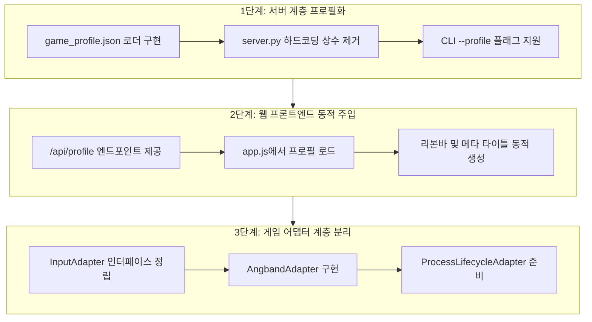

# ToME 2.3.8-ah 코드베이스 결합점 전수 감사 및 분리 체크포인트
## (Decoupling Audit & Architecture Checkpoint)

---

## 1. 개요 및 설계 철학

### 1.1 감사 목적
본 문서는 `tome238-mobile` 프로젝트의 현재 코드베이스(`web/server.py`, `web/app.js`, `web/index.html`, `web/keyboards.json`, `scripts/*` 등)를 전수 조사하여, 특정 게임 엔진(ToME 2.3.8-ah)에 우발적으로 고착화된 하드코딩 결합점(Coupling Points)을 식별하고, 이를 체계적으로 분류 및 분리하기 위한 아키텍처 체크포인트이다.

### 1.2 핵심 설계 원칙
> **«Preserve the game. Keep the transport thin. Make iteration cheap.»**
> (게임 엔진 원형을 보존하고, 전송 계층은 얇게 유지하며, 반복 실험 비용을 최소화한다.)

- **거대 범용 프레임워크 지양**: 모든 로그라이크를 아우르는 복잡한 다형성 엔진 프레임워크를 사전에 구축하지 않는다.
- **최소 Seam(접합선) 및 프로필 규격 도출**: ToME 2.3.8-ah 외의 타 로그라이크(Angband 모드, NetHack류, TomeNET 등)를 손쉽게 교체 장착할 수 있도록 **선언적 JSON 프로필**과 **얇은 어댑터(Thin Adapter)** 수준의 최소한의 틈새만을 정의한다.

---

## 2. 코드베이스 결합점 전수 카탈로그 및 4대 분류

조사된 모든 결합 항목은 아래 4대 기준에 따라 엄격하게 분류된다:

- `GENERIC`: 터미널 에뮬레이터 및 웹 전송 본연의 게임 무관 범용 기능 (공통 인프라로 유지)
- `CONFIG`: 코드 수정 없이 선언적 프로필/설정(JSON) 파일로 즉시 외부화해야 할 대상
- `ADAPTER`: 게임 엔진마다 동작 로직이 달라 얇은 전략/핸들러 어댑터가 필요한 실제 게임 고유 동작
- `LEAVE ALONE`: 결합이 존재하나, 현 단계에서 분리 시 득보다 실(복잡도 증가)이 커서 그대로 유지할 대상

### 2.1 종합 매트릭스

| 번호 | 결합 항목 | 소스 위치 | 분류 | 분리/유지 사유 및 향후 처리 방안 |
| :--- | :--- | :--- | :---: | :--- |
| **1** | 실행 파일 바이너리 경로 (`tome`) | `web/server.py:29` | `CONFIG` | 게임 바이너리 경로는 선언적 프로필의 `executable` 필드로 추출. |
| **2** | 실행 인수 (`-mgcu`, `-MToME`) | `web/server.py:178` | `CONFIG` | 런타임 플래그는 프로필의 `args` 리스트로 추출. |
| **3** | 환경 변수 (`TOME_PATH`, `ESCDELAY` 등) | `web/server.py:175`, `scripts/*` | `CONFIG` | 엔진 전용 환경변수는 프로필의 `env` 딕셔너리로 추출. |
| **4** | 작업 디렉토리 (`game/`) | `web/server.py:28`, `web/server.py:62` | `CONFIG` | 작업 경로는 프로필의 `cwd` 필드로 추출. |
| **5** | 세이브 파일 경로 및 네이밍 | `web/server.py`, `saves/` | `CONFIG` | 세이브 디렉토리 및 플레이어 식별자는 프로필의 `saveDir`로 추출. |
| **6** | UI 브랜딩, 타이틀, 버전 문자열 | `web/index.html:5,23`, `web/server.py:291` | `CONFIG` | 메타 정보(이름, 버전, 아이콘)를 프로필의 `meta` 객체로 추출. |
| **7** | 액션 리본 기본 버튼 목록 | `web/index.html:58-71` | `CONFIG` | 리본 버튼 정의(Rest, Magic, Inven 등)를 프로필의 `ribbon`으로 추출. |
| **8** | 가상 키보드 기본 프로필 | `web/keyboards.json`, `web/app.js:10` | `CONFIG` | 키보드 레이아웃과 키 매핑을 프로필의 `keyboards`로 통합. |
| **9** | 세션 ID 및 LocalStorage 키 네이밍 | `web/app.js:40,41`, `web/server.py:226` | `CONFIG` | `tome_kb_profile` 등 접두어를 프로필 ID 기반 동적 키로 전환. |
| **10** | RUN (달리기) 동작 메커니즘 | `web/app.js:321` | `ADAPTER` | Angband계열(`.`+방향), NetHack(`Shift`+방향), DCSS(`Shift`+방향) 차이를 어댑터로 위임. |
| **11** | 화면 강제 리드로우 트리거 | `web/server.py:241` | `ADAPTER` | 웹소켓 재접속 시 보내는 리드로우 키(`Ctrl+R` `\x12` vs `Ctrl+L` `\x0c`)를 어댑터로 위임. |
| **12** | 컨텍스트 스니퍼 정규식 & 반응 리본 | `web/app.js:756` | `ADAPTER` | 화면 버퍼 분석 및 프롬프트 감지(`(y/n)` 등) 로직을 어댑터 플러그인화. |
| **13** | 방향키 인코딩 및 매핑 | `web/app.js:317-329` | `ADAPTER` | 텐키(1~9) vs Vi-keys(hjklyubn) vs VT100 방향키 이스케이프 간 변환 어댑터 제공. |
| **14** | 프로세스 생명주기 및 단일 프로세스 가정 | `web/server.py:52-69` | `ADAPTER` | 단일 프로세스 포크 vs 다중 프로세스(서버 데몬 + 클라이언트 PTY) 라이프사이클 어댑터. |
| **15** | 터미널 80x24 표준 종횡비 최소 가정 | `web/server.py:38`, `web/app.js:73,147` | `LEAVE ALONE` | 모든 전통 CUI 로그라이크의 De-facto 표준이므로 80x24 하한 유지는 실용적 이득이 큼. |
| **16** | 문자 인코딩 처리 (UTF-8 / Latin-1) | `web/app.js:208`, `web/server.py:176` | `LEAVE ALONE` | 터미널 스트림의 Latin-1 폴백 처리는 CUI 로그라이크 전반에 공통 필요하므로 유지. |
| **17** | PTY 마스터/슬레이브 할당 및 입출력 | `web/server.py:49-75` | `GENERIC` | OS 레벨의 표준 pseudo-terminal 제어 메커니즘으로 완전한 범용 기능. |
| **18** | xterm.js 캔버스 자동 피팅 수학 | `web/app.js:133-171` | `GENERIC` | 화면 폭/높이에 따른 폰트 스케일링 수식은 모든 CUI 게임에 동일 적용. |
| **19** | 포인터 터치 연속 입력 & 햅틱 | `web/app.js:253,773-806` | `GENERIC` | 모바일 터치 이벤트(롱프레스 반복, 10ms 햅틱 진동)는 전형적인 프론트엔드 UI 기능. |
| **20** | 키보드 레이아웃 패널 (Grid/Dock/Ghost) | `web/app.js:353-595,717-748` | `GENERIC` | CSS Grid 기반 키보드 컨테이너 및 투명도/도킹 제어는 범용 UI 엔진. |

---

## 3. 항목별 상세 분석 및 결합 격리 방안

### 3.1 [CONFIG] 선언적 설정으로 분리할 항목들

#### 1) 실행 바이너리, 작업 디렉토리, 실행 인수, 환경 변수
- **현재 상태 (`web/server.py`)**:
  ```python
  GAME_DIR = os.path.join(PROJECT_ROOT, "game")
  GAME_BIN = os.path.join(GAME_DIR, "tome")
  GAME_LIB = os.path.join(GAME_DIR, "lib")
  ...
  env["TOME_PATH"] = GAME_LIB
  cmd = [GAME_BIN, "-mgcu", "-MToME"]
  ```
- **문제점**: ToME 2.3.8의 디렉토리 구조(`game/`, `game/lib`)와 모듈 인수(`-MToME`)가 서버 코드에 직결되어 있어, 다른 게임(예: `tomenet`, `angband`)을 실행하려면 파이썬 코드를 직접 수정해야 함.
- **분리 방안**: JSON 프로필 파일(예: `profiles/tome238.json`)로 외주화.

#### 2) 액션 리본 기본 버튼 목록 (`web/index.html`)
- **현재 상태**:
  ```html
  <div class="ribbon-section scrollable" id="dynamic-ribbon">
    <button class="ribbon-btn macro-btn" data-key="R&\n">💤 Rest</button>
    <button class="ribbon-btn" data-key="i">🎒 Inven</button>
    <button class="ribbon-btn" data-key="m">✨ Magic</button>
    ...
  </div>
  ```
- **문제점**: ToME 특유의 마법(`m`), 휴식 매크로(`R&\n`), 맵(`M`) 등의 단축키가 HTML 마크업에 하드코딩되어 있음. NetHack(`z` for zap, `e` for eat)이나 타 게임 탑재 시 HTML 구조를 뜯어고쳐야 함.
- **분리 방안**: HTML은 빈 컨테이너만 두고, 서버 또는 프로필 JSON의 `ribbon` 배열을 기반으로 JavaScript가 동적 렌더링하도록 변경.

#### 3) UI 브랜딩 및 메타데이터
- **현재 상태**: `<title>ToME 2.3.8-ah ...</title>`, `<span class="logo">⚡ ToME</span>`, 세션 쿼리 파라미터 `session=tome_default`.
- **분리 방안**: 프로필 JSON의 `meta.title`, `meta.logo`, `meta.version`을 읽어 클라이언트 초기화 시 동적 주입.

---

### 3.2 [ADAPTER] 얇은 어댑터가 필요한 게임 고유 동작

#### 1) RUN (달리기) 동작 메커니즘 (`web/app.js`)
- **현재 상태**:
  ```javascript
  function handleDirection(dir) {
    let cmd = dir;
    if (state.run || state.shift) {
      cmd = '.' + dir; // Angband / ToME 방식 고정
      ...
    }
    sendRaw(cmd);
  }
  ```
- **문제점**:
  - Angband / ToME: `.` 키 입력 후 방향키 입력 시 해당 방향으로 달리기 수행.
  - NetHack: 대문자 방향키(예: `Shift + k` = `K`) 또는 `g` + 방향키.
  - DCSS: `Shift + 방향키`.
- **어댑터 분리 방안**:
  ```typescript
  interface GameInputAdapter {
    formatRunCommand(dir: string): string[];
    formatDirectionCommand(dir: string, isShift: boolean): string[];
  }
  ```
  게임 프로필에 `adapter: "angband"` 또는 `adapter: "nethack"`을 선언하고 클라이언트가 해당 전략을 적용.

#### 2) 화면 강제 리드로우 트리거 (`web/server.py`)
- **현재 상태**:
  ```python
  # Redraw screen on client reconnection
  session.write_input(b"\x12") # Hardcoded Ctrl+R
  ```
- **문제점**:
  - Angband/ToME/TomeNET: `Ctrl+R` (`0x12`)이 전체 화면 다시 그리기.
  - NetHack / BSD Rogue: `Ctrl+R` 또는 `Ctrl+L` (`0x0c`).
  - Vi / 일반 Unix 유틸리티: `Ctrl+L`.
- **어댑터 분리 방안**: 어댑터 또는 프로필에 `redrawKey: "\x12"` 형태로 선언하여 PTY 세션 생성/재접속 시 주입.

#### 3) 컨텍스트 스니퍼(Context Sniffer) 정규식 (`web/app.js`)
- **현재 상태**:
  ```javascript
  const isYesNo = /\((y\/n|y\/n\/esc|\[y\/n\])\)/i.test(state.recentScreenText);
  if (isYesNo && contextMode !== 'yes_no') {
    // Ribbon 버튼을 Esc / No / Yes 로 핫스왑
  }
  ```
- **문제점**: 프롬프트 패턴과 그에 대응하는 컨텍스트 버튼셋은 게임 엔진의 메시지 형식에 100% 종속적임.
- **어댑터 분리 방안**: 프로필의 `contextTriggers` 배열로 선언:
  ```json
  "contextTriggers": [
    {
      "pattern": "\\((y\\/n|y\\/n\\/esc|\\[y\\/n\\])\\)",
      "buttons": [
        { "label": "⎋ Esc", "action": "\\e", "class": "esc-btn" },
        { "label": "✖ No (n)", "action": "n", "color": "#ef4444" },
        { "label": "✔ Yes (y)", "action": "y", "color": "#10b981" }
      ]
    }
  ]
  ```

#### 4) 프로세스 생명주기 제어 (단일 PTY vs 다중 프로세스)
- **현재 상태**: `web/server.py`는 단일 `os.fork()`로 단 하나의 자식 프로세스(`self.child_pid`)만 생성하고 감시함.
- **한계점**: 단독 실행 게임(ToME, Angband)에는 충분하나, 클라이언트-서버 분리형 게임(TomeNET 등)의 경우 백그라운드 서버 데몬을 선행 실행하고 클라이언트 PTY를 연결해야 하는 다중 프로세스 수명주기 제어가 불가능함.
- **어댑터 분리 방안**: `ProcessLifecycleAdapter`를 도입하여, `SinglePtyLifecycle`과 `CompanionServerLifecycle`로 분기.

---

### 3.3 [LEAVE ALONE] 현 단계에서 유지가 바람직한 항목들

#### 1) 80열 × 24행 터미널 해상도 기준
- **이유**: Roguelike 장르(Angband, ToME, NetHack, Moria, TomeNET)의 역사적 표준 디스플레이 규격이 80x24임.
- **판단**: 현재 구현된 폰트 오토스케일링 수식(`Math.floor(cw / (80 * charAspect))`, `Math.floor(ch / (24 * lineHeight))`)과 자투리 공간 확장(`adjustTermSize`)은 80x24를 하한선으로 삼을 때 가장 안정적으로 동작함. 이를 임의의 MxN으로 과도하게 파라미터화할 경우 계산 복잡도만 증가하므로 현 상태를 유지함.

#### 2) Latin-1 / UTF-8 하이브리드 디코딩
- **이유**: 고전 CUI 게임 바이너리들은 그래픽 타일/문자 표현 시 종종 확장 ASCII(0x80~0xFF) 바이트를 직접 출력함.
- **판단**: `app.js`에서 바이너리 스트림을 Latin-1 디코딩하고 xterm.js에 전달하는 메커니즘은 거의 모든 ANSI/VT100 기반 고전 게임에 필수적이므로 일반 인프라로 유지.

---

## 4. 제안: 선언적 게임 프로필 규격 (`game_profile.json`)

ToME 결합을 완전히 제거하고 모든 로그라이크 게임을 수용할 수 있는 단일 JSON 스키마를 정의한다.

### 4.1 TypeScript 인터페이스 정의

```typescript
export interface GameProfile {
  id: string;               // 예: "tome238", "tomenet", "nethack36"
  meta: {
    title: string;          // 웹 브라우저 타이틀
    logo: string;           // 상단 바 로고 텍스트
    version: string;        // 버전 문자열
    author?: string;
  };
  process: {
    type: 'single' | 'client_server';
    cwd: string;            // 작업 디렉토리 (프로젝트 루트 상대 경로)
    executable: string;     // 실행 파일 경로
    args: string[];         // 실행 인수
    env: Record<string, string>; // 환경 변수
    redrawKey: string;      // 재접속 리드로우 키 (기본: "\x12")
    companion?: {           // client_server 타입인 경우 백그라운드 서버 명세
      executable: string;
      args: string[];
      cwd: string;
      readyProbe: { type: 'tcp_port'; port: number; timeoutMs: number };
    };
  };
  terminal: {
    minCols: number;        // 기본 80
    minRows: number;        // 기본 24
    maxCols?: number;       // 기본 120
    maxRows?: number;       // 기본 45
    theme?: Record<string, string>;
  };
  input: {
    adapter: 'angband' | 'nethack' | 'standard';
    defaultKeyboardProfile: string;
  };
  ribbon: {
    fixedLeft: Array<{ label: string; action: string; class?: string }>;
    defaultActions: Array<{ label: string; action: string; class?: string; color?: string }>;
  };
  contextTriggers?: Array<{
    pattern: string;
    buttons: Array<{ label: string; action: string; color?: string }>;
  }>;
}
```

### 4.2 ToME 2.3.8-ah 프로필 실물 예시 (`profiles/tome238.json`)

```json
{
  "id": "tome238",
  "meta": {
    "title": "ToME 2.3.8-ah Mobile Terminal",
    "logo": "⚡ ToME",
    "version": "2.3.8-ah"
  },
  "process": {
    "type": "single",
    "cwd": "game",
    "executable": "game/tome",
    "args": ["-mgcu", "-MToME"],
    "env": {
      "TERM": "xterm-256color",
      "TOME_PATH": "lib",
      "LANG": "en_US.UTF-8",
      "ESCDELAY": "25"
    },
    "redrawKey": "\\x12"
  },
  "terminal": {
    "minCols": 80,
    "minRows": 24,
    "maxCols": 120,
    "maxRows": 45
  },
  "input": {
    "adapter": "angband",
    "defaultKeyboardProfile": "full108"
  },
  "ribbon": {
    "fixedLeft": [
      { "label": "⎋ Esc", "action": "\\e", "class": "esc-btn" },
      { "label": "⏎ Ret", "action": "\\n", "class": "enter-btn" },
      { "label": "⎵ Spc", "action": " " },
      { "label": "⇥ Tab", "action": "\\t" },
      { "label": "⌫ BS", "action": "\\b" }
    ],
    "defaultActions": [
      { "label": "💤 Rest", "action": "R&\\n", "class": "macro-btn" },
      { "label": "🎒 Inven", "action": "i" },
      { "label": "✨ Magic", "action": "m" },
      { "label": "🗑 Drop", "action": "d" },
      { "label": "👁 Look", "action": "l" },
      { "label": "🎯 Target", "action": "*" },
      { "label": "🏹 Fire", "action": "f" },
      { "label": "✋ Pickup", "action": "g" },
      { "label": "⚔ Wield", "action": "w" },
      { "label": "🧪 Quaff", "action": "q" },
      { "label": "📜 Read", "action": "r" },
      { "label": "🪄 Use", "action": "u" },
      { "label": "🗺 Map", "action": "M" }
    ]
  },
  "contextTriggers": [
    {
      "pattern": "\\((y\\/n|y\\/n\\/esc|\\[y\\/n\\])\\)",
      "buttons": [
        { "label": "⎋ Esc", "action": "\\e" },
        { "label": "✖ No (n)", "action": "n", "color": "#ef4444" },
        { "label": "✔ Yes (y)", "action": "y", "color": "#10b981" }
      ]
    }
  ]
}
```

---

## 5. 실행 가능한 단계별 분리 로드맵



1. **1단계 (서버 계층 프로필화)**:
   - `web/server.py` 상단의 `GAME_DIR`, `GAME_BIN`, `GAME_LIB`, `cmd`, `env`를 완전히 제거.
   - `server.py --profile <path_to_json>` 인수를 통해 임의의 게임을 로드할 수 있도록 변경.
2. **2단계 (웹 프론트엔드 동적 주입)**:
   - `server.py`의 정적 서빙 루틴에 `/profile.json` 엔드포인트를 노출.
   - `web/index.html` 내의 하드코딩된 리본 버튼과 타이틀 텍스트를 제거하고, `app.js`가 로드된 프로필로부터 렌더링하도록 전환.
3. **3단계 (어댑터 분리 및 다중 프로세스 확장)**:
   - `app.js` 내의 RUN(`.`+dir) 및 프롬프트 스니퍼 로직을 어댑터 플러그인 구조로 격리.
   - 과업 2에서 분석된 TomeNET 다중 프로세스 수명주기를 수용할 수 있는 백그라운드 서버 데몬 어댑터 기반 마련.

---

## 6. 결론

현재 코드베이스는 모바일 터미널과 고정밀 뷰포트 피팅이라는 핵심 인프라를 이미 견고하게 갖추고 있다. 본 감사를 통해 식별된 결합점들은 대부분 선언적 JSON 프로필로 즉시 치환 가능한 수준(`CONFIG`)이며, 일부 게임별 상이한 동작(`ADAPTER`) 역시 얇은 인터페이스 2~3개로 완벽히 격리할 수 있음을 확인하였다. 본 분리 체크포인트를 바탕으로 ToME 원형을 훼손하지 않으면서도 다양한 로그라이크로의 확장을 신속하고 안전하게 달성할 수 있다.
