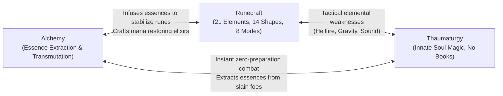
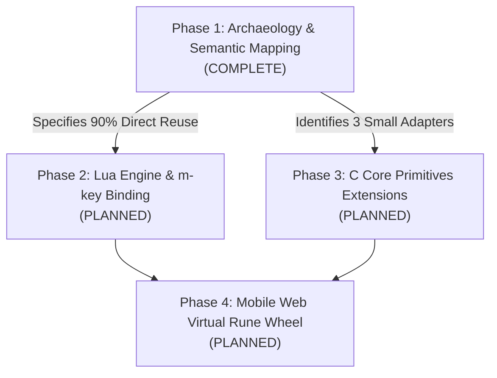

# ToME 2.3.8-ah Mobile Fork: Gameplay Changes & Class Specifications

> **Scope**: This document tracks all deviations, balancing adjustments, new class archetypes, and magic system integrations introduced in this mobile-optimized fork compared to upstream **ToME 2.3.8-ah (Tales of Middle-earth)**.  
> **Guiding Principle**: Preserve original Tolkien lore, high lethality, and mechanical depth while optimizing character systems for book-free, fluid interaction on mobile touch displays.

---

## 1. Upstream ToME 2.3.8-ah vs This Fork Comparison Tracker

| Feature Domain | Upstream ToME 2.3.8-ah | Mobile Web Fork (`tome238-mobile`) | Design Rationale & Impact |
| :--- | :--- | :--- | :--- |
| **Platform & Host** | Desktop X11, Win32, DOS, raw Linux console | Native Termux Linux (aarch64) with PTY daemon | Eliminates bulky Android APK/NDK packaging; 100% native execution on mobile devices. |
| **Display & Viewport** | Fixed OS terminal window or graphical tiles | Responsive Xterm.js Canvas locked to 80x24 | Guarantees exact roguelike aspect ratio on any phone/tablet screen without character distortion or text clipping. |
| **Input System** | Physical 101/104-key PC keyboard with Numpad | 3x3 D-Pad with 300ms/75ms auto-repeat + Context Ribbon | Enables single-handed and thumb-friendly movement, running, and prompt answering without invoking the OS on-screen keyboard. |
| **Interactive Prompts** | Player must manually type `y`, `n`, or `Esc` | Dynamic Context Sniffer automatically injects touch buttons | Eliminates typing friction during frequent queries (`(y/n)`, `Direction?`). |
| **Session Resilience** | Quitting terminal terminates process; disconnect leads to SIGHUP | 64KB Circular Ring Buffer with auto-reconnection & `Ctrl+R` | Mobile browser tab closures or cellular switches no longer kill active dungeon runs. |
| **Class Archetypes** | Rigid specialization (Mages, Sorcerers, Thaumaturgists, Alchemists) | **Adventurer** Generalist Class (Hybrid Caster-Crafter) | Synthesizes Alchemy + Thaumaturgy + Runecraft for book-free, fluid touch gameplay. |
| **Magic Progression** | Inventory-heavy spellbooks or isolated single-discipline casting | TomeNET Dynamic Runecraft + Innate Thaumaturgy + Alchemy | Eliminates deep inventory scrolling for spellbooks; empowers on-the-fly elemental spell tracing. |

---

## 2. The Adventurer Generalist Class Specification

### 2.1 Concept & Mobile Gameplay Rationale
In standard ToME 2.3.8-ah, traditional spellcasters are tethered to physical spellbooks (`m_info.txt`, `k_info.txt`) requiring multiple keystrokes to browse, select, cast, and target (`m -> a -> a -> dir`). Furthermore, Mage subclasses impose severe skill penalties against cross-discipline learning (e.g., Alchemists receive `-600` skill points to Thaumaturgy and elemental schools).

On a mobile touchscreen:
- Swapping spellbooks and managing inventory clutter introduces significant cognitive and tactile friction.
- The **Adventurer** class resolves this by uniting Middle-earth's three most tactile, book-free magical systems into a cohesive caster-crafter archetype:
  1. **Alchemy ([`s_info.txt:374`](file:///data/data/com.termux/files/home/tome238-mobile/game/lib/edit/s_info.txt#L374))**: Extraction of raw magical essences from dungeon loot; transmutation and self-sufficient item crafting without store reliance.
  2. **Thaumaturgy ([`s_info.txt:144`](file:///data/data/com.termux/files/home/tome238-mobile/game/lib/edit/s_info.txt#L144))**: Spontaneous, innate magic projected directly from the soul. Generates unique offensive bolts, beams, and balls per character without carrying spellbooks.
  3. **Runecraft ([`s_info.txt:138`](file:///data/data/com.termux/files/home/tome238-mobile/game/lib/edit/s_info.txt#L138))**: Dynamic combination of fundamental runes (Light, Dark, Nexus, Nether, Chaos, Mana) traced directly into the air to cast 21 elemental spells across 14 shapes.

### 2.2 Class Lore & Identity
> *The Adventurer is not a scholar bound to the dusty libraries of Minas Tirith, nor a cloistered hermit of Dol Guldur. They are an intrepid wanderer of Middle-earth who learned survival through experimentation. Recognizing that true power lies in adaptability, the Adventurer transmutes dungeon detritus with Alchemy, releases instinctual offensive bursts through Thaumaturgy, and carves ancient eldritch runes into the air to shape the elements.*

### 2.3 Skill Tree Modifiers & Affinities

```
Skill Tree Hierarchy for Adventurer:
Magic (Base)
├── Alchemy (ID 39)       [Primary Crafting]
├── Thaumaturgy (ID 43)   [Primary Innate Combat]
├── Runecraft (ID 34)     [Primary Tactical Versatility]
├── Spell-power           [Secondary Magnitude]
└── Magic-Device          [Secondary Device Use]
Combat
├── Weaponmastery         [Basic Defense/Offense]
└── Dodging               [Evasion]
```

#### Concrete Engine Definitions ([`game/lib/edit/p_info.txt`](file:///data/data/com.termux/files/home/tome238-mobile/game/lib/edit/p_info.txt#L826-L875))
The Adventurer is registered both as a standalone generalist class (`C:N:6:Adventurer`) and as a specialized Mage subclass (`C:a:N:Adventurer`):

- **Class ID & Title Progression**:
  - `C:N:6:Adventurer`
  - Titles: *Wanderer* (1-9), *Explorer* (10-19), *Adventurer* (20-29), *Master Adventurer* (30-39), *Hero* (40-44), *Champion* (45-49), *Lord* (50)
- **Base Stats & Growth**:
  - Hit Die: `d10` base (`C:B:4:40:2`)
  - Experience Penalty: `35%` (`C:S:...:35:0`) reflecting multi-discipline mastery
  - God Worship: `All Gods` (`C:g:All Gods`)
  - Innate Ability: `Perfect casting` (`C:b:1:Perfect casting`)
- **Core Skill Tree Modifiers**:
  - `Magic`: `+2000` base, `+900` modifier
  - `Alchemy` (ID 39): `+2000` base, `+800` modifier
  - `Thaumaturgy` (ID 43): `+2000` base, `+800` modifier
  - `Runecraft` (ID 34): `+2000` base, `+800` modifier
  - `Mana`: `+1000` base, `+700` modifier
  - `Combat`: `+1000` base, `+500` modifier
  - `Weaponmastery`: `+1000` base, `+500` modifier
  - `Magic-Device`: `+1000` base, `+400` modifier
  - `Sneakiness`: `+1000` base, `+500` modifier
- **Allowed Races**: Human, Half-Elf, Elf, Hobbit, Gnome, Dwarf.
- **Starting Equipment & Spell**:
  - Starter spells: `Manathrust` auto-inscribed ([`player.lua:66-72`](file:///data/data/com.termux/files/home/tome238-mobile/game/lib/scpt/player.lua#L66-L72))
  - Runes: Fundamental Light, Dark, Nexus runes (`TV_RUNE`)
  - Survival kit: Flask of oil, torches, rations, starting dagger.

#### Stat Priority Matrix
- **Intelligence (INT)**: Primary stat. Determines spell failure rate, Thaumaturgy spell tiering, Runecraft tracing stability (65% weight), and Alchemy essence yields.
- **Dexterity (DEX)**: Secondary stat. Influences Runecraft casting speed and failure calculation (35% weight), dodging, and physical precision.
- **Constitution (CON)**: Defensive necessity. Runecraft failure produces backlash damage; a healthy HP pool ensures the Adventurer survives accidental elemental backfires.


### 2.4 Three-Way Discipline Synergy Matrix



1. **Runecraft + Thaumaturgy (Tactical Flexibility + Instant Power)**:
   - Thaumaturgy provides fast, cheap, single-action innate bolts and beams for clearing routine mobs.
   - Runecraft provides precision elemental exploitation (e.g., casting Nether against living foes, Hellfire against demons, Sound/Gravity for stuns) and area denial (Walls, Storms, Clouds).
2. **Alchemy + Runecraft (Resource Sustainability + Backlash Protection)**:
   - Alchemy extracts essences from surplus equipment to craft resistance potions, directly cushioning the caster against Runecraft failure backlash (`unsafe = TRUE`).
   - Runecraft runes can be permanently etched into weapons and armor via alchemical forging.
3. **Thaumaturgy + Alchemy (Zero-Burden Scavenging)**:
   - The Adventurer operates at minimal carrying weight because neither discipline requires books. All inventory capacity is dedicated to alchemical reagents, extracted essences, and rune stones.

---

## 3. Runecraft Integration Roadmap

Integration of the TomeNET Runecraft engine into ToME 2.3.8-ah follows a modular, 4-phase plan:



### Phase 1: Archaeology & Semantic Mapping (Complete)
- **TomeNET Reverse-Engineering**: Extracted complete 32-bit bitmask encoding, formulas, and element tables into [`docs/tomenet_runecraft_spec.md`](file:///data/data/com.termux/files/home/tome238-mobile/docs/tomenet_runecraft_spec.md).
- **Core Engine Investigation**: Proved that ToME 2.3.8-ah already includes 100% of the 21 elemental projection types (`GF_*`), projectile functions (`fire_bolt`, `fire_ball`, `fire_cloud`, `fire_wave`), and the `unsafe = TRUE` player backlash mechanism. Detailed in [`docs/runecraft_mapping.md`](file:///data/data/com.termux/files/home/tome238-mobile/docs/runecraft_mapping.md).

### Phase 2: Lua Engine & m-key Binding (Planned)
- Implement `game/lib/scpt/runecraft.lua`:
  - Port TomeNET's single-player casting logic without multiplayer network packets.
  - Calculate casting failure using INT (65%) and DEX (35%) weights against `p_ptr->stat_ind`.
  - Wire backlash damage directly to `project(-1, 0, p_ptr->py, p_ptr->px, dam, typ, PROJECT_KILL)` with `unsafe = TRUE`.
- Register the Runecraft skill command in [`game/lib/scpt/mkeys.lua`](file:///data/data/com.termux/files/home/tome238-mobile/game/lib/scpt/mkeys.lua) under Skill ID 34.

### Phase 3: C Core Primitives Extensions (Planned - ~40 Lines of C)
- **`fire_burst()` Adapter**: Add a uniform damage radius explosion in [`game/src/spells2.c`](file:///data/data/com.termux/files/home/tome238-mobile/game/src/spells2.c) that bypasses distance-based falloff.
- **`explosive_rune_ext()` Adapter**: Enhance [`spells2.c:169`](file:///data/data/com.termux/files/home/tome238-mobile/game/src/spells2.c#L169) `explosive_rune()` to pass custom element types (`typ`) and damage (`dam`) to floor glyphs.
- **`Nimbus` Shield State**: Add `nimbus`, `nimbus_t`, and `nimbus_d` timers to `player_type` in [`game/src/types.h`](file:///data/data/com.termux/files/home/tome238-mobile/game/src/types.h) and inject a 15-line counter-attack explosion hook into [`game/src/melee2.c`](file:///data/data/com.termux/files/home/tome238-mobile/game/src/melee2.c).

### Phase 4: Mobile Web Virtual Rune Wheel UI (Planned)
- Design a radial or carousel 6-rune touch wheel overlay in the web frontend ([`web/app.js`](file:///data/data/com.termux/files/home/tome238-mobile/web/app.js)).
- Enable 2-tap spell assembly: Tap Rune 1 -> Tap Rune 2 -> Cast.
- Store favorite rune combinations into the Dynamic Ribbon as 1-tap quickcast macros.

---

## 4. Cross-Reference Documentation

- **Full Architecture & Transport Specification**: [`docs/architecture.md`](file:///data/data/com.termux/files/home/tome238-mobile/docs/architecture.md)
- **TomeNET Runecraft Detailed Formulas & Rules**: [`docs/tomenet_runecraft_spec.md`](file:///data/data/com.termux/files/home/tome238-mobile/docs/tomenet_runecraft_spec.md)
- **Runecraft ↔ ToME 2.3.8-ah Semantic Mapping Table**: [`docs/runecraft_mapping.md`](file:///data/data/com.termux/files/home/tome238-mobile/docs/runecraft_mapping.md)
- **Runecraft Vertical Slice Prototype (Lua MVP)**: [`docs/runecraft_vertical_slice_spec.md`](file:///data/data/com.termux/files/home/tome238-mobile/docs/runecraft_vertical_slice_spec.md)
- **Mobile Keyboard & UX Reverse-Engineering**: [`docs/mobile_keyboard_spec.md`](file:///data/data/com.termux/files/home/tome238-mobile/docs/mobile_keyboard_spec.md)
- **Agent Operational Handbook**: [`AGENTS.md`](file:///data/data/com.termux/files/home/tome238-mobile/AGENTS.md)

