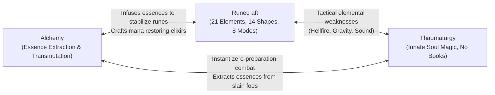
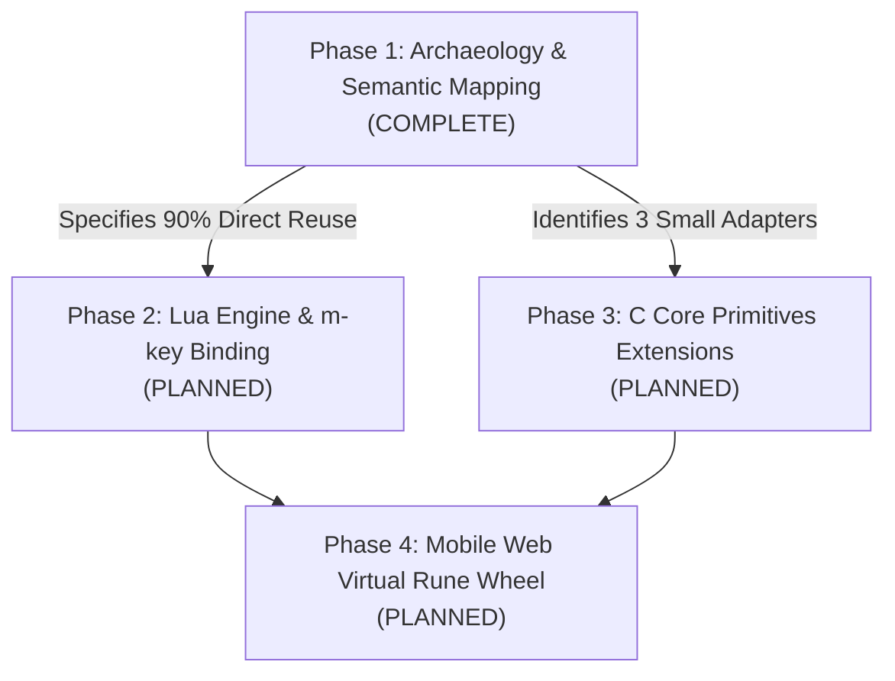

# ToME 2.3.8-ah Mobile Fork: Gameplay Changes & Class Specifications

> **Scope**: This document tracks all deviations, balancing adjustments, new class archetypes, and magic system integrations introduced in this mobile-optimized fork compared to upstream **ToME 2.3.8-ah (Tales of Middle-earth)**.  
> **Guiding Principle**: Preserve original Tolkien lore, high lethality, and mechanical depth while optimizing character systems for book-free, fluid interaction on mobile touch displays.

---

## 1. Upstream ToME 2.3.8-ah vs This Fork Comparison Tracker

| Feature Domain | Upstream ToME 2.3.8-ah | Mobile Web Fork (`tome238-mobile`) | Design Rationale & Impact |
| :--- | :--- | :--- | :--- |
| **Platform & Host** | Desktop X11, Win32, DOS, raw Linux console | Native Termux Linux (aarch64) with PTY daemon | Eliminates bulky Android APK/NDK packaging; 100% native execution on mobile devices. |
| **Display & Viewport** | Fixed OS terminal window or graphical tiles | Responsive Xterm.js Canvas locked to 80x24 | Guarantees exact roguelike aspect ratio on any phone/tablet screen without character distortion or text clipping. |
| **Input System** | Physical 101/104-key PC keyboard with Numpad | 3x3 D-Pad with 300ms/75ms auto-repeat + Context Ribbon | Enables single-handed and thumb-friendly movement, running, and prompt answering without invoking the OS on-screen keyboard. |
| **Interactive Prompts** | Player must manually type `y`, `n`, or `Esc` | Dynamic Context Sniffer automatically injects touch buttons | Eliminates typing friction during frequent queries (`(y/n)`, `Direction?`). |
| **Session Resilience** | Quitting terminal terminates process; disconnect leads to SIGHUP | 64KB Circular Ring Buffer with auto-reconnection & `Ctrl+R` | Mobile browser tab closures or cellular switches no longer kill active dungeon runs. |
| **Class Archetypes** | Rigid specialization (Mages, Sorcerers, Thaumaturgists, Alchemists) | **Adventurer** Generalist Class (Hybrid Caster-Crafter) | Synthesizes Alchemy + Thaumaturgy + Runecraft for book-free, fluid touch gameplay. |
| **Magic Progression** | Inventory-heavy spellbooks or isolated single-discipline casting | TomeNET Dynamic Runecraft + Innate Thaumaturgy + Alchemy | Eliminates deep inventory scrolling for spellbooks; empowers on-the-fly elemental spell tracing. |
| **Birth & Savefile Stability** | Savefile check prone to NULL stream crash on modern Bionic libc | Bionic FORTIFY NULL checks in `loadsave.c` + automated regression test | Completely prevents `SIGABRT` aborts when confirming default character name on Android Termux. |
| **Mobile UI & Diagnostics** | None (Raw terminal / OS console only) | 5x10 Neon Cyan AdvKeyboard, Draggable 3x3 D-Pad, Crash Diagnostics Modal | 100% faithful Angbandroid UX plus instant crash reporting and one-click session restart. |
| **Floating Action Buttons (FAB)** | None (Strict hardware or OS keyboard input) | Draggable Neon Cyan FAB layer with pointer capture & `localStorage` persistence | Enables players to place custom macros and F-keys anywhere on screen with tap vs drag discrimination. |
| **Action Ribbon Customization** | Static command keys or complex multi-key combinations | Dynamically configurable action ribbon with `➕` addition button and long-press editor | Allows instant 1-tap triggering of user-defined spells, item actions, and macros without keyboard toggles. |
| **Function Keys & Macro Palette** | Manual ANSI escape sequence entry or PC keyboard F-keys | 2×6 visual F1~F12 grid, `{F1}`~`{F12}` token parser, and quick macro chips | Bridges complex roguelike terminal commands to intuitive touch buttons. |
| **Keyboard Ergonomics** | Rigid layout with low-utility Redo key on primary row | Dedicated `⎋` Esc keycap replacing `↺` Redo on Row 4 | Instant thumb access to the roguelike cancel/escape action with automatic Shift/page reset. |
| **Floating Button Manager** | None (No visibility or batch controls for macros) | Centralized inspection modal (`#manage-fb-modal`) with live coordinate display & batch clear | Eliminates screen clutter; provides 1-tap editing, deletion, and complete purge of floating action buttons. |
| **Layout & Macro Presets** | Fixed input setup requiring manual re-binding per character | Full layout state serialization (`#presets-modal`) with 3 built-in profiles + custom slots | Allows seamless switching between Warrior, Mage, and minimalist touch setups with instant 1-tap application. |
| **One-Click Keyboard Toggle** | Multi-level menu navigation to toggle software keyboard | Dedicated top-bar `⌨` button with active amber indicator (`.active-toggled`) | Instantly frees 100% viewport height for exploration and automatically re-scales terminal typography. |
| **3-Row Compact Simple Keyboard**| Bulky 5x10 keyboard (40~44vh) or none | 22vh compact 3-row layout (`simple_portrait`/`simple_landscape`) with top-bar switcher | Over 50% viewport height savings while preserving essential roguelike commands and numeric keys. |

---

## 2. The Adventurer Generalist Class Specification

### 2.1 Concept & Mobile Gameplay Rationale
In standard ToME 2.3.8-ah, traditional spellcasters are tethered to physical spellbooks (`m_info.txt`, `k_info.txt`) requiring multiple keystrokes to browse, select, cast, and target (`m -> a -> a -> dir`). Furthermore, Mage subclasses impose severe skill penalties against cross-discipline learning (e.g., Alchemists receive `-600` skill points to Thaumaturgy and elemental schools).

On a mobile touchscreen:
- Swapping spellbooks and managing inventory clutter introduces significant cognitive and tactile friction.
- The **Adventurer** class resolves this by uniting Middle-earth's three most tactile, book-free magical systems into a cohesive caster-crafter archetype:
  1. **Alchemy ([`s_info.txt:374`](file:///data/data/com.termux/files/home/tome238-mobile/game/lib/edit/s_info.txt#L374))**: Extraction of raw magical essences from dungeon loot; transmutation and self-sufficient item crafting without store reliance.
  2. **Thaumaturgy ([`s_info.txt:144`](file:///data/data/com.termux/files/home/tome238-mobile/game/lib/edit/s_info.txt#L144))**: Spontaneous, innate magic projected directly from the soul. Generates unique offensive bolts, beams, and balls per character without carrying spellbooks.
  3. **Runecraft ([`s_info.txt:138`](file:///data/data/com.termux/files/home/tome238-mobile/game/lib/edit/s_info.txt#L138))**: Dynamic combination of fundamental runes (Light, Dark, Nexus, Nether, Chaos, Mana) traced directly into the air to cast 21 elemental spells across 14 shapes.

### 2.2 Class Lore & Identity
> *The Adventurer is not a scholar bound to the dusty libraries of Minas Tirith, nor a cloistered hermit of Dol Guldur. They are an intrepid wanderer of Middle-earth who learned survival through experimentation. Recognizing that true power lies in adaptability, the Adventurer transmutes dungeon detritus with Alchemy, releases instinctual offensive bursts through Thaumaturgy, and carves ancient eldritch runes into the air to shape the elements.*

### 2.3 Skill Tree Modifiers & Affinities

```
Skill Tree Hierarchy for Adventurer:
Magic (Base)
├── Alchemy (ID 39)       [Primary Crafting]
├── Thaumaturgy (ID 43)   [Primary Innate Combat]
├── Runecraft (ID 34)     [Primary Tactical Versatility]
├── Spell-power           [Secondary Magnitude]
└── Magic-Device          [Secondary Device Use]
Combat
├── Weaponmastery         [Basic Defense/Offense]
└── Dodging               [Evasion]
```

#### Concrete Engine Definitions ([`game/lib/edit/p_info.txt`](file:///data/data/com.termux/files/home/tome238-mobile/game/lib/edit/p_info.txt#L826-L875))
The Adventurer is registered both as a standalone generalist class (`C:N:6:Adventurer`) and as a specialized Mage subclass (`C:a:N:Adventurer`):

- **Class ID & Title Progression**:
  - `C:N:6:Adventurer`
  - Titles: *Wanderer* (1-9), *Explorer* (10-19), *Adventurer* (20-29), *Master Adventurer* (30-39), *Hero* (40-44), *Champion* (45-49), *Lord* (50)
- **Base Stats & Growth**:
  - Hit Die: `d10` base (`C:B:4:40:2`)
  - Experience Penalty: `35%` (`C:S:...:35:0`) reflecting multi-discipline mastery
  - God Worship: `All Gods` (`C:g:All Gods`)
  - Innate Ability: `Perfect casting` (`C:b:1:Perfect casting`)
- **Core Skill Tree Modifiers**:
  - `Magic`: `+2000` base, `+900` modifier
  - `Alchemy` (ID 39): `+2000` base, `+800` modifier
  - `Thaumaturgy` (ID 43): `+2000` base, `+800` modifier
  - `Runecraft` (ID 34): `+2000` base, `+800` modifier
  - `Mana`: `+1000` base, `+700` modifier
  - `Combat`: `+1000` base, `+500` modifier
  - `Weaponmastery`: `+1000` base, `+500` modifier
  - `Magic-Device`: `+1000` base, `+400` modifier
  - `Sneakiness`: `+1000` base, `+500` modifier
- **Allowed Races**: Human, Half-Elf, Elf, Hobbit, Gnome, Dwarf.
- **Starting Equipment & Spell**:
  - Starter spells: `Manathrust` auto-inscribed ([`player.lua:66-72`](file:///data/data/com.termux/files/home/tome238-mobile/game/lib/scpt/player.lua#L66-L72))
  - Runes: Fundamental Light, Dark, Nexus runes (`TV_RUNE`)
  - Survival kit: Flask of oil, torches, rations, starting dagger.

#### Stat Priority Matrix
- **Intelligence (INT)**: Primary stat. Determines spell failure rate, Thaumaturgy spell tiering, Runecraft tracing stability (65% weight), and Alchemy essence yields.
- **Dexterity (DEX)**: Secondary stat. Influences Runecraft casting speed and failure calculation (35% weight), dodging, and physical precision.
- **Constitution (CON)**: Defensive necessity. Runecraft failure produces backlash damage; a healthy HP pool ensures the Adventurer survives accidental elemental backfires.


### 2.4 Three-Way Discipline Synergy Matrix



1. **Runecraft + Thaumaturgy (Tactical Flexibility + Instant Power)**:
   - Thaumaturgy provides fast, cheap, single-action innate bolts and beams for clearing routine mobs.
   - Runecraft provides precision elemental exploitation (e.g., casting Nether against living foes, Hellfire against demons, Sound/Gravity for stuns) and area denial (Walls, Storms, Clouds).
2. **Alchemy + Runecraft (Resource Sustainability + Backlash Protection)**:
   - Alchemy extracts essences from surplus equipment to craft resistance potions, directly cushioning the caster against Runecraft failure backlash (`unsafe = TRUE`).
   - Runecraft runes can be permanently etched into weapons and armor via alchemical forging.
3. **Thaumaturgy + Alchemy (Zero-Burden Scavenging)**:
   - The Adventurer operates at minimal carrying weight because neither discipline requires books. All inventory capacity is dedicated to alchemical reagents, extracted essences, and rune stones.

---

## 3. Runecraft Integration Roadmap

Integration of the TomeNET Runecraft engine into ToME 2.3.8-ah follows a modular, 4-phase plan:



### Phase 1: Archaeology & Semantic Mapping (Complete)
- **TomeNET Reverse-Engineering**: Extracted complete 32-bit bitmask encoding, formulas, and element tables into [`docs/tomenet_runecraft_spec.md`](file:///data/data/com.termux/files/home/tome238-mobile/docs/tomenet_runecraft_spec.md).
- **Core Engine Investigation**: Proved that ToME 2.3.8-ah already includes 100% of the 21 elemental projection types (`GF_*`), projectile functions (`fire_bolt`, `fire_ball`, `fire_cloud`, `fire_wave`), and the `unsafe = TRUE` player backlash mechanism. Detailed in [`docs/runecraft_mapping.md`](file:///data/data/com.termux/files/home/tome238-mobile/docs/runecraft_mapping.md).

### Phase 2: Lua Engine & m-key Binding (Planned)
- Implement `game/lib/scpt/runecraft.lua`:
  - Port TomeNET's single-player casting logic without multiplayer network packets.
  - Calculate casting failure using INT (65%) and DEX (35%) weights against `p_ptr->stat_ind`.
  - Wire backlash damage directly to `project(-1, 0, p_ptr->py, p_ptr->px, dam, typ, PROJECT_KILL)` with `unsafe = TRUE`.
- Register the Runecraft skill command in [`game/lib/scpt/mkeys.lua`](file:///data/data/com.termux/files/home/tome238-mobile/game/lib/scpt/mkeys.lua) under Skill ID 34.

### Phase 3: C Core Primitives Extensions (Planned - ~40 Lines of C)
- **`fire_burst()` Adapter**: Add a uniform damage radius explosion in [`game/src/spells2.c`](file:///data/data/com.termux/files/home/tome238-mobile/game/src/spells2.c) that bypasses distance-based falloff.
- **`explosive_rune_ext()` Adapter**: Enhance [`spells2.c:169`](file:///data/data/com.termux/files/home/tome238-mobile/game/src/spells2.c#L169) `explosive_rune()` to pass custom element types (`typ`) and damage (`dam`) to floor glyphs.
- **`Nimbus` Shield State**: Add `nimbus`, `nimbus_t`, and `nimbus_d` timers to `player_type` in [`game/src/types.h`](file:///data/data/com.termux/files/home/tome238-mobile/game/src/types.h) and inject a 15-line counter-attack explosion hook into [`game/src/melee2.c`](file:///data/data/com.termux/files/home/tome238-mobile/game/src/melee2.c).

### Phase 4: Mobile Web Virtual Rune Wheel UI (Planned)
- Design a radial or carousel 6-rune touch wheel overlay in the web frontend ([`web/app.js`](file:///data/data/com.termux/files/home/tome238-mobile/web/app.js)).
- Enable 2-tap spell assembly: Tap Rune 1 -> Tap Rune 2 -> Cast.
- Store favorite rune combinations into the Dynamic Ribbon as 1-tap quickcast macros.

---

---

## 4. Engine Stability & Critical Bugfixes

### 4.1 Bionic FORTIFY NULL Pointer Abort in `loadsave.c`

#### Root Cause Analysis
During character creation in ToME 2.3.8-ah, confirming the default player name (hitting Return on the initial `PLAYER` prompt) triggers the birth routine in [`game/src/birth.c`](file:///data/data/com.termux/files/home/tome238-mobile/game/src/birth.c), which calls `load_player()` in [`game/src/loadsave.c`](file:///data/data/com.termux/files/home/tome238-mobile/game/src/loadsave.c) to inspect whether a savefile for that name already exists.

When starting a fresh character, no savefile exists yet. `my_fopen(savefile, "rb")` returns `NULL`.
In unpatched upstream code:
1. `fff` was set to `NULL`.
2. Error handling paths or subsequent stream decode routines invoked `sf_get()` or `sf_put()`.
3. Inside `sf_get()`, `c = getc(fff)` was executed directly with `fff == NULL`.
4. On standard desktop glibc or older compilers, passing `NULL` to `getc()` silently fails with `EOF`. However, on **Android Termux ARM64** using **Bionic libc compiled with `_FORTIFY_SOURCE=2`**, the fortified standard I/O implementation (`__getc_chk`, `__putc_chk`) detects passing a `NULL` `FILE*` pointer as an immediate memory/stream corruption violation, raising an assertion failure and aborting the process via `SIGABRT` (signal 6).

This caused an immediate, non-recoverable crash during new character creation whenever a player accepted the default name or started a new run.

#### C Engine Resolution ([`game/src/loadsave.c`](file:///data/data/com.termux/files/home/tome238-mobile/game/src/loadsave.c))
We applied strict null-pointer defenses to the serialization functions:
```c
/* In sf_get(): guard against NULL file descriptor */
static byte sf_get(void)
{
	byte c;
	if (!fff) return 0;
#ifndef BZ_SAVES
	c = getc(fff) & 0xFF;
...
```

```c
/* In sf_put(): guard against NULL file descriptor */
static void sf_put(byte v)
{
	if (!fff) return;
#ifndef BZ_SAVES
	(void)putc((int)v, fff);
...
```

```c
/* In load_player(): safe error handling and guaranteed NULL cleanup */
fff = my_fopen(savefile, "rb");
if (!fff)
{
	err = -1;
	what = "Cannot open savefile";
}
else
{
	...
	my_fclose(fff);
	fff = NULL;
}
```

#### Automated Birth Flow Regression Test ([`scripts/test_birth.py`](file:///data/data/com.termux/files/home/tome238-mobile/scripts/test_birth.py))
To prevent any future regression in the birth sequence, an automated headless PTY test was created and integrated into `./test`:
- **Case 1**: Confirms default name (`PLAYER`) with Return, skips intro animation, selects Male Human Classic Adventurer (`g`), completes character creation, and confirms active dungeon entry.
- **Case 2**: Enters custom character name (`Hero`), selects Warrior (`a`), autorolls stats, and verifies clean world transition.

### 4.2 Premature `exit_game_panic()` & Exit 255 Crash on SIGWINCH / Terminal Resize (`main-gcu.c`, `files.c`)

#### Root Cause Analysis
In a mobile web environment, the virtual terminal geometry dynamically resizes whenever the user rotates their mobile device (portrait <-> landscape), toggles the on-screen 5x10 AdvKeyboard, or scales the browser viewport. Each geometry change triggers `ioctl(TIOCSWINSZ)` in the Python PTY host, causing the Linux kernel to send a `SIGWINCH` (Window Change) signal to the child PTY curses process.

In upstream ToME 2.3.8-ah's curses driver ([`game/src/main-gcu.c`](file:///data/data/com.termux/files/home/tome238-mobile/game/src/main-gcu.c)):
1. In `Term_xtra_gcu_event()`, the engine enters a blocking `getch()` call waiting for player keystrokes.
2. When `SIGWINCH` is delivered, the underlying OS `read()` syscall is interrupted, causing `getch()` to return `ERR` (-1) with `errno == EINTR` (Interrupted system call).
3. The legacy upstream loop attempted to recover via:
   ```c
   /* Mega-Hack -- allow graceful "suspend" */
   for (k = 0; (k < 10) && (i == ERR); k++) i = getch();
   if (i == ERR) exit_game_panic();
   ```
   Because all 10 consecutive non-delayed `getch()` calls immediately returned `ERR` before the signal handler settled, the engine assumed the terminal connection was broken or stdin was dead, immediately invoking `exit_game_panic()`.
4. In [`game/src/files.c`](file:///data/data/com.termux/files/home/tome238-mobile/game/src/files.c), `exit_game_panic()` wrote an emergency panic save and terminated the game via `quit("panic save succeeded!")`.
5. In ToME's `quit()`, string messages trigger `exit(255)`.
6. To our new real-time diagnostics supervisor ([`web/server.py`](file:///data/data/com.termux/files/home/tome238-mobile/web/server.py)), exit code 255 was correctly classified as an abnormal exit, popping up the `CrashModal` on the player's screen whenever they rotated their phone or opened the virtual keyboard!

#### C Engine Resolution ([`main-gcu.c`](file:///data/data/com.termux/files/home/tome238-mobile/game/src/main-gcu.c) & [`files.c`](file:///data/data/com.termux/files/home/tome238-mobile/game/src/files.c))
We re-architected the curses event loop and panic exit mechanics:

1. **`EINTR` Signal Interruption Recovery ([`main-gcu.c:612-617`](file:///data/data/com.termux/files/home/tome238-mobile/game/src/main-gcu.c#L612-L617))**:
   - The event loop wraps `getch()` in an explicit `while (1)` loop with `errno = 0`.
   - If `i == ERR && errno == EINTR`, it immediately loops back and retries, cleanly absorbing `SIGWINCH` and window resize interruptions.
2. **`KEY_RESIZE` Handling ([`main-gcu.c:619-625, 678-684`](file:///data/data/com.termux/files/home/tome238-mobile/game/src/main-gcu.c#L619-L625))**:
   - When ncurses returns `KEY_RESIZE`, the engine dispatches `Term_xtra(TERM_XTRA_REACT, 0)` to recalculate internal geometry without triggering panic logic.
3. **Genuine Stdin Disconnection Detection via `feof()` ([`main-gcu.c:629-654`](file:///data/data/com.termux/files/home/tome238-mobile/game/src/main-gcu.c#L629-L654))**:
   - Instead of treating every `ERR` as terminal death, it verifies `feof(stdin)`.
   - For non-EOF transient errors, it introduces a 20-iteration retry with 20ms sleeps (`usleep(20000)`), granting a 400ms stabilization window. Only persistent errors trigger `exit_game_panic()`.
4. **Clean Rescue Exit Status Code `+0` ([`files.c:6591, 6625`](file:///data/data/com.termux/files/home/tome238-mobile/game/src/files.c#L6591))**:
   - In `exit_game_panic()`, when no character is generated or when the panic save successfully writes to `<savefile>.pnc`, the engine now invokes `quit("+0")`.
   - The `+` prefix signals `quit()` to exit with status code `0` (clean rescue exit), preventing the diagnostics supervisor from misclassifying emergency saves as fatal application crashes.

### 4.3 ASCII Tile Corruption & Refresh Synchronization Fix (Fixed 80x24 Geometry, Ncurses Cache Invalidation, Auto Ctrl+R)

#### Root Cause Analysis
In classic roguelikes like ToME 2.3.8-ah, the dungeon map, sidebar stat panels, and top bars are rigidly formatted around an exact 80-column by 24-row VT100 grid. During mobile play, two subtle rendering defects caused visual degradation and ASCII tile distortion:

1. **Geometry Drift & Column Expansion via `fitAddon`**:
   - `xterm-addon-fit` dynamically calculates columns and rows based on container pixel dimensions. On wide mobile screens or landscape devices, `fitAddon` expanded the terminal beyond 80 columns (e.g. 84~120 columns).
   - Because the ToME C curses engine explicitly wraps lines at column 80, the extra terminal columns caused dungeon rows to misalign, wrap prematurely, and shear dungeon corridors diagonally.
2. **Ncurses Screen Cache Stale State (`curscr`)**:
   - Ncurses maintains an internal optimization buffer of the physical terminal screen (`curscr`) to minimize bandwidth by emitting diffs.
   - When the browser viewport was resized, rotated, or when the mobile device woke up from sleep (`visibilitychange`), xterm.js re-rendered from scratch, but ncurses believed the physical screen still held previous character cells.
   - Consequently, redraw commands omitted unchanged tiles, leaving orphaned ghost glyphs, missing dungeon walls, and fragmented text strings across the viewport.

#### Technical Resolution Across Engine, Shell, and Frontend

1. **Declarative Fixed Geometry Constraint (`"fixed_geometry": true`)**:
   - In [`profiles/tome238.json`](file:///data/data/com.termux/files/home/tome238-mobile/profiles/tome238.json), we declared `"fixed_geometry": true` alongside `"cols": 80, "rows": 24`.
   - In [`web/server.py`](file:///data/data/com.termux/files/home/tome238-mobile/web/server.py), `PtySession.resize()` enforces strict clamping: if `fixed_geometry` is active, it ignores client dimension expansion and pins the PTY slave strictly to 80x24.
2. **Pure Font-Scale Responsive Fitting Engine ([`web/app.js`](file:///data/data/com.termux/files/home/tome238-mobile/web/app.js))**:
   - Refactored `adjustTerminalScale()`: instead of allowing `fitAddon` to stretch columns, the frontend computes the exact mathematical font size (`fontSize`) that allows 80 columns (Fit Width) or 24 rows (Fit Height) to fill the available screen area.
   - `state.term.resize(80, 24)` is strictly enforced, guaranteeing zero column shearing or line-wrapping corruption regardless of device aspect ratio.
   - Configured `letterSpacing: 0` and standard monospace font fallbacks (`DejaVu Sans Mono`, `Liberation Mono`, `Courier New`).
3. **Ncurses Physical Screen Cache Invalidation ([`game/src/main-gcu.c:Term_xtra_gcu_react()`](file:///data/data/com.termux/files/home/tome238-mobile/game/src/main-gcu.c))**:
   - When screen refresh or geometry recalculation occurs:
     ```c
     if (td && td->win)
     {
         clearok(curscr, TRUE);
         touchwin(td->win);
         wrefresh(td->win);
     }
     ```
   - `clearok(curscr, TRUE)` forces ncurses to completely discard its differential cache and re-emit every character cell for all 80x24 positions during the next `wrefresh()`, completely eliminating ghost tiles.
4. **Mobile Lifecycle Auto-Redraw Synchronization (`\x12` / `Ctrl+R`)**:
   - In [`web/app.js`](file:///data/data/com.termux/files/home/tome238-mobile/web/app.js), a debounced `triggerAutoRedraw()` sends `\x12` (`Ctrl+R`) automatically whenever:
     - The browser window resizes (`resize`, 150ms debounce).
     - The device orientation changes (`orientationchange`, 150ms debounce).
     - The user switches back to the browser tab (`visibilitychange -> visible`, 80ms debounce).
     - A new WebSocket connection is established (`ws.onopen`, 120ms debounce).
5. **Top Bar Redraw Quick Action Button (`⟳`)**:
   - Added a dedicated 1-tap screen redraw button (`#btn-redraw`) in [`web/index.html`](file:///data/data/com.termux/files/home/tome238-mobile/web/index.html) and [`web/app.js`](file:///data/data/com.termux/files/home/tome238-mobile/web/app.js), allowing players to manually force a full terminal re-render at any time.

### 4.4 In-Game Ctrl+S Save Freeze / Crash Fix (POSIX Termios `IXON`/`IXOFF` Flow Control Bypass)

#### Root Cause Analysis
In classic roguelikes, `Ctrl+S` (`\x13`, `KTRL('S')`) is the standard in-game command to save the current character without exiting (`dungeon.c:4477`). However, in standard POSIX terminal and PTY drivers:
1. `IXON` (software flow control) is enabled by default in `c_iflag`.
2. When the player pressed `Ctrl+S` (`\x13`), the POSIX TTY/PTY driver intercepted `0x13` as `XOFF` (`VSTOP`), suspending all subsequent character transmission from the game process.
3. The legacy C curses driver ([`game/src/main-gcu.c`](file:///data/data/com.termux/files/home/tome238-mobile/game/src/main-gcu.c)) had an explicit comment `/* Hack -- Leave "VSTART/VSTOP" alone */` and never cleared `IXON`/`IXOFF` in `game_termios.c_iflag`.
4. As a result, the terminal completely froze upon pressing `Ctrl+S`: stdout was paused in the kernel buffer, the `Saving game... done.` prompt was never rendered, and the terminal appeared dead until an `XON` character (`Ctrl+Q`, `\x11`) was received.

#### Technical Resolution Across PTY Host and Engine
1. **Engine GCU Driver (`game/src/main-gcu.c`)**:
   - In `keymap_game_prepare()` (both `USE_TPOSIX` and `USE_TERMIO` code paths), explicitly disable software flow control:
     ```c
     game_termios.c_iflag &= ~(IXON | IXOFF);
     game_termios.c_cc[VSTART] = (char) - 1;
     game_termios.c_cc[VSTOP] = (char) - 1;
     ```
   - This ensures `\x13` and `\x11` pass cleanly through to the engine without halting output or triggering TTY driver intercept.
2. **PTY Server Wrapper (`web/server.py`)**:
   - In `PtySession.start()`, right after `pty.openpty()`, explicitly clear `termios.IXON` and `termios.IXOFF` on `slave_fd` before process execution.
3. **Automated Regression Test (`scripts/test_ctrl_s.py`)**:
   - Added automated headless PTY test that completes character creation into Bree, sends `\x13` (`Ctrl+S`), verifies `Saving game... done.`, checks that the savefile is written into `saves/`, and validates terminal responsiveness with subsequent commands. Integrated into `./test` as test `[6/6]`.

### 4.5 Mobile Touch Interaction Suite: Draggable Floating Buttons, Custom Action Ribbon, F-Key Palette, Presets System, Keyboard Toggle & 3-Row Simple Layout

#### Rationale & Mobile UX Objectives
In desktop ToME, keyboard shortcuts (such as function keys `F1`~`F12`, macros, and `Escape`) provide rapid access to vital combat and recovery maneuvers. On mobile touch screens, requiring players to toggle through multiple keyboard sub-pages or type escape codes in the heat of battle leads to character death. We implemented a unified mobile touch interaction suite:

1. **Draggable Floating Action Buttons (FAB Engine)**:
   - **On-Screen Canvas Overlay**: Added `#floating-buttons-layer` in [`web/index.html`](file:///data/data/com.termux/files/home/tome238-mobile/web/index.html) and [`web/style.css`](file:///data/data/com.termux/files/home/tome238-mobile/web/style.css) containing translucent dark glass neon cyan pill buttons (`.floating-action-btn`).
   - **Touch Drag vs Tap Discrimination**: In [`web/app.js`](file:///data/data/com.termux/files/home/tome238-mobile/web/app.js), pointer movements below 6px trigger instant command dispatch (`processAction()`) with haptics. Movements exceeding 6px transition into real-time drag-and-drop with pointer capture, updating coordinates dynamically.
   - **Viewport Bounds Clamping & Resize Re-centering**: Buttons are clamped to the visible viewport on drag and automatically re-clamped during screen rotation or browser window resizing.
   - **In-Place Long-Press Configuration**: Holding any floating button for >1000ms launches the Universal Button Editor dialog to adjust its label, bound macro sequence, or delete it.
   - **Persistence**: Saved to `localStorage` under `tome_floating_buttons` (provisioning default `F1` and `Rest` buttons). New buttons can be added via the Quick Settings menu (`Add Floating Button`).

2. **Action Ribbon Customization & Direct Addition (`➕`)**:
   - **Dynamic Ribbon Rendering**: The scrolling action ribbon (`#dynamic-ribbon`) is rendered from `state.customRibbon` (persisted under `tome_custom_ribbon`).
   - **Direct `➕` Addition Button**: Placed at the end of the ribbon bar (`#btn-ribbon-add`), enabling players to tap `➕` and instantly configure a new action button without opening external setting menus.
   - **Long-Press Editing & Deletion**: Long-pressing (>1000ms) any existing ribbon button opens the editor to change its label, modify its macro string, or delete it.
   - **One-Tap Factory Reset**: The Quick Settings menu provides `Reset Ribbon Buttons` (`reset-ribbon`) to immediately restore the default 13-action palette.

3. **Universal Button & Macro Editor Dialog (`#keymap-modal`)**:
   - **Polymorphic Target Architecture**: Unifies the configuration of Virtual Keyboard keycaps, Floating Action Buttons, and Action Ribbon buttons in a single responsive dialog.
   - **Visual 2×6 F-Key Palette (`.fkey-palette-grid`)**: Provides 12 dedicated buttons for `F1` through `F12`. Tapping an F-key inserts `{F1}` ~ `{F12}` into the action field at the current cursor position and auto-populates the button label.
   - **Special Key Inserts & Macro Template Chips**: Quick-insert buttons for `\e` (Esc), `\n` (Enter), `\s` (Space), `\t` (Tab), `\b` (Backspace), `*` (Target), and `.` (Wait), alongside 1-tap macro chips (`^S` Save, `^X` Quit, `^R` Redraw, `R&\n` Rest Full, `f*t` Fire Nearest, `m0a` Cast Spell).
   - **Robust Token Parser (`parseActionString`)**: Resolves `{F1}`~`{F12}` into ANSI VT100/VT220 escape sequences (`\x1bOP` .. `\x1b[24~`), named tokens (`{ESC}`, `{ENTER}`, etc.), control shortcuts (`^S` -> `\x13`), and C-style escape codes (`\n`, `\r`, `\e`, `\t`, `\s`, `\b`).

4. **AdvKeyboard Row 4 Esc (`⎋`) Keycap Ergonomics**:
   - In [`web/keyboards.json`](file:///data/data/com.termux/files/home/tome238-mobile/web/keyboards.json) (both Page 0 and Page 1), replaced the low-utility Redo key (`↺`) on Row 4 left of `⏎` with the roguelike cancel/escape key (`⎋`).
   - In [`web/app.js`](file:///data/data/com.termux/files/home/tome238-mobile/web/app.js), pressing `⎋` transmits raw `\x1b`, cancels `Shift` mode, and resets pagination to Page 0, ensuring players can instantly back out of menus or danger.

5. **Floating Action Buttons Manager & Batch Deletion (`#manage-fb-modal`)**:
   - **Centralized Inspection Cockpit**: Dedicated modal dialog displaying all on-screen floating macro buttons with their assigned labels, action commands, and current `(left, top)` coordinates.
   - **Management Operations**: Provides quick-addition (`➕ Add New`), inline editing (`✏️ Edit`), individual removal (`🗑️ Delete`), and 1-tap batch purge (`🗑️ Delete All Buttons`), updating `localStorage: tome_floating_buttons` and synchronizing the DOM in real time.

6. **Unified Layout & Macro Preset System (`#presets-modal`)**:
   - **Full Interface Serialization**: Captures a comprehensive snapshot including active keyboard layout style, visibility flags, dock positioning, floating buttons array, ribbon buttons array, and custom keymap bindings.
   - **Built-in Factory Presets**: Ships with 3 factory built-in presets: `Default` (5x10 AdvKeyboard + default ribbon & shortcuts), `Minimal Touch` (Maximized screen, hidden keyboard, D-pad + 4 quick action badges), and `Compact 3-Row` (Slim 3-row keyboard + D-pad & floating macros).
   - **Custom Slots & Instant Switching**: Allows saving custom preset profiles under `localStorage: tome_presets` with instant 1-tap restoration (`🔄 Apply`) and per-item deletion (`✕`).

7. **One-Click Top-Bar Keyboard Toggle (`#btn-toggle-keyboard`)**:
   - **Instant Exploration Mode**: Dedicated top action bar button (`⌨`) providing instantaneous single-tap hiding or showing of the virtual keyboard without navigating settings dialogs.
   - **Active State Indicator**: Features an active amber status indicator (`.active-toggled`) when hidden and dynamically triggers terminal font re-scaling (`adjustTerminalScale()`) to expand the ASCII dungeon canvas to 100% viewport height.

8. **3-Row Compact Simple Keyboard Layout (`simple_portrait` / `simple_landscape`)**:
   - **Streamlined Ergonomics**: Ultra-compact 3-row × 10-column layout defined in [`web/keyboards.json`](file:///data/data/com.termux/files/home/tome238-mobile/web/keyboards.json) dedicating row 0 to primary roguelike interactions (`⎋`, `i`, `m`, `d`, `l`, `*`, `f`, `g`, `⏎`), row 1 to secondary actions (`q`, `r`, `u`, `w`, `M`, `R`, `.`, `o`, `s`), and row 2 to numeric target/selection indices (`1`~`0`).
   - **High-Clearance Viewport (22vh)**: Constrains keyboard height to `22vh` (min 125px, max 185px), freeing over 50% more vertical canvas for the dungeon viewport compared to the standard 5x10 keyboard (40~44vh).
   - **Instant Mode Switching**: Swapped seamlessly via the top action bar's `#btn-switch-kbd-style` switcher pill (`5x10` vs `3-Row`).

---

## 5. Cross-Reference Documentation

- **Full Architecture & Transport Specification**: [`docs/architecture.md`](file:///data/data/com.termux/files/home/tome238-mobile/docs/architecture.md)
- **Comprehensive Mobile UI/UX Implementation Plan**: [`docs/mobile_ui_ux_plan.md`](file:///data/data/com.termux/files/home/tome238-mobile/docs/mobile_ui_ux_plan.md)
- **TomeNET Runecraft Detailed Formulas & Rules**: [`docs/tomenet_runecraft_spec.md`](file:///data/data/com.termux/files/home/tome238-mobile/docs/tomenet_runecraft_spec.md)
- **Runecraft ↔ ToME 2.3.8-ah Semantic Mapping Table**: [`docs/runecraft_mapping.md`](file:///data/data/com.termux/files/home/tome238-mobile/docs/runecraft_mapping.md)
- **Runecraft Vertical Slice Prototype (Lua MVP)**: [`docs/runecraft_vertical_slice_spec.md`](file:///data/data/com.termux/files/home/tome238-mobile/docs/runecraft_vertical_slice_spec.md)
- **Mobile Keyboard & UX Reverse-Engineering**: [`docs/mobile_keyboard_spec.md`](file:///data/data/com.termux/files/home/tome238-mobile/docs/mobile_keyboard_spec.md)
- **Agent Operational Handbook**: [`AGENTS.md`](file:///data/data/com.termux/files/home/tome238-mobile/AGENTS.md)

