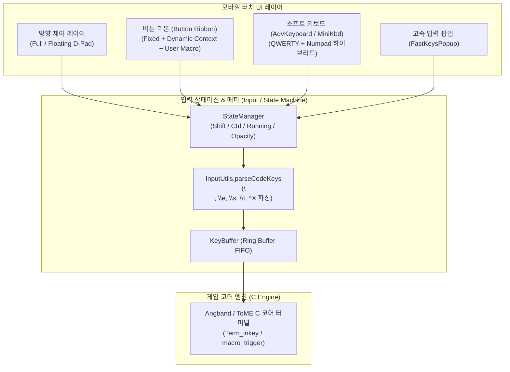

# Angband for Android 모바일 가상 키보드 & UX 아키텍처 분석 및 웹 프론트엔드 설계 사양서

> **목적**: `Cuboideb/angbandroid` 리포지토리의 모바일 전용 입력/키보드 UX 설계를 심층 역공학 분석하고, ToME 2.3.8 모바일 웹 프론트엔드(Phase 3)에서 사용할 경량 Data-Driven JSON 가상 키보드 및 리본 시스템 규격을 정의한다.  
> **핵심 설계 원칙**: «Preserve the game. Keep the transport thin. Make iteration cheap.»

---

## 1. Angbandroid 입력 아키텍처 역공학 분석 (Archaeology)

Angbandroid는 텍스트 터미널 기반 로그라이크 게임을 터치스크린 환경에서 플레이할 수 있도록 크게 4가지 입력 컴포넌트 레이어를 제공합니다:



### 1.1 주요 구현 파일 목록
- [AdvKeyboard.java](file:///data/data/com.termux/files/home/ref_repos/angbandroid/app/src/main/java/org/rephial/xyangband/AdvKeyboard.java): 5행 QWERTY + 우측 3x3 넘패드 통합 하이브리드 가상 키보드 및 Shift/Ctrl/Keymap 상태머신
- [AdvButton.java](file:///data/data/com.termux/files/home/ref_repos/angbandroid/app/src/main/java/org/rephial/xyangband/AdvButton.java): 키별 렌더링, 롱프레스(1000ms), 투명도 제어, 인라인 매크로 바인딩
- [ButtonRibbon.java](file:///data/data/com.termux/files/home/ref_repos/angbandroid/app/src/main/java/org/rephial/xyangband/ButtonRibbon.java): 상단/하단 가로 스크롤 버튼 리본 (고정 Esc/Enter/BackSpace + 동적 컨텍스트 키 + 사용자 매크로)
- [TermView.java](file:///data/data/com.termux/files/home/ref_repos/angbandroid/app/src/main/java/org/rephial/xyangband/TermView.java#L575-L640): 터미널 화면 위 3x3 Full Screen 터치 격자 및 우하단 플로팅 D-Pad 구현
- [MiniKbd.java](file:///data/data/com.termux/files/home/ref_repos/angbandroid/app/src/main/java/org/rephial/xyangband/MiniKbd.java): 한 손 조작용 5x4 초소형 키패드 (페이징 방식)
- [InputUtils.java](file:///data/data/com.termux/files/home/ref_repos/angbandroid/app/src/main/java/org/rephial/xyangband/InputUtils.java): 키코드 매핑, 제어문자(`^A`~`^Z`), 이스케이프 문자열 파싱
- [KeymapEditor.java](file:///data/data/com.termux/files/home/ref_repos/angbandroid/app/src/main/java/org/rephial/xyangband/KeymapEditor.java): 사용자 매크로 커스텀 에디터 및 직렬화

---

## 2. 세부 컴포넌트별 동작 메커니즘

### 2.1 하이브리드 소프트 키보드 (AdvKeyboard & Layout XML)

1. **가로/세로 레이아웃 분기**:
   - 가로(Landscape): 5행 10열 그리드. 좌측 QWERTY + 우측 방향 넘패드(7, 8, 9 / 4, 5, 6 / 1, 2, 3)가 한 화면에 공존하여 한 손으로 이동하면서 다른 손으로 명령을 입력 가능.
   - 세로(Portrait): 10행 5열 그리드로 재구성되어 한 화면 폭에 최적화.
2. **Shift / Modifier 상태머신**:
   - `shiftMode = 0`: 소문자 (`a`~`z`)
   - `shiftMode = 1`: 대문자 (`A`~`Z`) (Shift)
   - `shiftMode = 2`: 컨트롤 키 (`^A`~`^Z`) (Ctrl)
   - `lck` (Lock) 토글: 락이 걸려있지 않으면 키를 1회 누른 후 자동으로 `shiftMode = 0`으로 복귀, 락이 활성화되면 현재 모드 고정.
3. **페이지 전환 (`+/-`, `abc`)**:
   - Page 0: 기본 알파벳 + 숫자 + 주요 이동키
   - Page 1: 특수문자 (`~!#$&<>|=/\\[](){}\`^@+-_:;"?*`) + 기능키 (`F1`~`F10`)
4. **타이머 및 투명도 (Opacity & Timers)**:
   - `LONG_PRESS` (1000ms): 키를 길게 누르면 해당 키의 커스텀 매크로 설정 팝업([OptionPopup](file:///data/data/com.termux/files/home/ref_repos/angbandroid/app/src/main/java/org/rephial/xyangband/AdvButton.java#L232-L332)) 호출.
   - `AUTO_HIDE` (5000ms): 입력이 5초간 없으면 키보드가 반투명(Ghost/Dim) 모드로 전환되어 게임 시야 확보.
   - `BlackWhite` (◧): 키보드 가시성 3단계(완전 불투명 -> 반투명 -> 필수 키만 표시) 토글.

### 2.2 버튼 리본 (Button Ribbon)

상시 노출되는 가로 스크롤 바 형태로, 터미널 상단 또는 하단에 도킹됩니다.

```
[ FixedL: ⎋(Esc) | ⏎(Ret) | ⌫(BS) ] [ Dynamic1: (Context Keys / Fast Keys) >>> ] [ Dynamic2: User Macros ]
```

1. **고정 제어 영역 (FixedL)**:
   - 일반 상태: `⎋ (Escape)`, `⏎ (Enter)`, `⌫ (BackSpace)`
   - 질의응답 상태 (`yes_no` 모드): 게임에서 `[y/n]` 프롬프트가 발생하면 즉시 `⎋ (Esc)`, `n`, `y` 3개 버튼으로 치환되어 오입력 방지.
2. **동적 컨텍스트 영역 (Dynamic1)**:
   - 인벤토리 선택(`a`~`h`), 방향 선택(`1`~`9`), 마법 선택 등 게임 엔진의 요구에 따라 필요한 최소 키 세트만 버튼으로 동적 생성.
   - `F-Key` 패턴 감지 시 `F1`~`F12` 버튼 자동 주입.
3. **사용자 매크로 영역 (Dynamic2)**:
   - 사용자가 자주 쓰는 복합 명령(예: `m1a-`, `q1`, `R&`)을 등록하여 1터치 즉시 실행.

### 2.3 방향 제어 시스템 (Directional Controls / D-Pad)

로그라이크 특유의 8방향 이동을 터치로 완벽히 지원하기 위해 2가지 방식을 제공합니다:

1. **전체화면 3x3 보이지 않는 터치 격자 (Full Screen D-Pad)**:
   - 터미널 뷰 전체를 가로 `[20%, 60%, 20%]`, 세로 `[33%, 33%, 34%]` 비율의 9개 구역으로 가상 분할.
   - 중앙(5) 영역을 제외한 8개 외곽 구역을 탭/스와이프하면 해당 방향키(`1`~`4`, `6`~`9`) 즉시 발생.
   - 중앙 구역은 탐색/대기 또는 롱프레스 시 컨텍스트 메뉴 트리거로 활용.
2. **플로팅 D-Pad (Floating Corner D-Pad)**:
   - 화면 구석에 반투명 3x3 D-Pad 오버레이 렌더링.
   - `RepeatListener`가 장착되어 있어 꾹 누르고 있으면 초기 지연(400ms) 후 80ms 간격으로 고속 연속 이동 지원.
   - 중앙 '5' 버튼을 누른 채 드래그하면 원하는 위치로 D-Pad 자유 이동 및 좌표 영구 저장.

### 2.4 커스텀 매크로 및 데이터 직렬화 (Serialization Format)

Angbandroid는 키맵과 설정을 매우 가볍고 직관적인 문자열 포맷으로 직렬화하여 저장합니다:

1. **소프트키 매크로 바인딩 포맷 (`AdvKeyboard`)**:
   ```
   <Trigger>:prop:<Action>:prop:<AlwaysVisible>:sep:<Trigger>:prop:<Action>:prop:...
   ```
   - 예시: `a:prop:q1\n:prop:yes:sep:b:prop:\em@12\raaaa-:prop:no`
   - 이스케이프 지원:
     - `\n`: Enter (Return)
     - `\e`: Escape
     - `\s`: Space
     - `\t`: Tab
     - `^X`: Control + X (`KTRL(X) = X & 0x1F`)
2. **리본 매크로 행 직렬화 (`KeymapEditor`)**:
   - `Row1`과 `Row2`는 `#rowsep#`으로 구분.
   - 각 행 내부의 버튼 액션들은 `###`으로 구분.
   - 예시: `q1###m1a-###R&` + `#rowsep#` + `w0###d1`

---

## 3. ToME 2.3.8 모바일 웹 프론트엔드 키보드 아키텍처 제안

ToME 2.3.8 WebAssembly/WebSocket 환경에서 사용될 순수 모바일 웹(Vue/React/Vanilla TS) 전용 **Data-Driven JSON 가상 키보드 아키텍처**를 제안합니다.

### 3.1 JSON 키보드 데이터 스키마 (Keyboard Schema Specification)

```json
{
  "$schema": "http://json-schema.org/draft-07/schema#",
  "title": "MobileKeyboardConfig",
  "type": "object",
  "properties": {
    "profileName": { "type": "string" },
    "theme": {
      "type": "object",
      "properties": {
        "bg": { "type": "string" },
        "fg": { "type": "string" },
        "accent": { "type": "string" },
        "highContrast": { "type": "boolean" },
        "opacity": { "type": "number", "minimum": 0.1, "maximum": 1.0 }
      }
    },
    "ribbon": {
      "type": "object",
      "properties": {
        "fixedLeft": {
          "type": "array",
          "items": { "$ref": "#/definitions/KeyButton" }
        },
        "userMacros": {
          "type": "array",
          "items": { "$ref": "#/definitions/KeyButton" }
        }
      }
    },
    "layouts": {
      "type": "object",
      "properties": {
        "landscape": { "$ref": "#/definitions/LayoutPageSet" },
        "portrait": { "$ref": "#/definitions/LayoutPageSet" }
      }
    }
  },
  "definitions": {
    "KeyButton": {
      "type": "object",
      "required": ["label", "action"],
      "properties": {
        "label": { "type": "string" },
        "action": { "type": "string" },
        "type": { "type": "string", "enum": ["key", "macro", "mod", "page", "dpad", "ui"] },
        "repeat": { "type": "boolean", "default": false },
        "width": { "type": "number", "default": 1.0 },
        "highlight": { "type": "boolean", "default": false }
      }
    },
    "LayoutPageSet": {
      "type": "object",
      "properties": {
        "default": { "$ref": "#/definitions/GridPage" },
        "symbols": { "$ref": "#/definitions/GridPage" },
        "compact": { "$ref": "#/definitions/GridPage" }
      }
    },
    "GridPage": {
      "type": "object",
      "required": ["rows"],
      "properties": {
        "rows": {
          "type": "array",
          "items": {
            "type": "array",
            "items": { "$ref": "#/definitions/KeyButton" }
          }
        }
      }
    }
  }
}
```

### 3.2 ToME 2.3.8 기본 키보드 설정 JSON 예시 (Default Profile)

```json
{
  "profileName": "ToME 2.3.8 Default",
  "theme": {
    "bg": "rgba(30, 30, 36, 0.92)",
    "fg": "#F0F0F0",
    "accent": "#E69A28",
    "highContrast": false,
    "opacity": 0.95
  },
  "ribbon": {
    "fixedLeft": [
      { "label": "⎋", "action": "\\e", "type": "key" },
      { "label": "⏎", "action": "\\n", "type": "key" },
      { "label": "⌫", "action": "\\b", "type": "key" }
    ],
    "userMacros": [
      { "label": "Rest", "action": "R&\\n", "type": "macro" },
      { "label": "Map", "action": "M", "type": "key" },
      { "label": "Magic", "action": "m", "type": "key" },
      { "label": "Inven", "action": "i", "type": "key" },
      { "label": "Look", "action": "l", "type": "key" },
      { "label": "Target", "action": "*", "type": "key" },
      { "label": "Fire", "action": "f", "type": "key" }
    ]
  },
  "layouts": {
    "landscape": {
      "default": {
        "rows": [
          [
            { "label": "q", "action": "q", "type": "key" },
            { "label": "w", "action": "w", "type": "key" },
            { "label": "e", "action": "e", "type": "key" },
            { "label": "r", "action": "r", "type": "key" },
            { "label": "t", "action": "t", "type": "key" },
            { "label": "y", "action": "y", "type": "key" },
            { "label": "u", "action": "u", "type": "key" },
            { "label": "i", "action": "i", "type": "key" },
            { "label": "o", "action": "o", "type": "key" },
            { "label": "p", "action": "p", "type": "key" },
            { "label": "7", "action": "7", "type": "dpad", "repeat": true },
            { "label": "8", "action": "8", "type": "dpad", "repeat": true },
            { "label": "9", "action": "9", "type": "dpad", "repeat": true }
          ],
          [
            { "label": "a", "action": "a", "type": "key" },
            { "label": "s", "action": "s", "type": "key" },
            { "label": "d", "action": "d", "type": "key" },
            { "label": "f", "action": "f", "type": "key" },
            { "label": "g", "action": "g", "type": "key" },
            { "label": "h", "action": "h", "type": "key" },
            { "label": "j", "action": "j", "type": "key" },
            { "label": "k", "action": "k", "type": "key" },
            { "label": "l", "action": "l", "type": "key" },
            { "label": "*", "action": "*", "type": "key" },
            { "label": "4", "action": "4", "type": "dpad", "repeat": true },
            { "label": "5", "action": "5", "type": "dpad", "repeat": false },
            { "label": "6", "action": "6", "type": "dpad", "repeat": true }
          ],
          [
            { "label": "⇧", "action": "toggle_shift", "type": "mod" },
            { "label": "z", "action": "z", "type": "key" },
            { "label": "x", "action": "x", "type": "key" },
            { "label": "c", "action": "c", "type": "key" },
            { "label": "v", "action": "v", "type": "key" },
            { "label": "b", "action": "b", "type": "key" },
            { "label": "n", "action": "n", "type": "key" },
            { "label": "m", "action": "m", "type": "key" },
            { "label": "'", "action": "'", "type": "key" },
            { "label": "Sym", "action": "toggle_symbols", "type": "page" },
            { "label": "1", "action": "1", "type": "dpad", "repeat": true },
            { "label": "2", "action": "2", "type": "dpad", "repeat": true },
            { "label": "3", "action": "3", "type": "dpad", "repeat": true }
          ],
          [
            { "label": "Ctrl", "action": "toggle_ctrl", "type": "mod" },
            { "label": "RUN", "action": "toggle_run", "type": "mod" },
            { "label": "Space", "action": "\\s", "type": "key", "width": 2.0 },
            { "label": ".", "action": ".", "type": "key" },
            { "label": ",", "action": ",", "type": "key" },
            { "label": "<", "action": "<", "type": "key" },
            { "label": ">", "action": ">", "type": "key" },
            { "label": "0", "action": "0", "type": "key" },
            { "label": "Ghost", "action": "toggle_ghost", "type": "ui" }
          ]
        ]
      }
    }
  }
}
```

---

## 4. 프론트엔드 모듈 아키텍처 및 구현 설계

### 4.1 상태 머신 (Input State Machine)

웹 프론트엔드에서 관리하는 입력 상태:
```typescript
interface InputState {
  shift: boolean;          // Shift 활성화 여부
  ctrl: boolean;           // Ctrl 활성화 여부
  lock: boolean;           // 대/소문자 락 여부
  running: boolean;        // 달리기(Run / Shift+방향) 모드
  activePage: string;      // 'default' | 'symbols' | 'compact'
  opacityMode: 'solid' | 'ghost' | 'hidden';
  macroBuffer: string[];   // 연속 실행 대기 큐
}
```

- **키 입력 시퀀스 변환 (Action Resolution)**:
  1. `type === 'key'`:
     - if (`ctrl`): code = `action.toUpperCase().charCodeAt(0) - 64` (1..26)
     - else if (`shift`): code = `action.toUpperCase().charCodeAt(0)`
     - else: code = `action.charCodeAt(0)`
     - if (`!lock`): `shift = false; ctrl = false;` (일회성 해제)
  2. `type === 'dpad'`:
     - if (`running`): 전송 문자열 = `.` + `action` (또는 `Shift + 방향키`)
     - else: 전송 문자열 = `action`
  3. `type === 'macro'`:
     - `InputUtils.parseCodeKeys(action)`를 통해 `\e`, `\n`, `\s`, `^X`를 바이트 배열로 변환하여 게임 웹소켓/엔진 입력 큐로 연속 디스패치.

### 4.2 터미널 출력 감지 및 컨텍스트 리본 동적 변환 (Context Detection Sniffer)

Angband/ToME C 코어 터미널 스트림에서 특정 프롬프트 문자열이 감지되면 리본의 `dynamic` 영역을 즉시 해당 모드로 스위칭합니다:

```typescript
export class ContextRibbonSniffer {
  private static YES_NO_REGEX = /\((y\/n|y\/n\/esc|\[y\/n\])\)/i;
  private static DIRECTION_REGEX = /(Direction\?|Which direction\?)/i;
  private static ITEM_CHOICE_REGEX = /\([a-z]-[a-z]\)|\([a-z]\/[a-z]\)/i;

  public static inspectScreenLine(line: string, ribbon: WebRibbonController) {
    if (this.YES_NO_REGEX.test(line)) {
      ribbon.setContextMode('yes_no'); // [Esc] [No (n)] [Yes (y)] 즉시 주입
    } else if (this.DIRECTION_REGEX.test(line)) {
      ribbon.setContextMode('direction'); // 8방향 화살표 버튼 주입
    } else {
      ribbon.restoreUserMacros();
    }
  }
}
```

### 4.3 가상 D-Pad 터치 제스처 제어 (Virtual Touch D-Pad)

모바일 화면에서 캔버스 터치 제스처를 감지하는 방법:
1. **화면 3x3 존 터치**:
   - 가로 `[0..20%]`, `[20%..80%]`, `[80%..100%]`
   - 세로 `[0..33%]`, `[33%..67%]`, `[67%..100%]`
   - 모바일 브라우저의 기본 제스처(핀치 줌, 더블탭 줌, 풀투리프레시)를 `touch-action: none`과 `event.preventDefault()`로 완전 차단.
2. **반복 타이머 (Continuous Repeat)**:
   - `pointerdown`: 350ms 지연 타이머 시작 (`setTimeout`)
   - 지연 경과 시: 70ms 간격으로 반복 전송 (`setInterval`)
   - `pointerup` / `pointercancel`: 타이머 클리어.

---

## 5. 결론 및 ToME 2.3.8 Mobile 로드맵 제언

1. **Phase 3 (웹 프론트엔드 구축)**:
   - 본 사양서의 `JSON Keyboard Schema`를 기반으로 한 Web Component/Canvas 기반 키보드를 구현하여 디바이스 크기(폰, 태블릿)에 맞춰 실시간 재배치 지원.
   - Angbandroid의 핵심 강점인 **[QWERTY + 우측 3x3 넘패드 통합]** 구조를 채택하여 세로/가로 모드 모두에서 탁월한 조작감 제공.
2. **Phase 6 (TomeNET Runecraft 포팅)**:
   - `docs/tomenet_runecraft_spec.md`에서 도출된 6원소 휠 UI를 본 가상 키보드의 특수 모달(`Runecraft Modal`)로 결합하여 원클릭 룬 조합 및 시전 매크로 등록 기능 제공.
