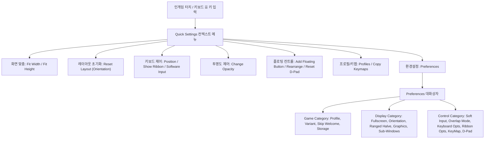

# 모바일 UI/UX 설정 계층 구조, 키보드/화면 레이아웃 및 플로팅 컨트롤러 구현 계획서
(Mobile UI/UX Setup Hierarchy, Keyboard/Screen Layout & Floating Controllers Implementation Plan)

---

## 1. 개요 및 8종 실기 스크린샷 전수 시각 역공학 감사 (Executive Summary & Visual Audit)

본 문서는 안드로이드 로그라이크 포팅의 정점에 있는 Angbandroid(`https://github.com/Cuboideb/angbandroid`)의 실기 캡처 스크린샷 8종 및 원작 자바/리소스 소스 코드를 전수 분석하여, 웹 모바일 환경(`xterm.js` 기반 터미널 엔진)에서 **창작이나 임의 변형 없이 100% 동일하게 이식**하기 위한 최종 구현 계획서이다.

### 1.1 스크린샷 8종 전수 분석 매트릭스

| 번호 | 스크린샷 파일명 | 화면 분류 | 핵심 UI 구성 요소 및 시각 속성 | 원작 참조 소스 코드 |
|:---|:---|:---|:---|:---|
| 1 | `Screenshot_20261002_111734_Angband.jpg` | 가로 모드 (Landscape) 인게임 플레이 | - 상단 상태바 (캐릭터 상태, HP/SP, 스탯)<br>- 중앙 던전 뷰포트 (타일셋 렌더링)<br>- 하단 좌측: 5×10 반투명 네온 시안 가상 키보드 (`#00e5ff`, 다크 글래스)<br>- 하단 우측: 3×3 반투명 플로팅 D-Pad | [`GameActivity.java`](file:///data/data/com.termux/files/home/ref_repos/angbandroid/app/src/main/java/org/rephial/xyangband/GameActivity.java#L745-L825)<br>[`AdvKeyboard.java`](file:///data/data/com.termux/files/home/ref_repos/angbandroid/app/src/main/java/org/rephial/xyangband/AdvKeyboard.java)<br>[`TermView.java`](file:///data/data/com.termux/files/home/ref_repos/angbandroid/app/src/main/java/org/rephial/xyangband/TermView.java#L685-L737) |
| 2 | `Screenshot_20261002_111752_Angband.jpg` | 퀵 세팅 모달 1 (Quick Settings Top) | - 팝업 헤더: `Quick Settings`<br>- 목록 항목 (상단부):<br>  1. `Fit Width`<br>  2. `Fit Height`<br>  3. `Reset Layout (Landscape)`<br>  4. `Add Floating Button`<br>  5. `Keyboard Position`<br>  6. `Show Button Ribbon` | [`GameActivity.java`](file:///data/data/com.termux/files/home/ref_repos/angbandroid/app/src/main/java/org/rephial/xyangband/GameActivity.java#L748-L767) |
| 3 | `Screenshot_20261002_111758_Angband.jpg` | 퀵 세팅 모달 2 (Quick Settings Bottom) | - 목록 항목 (하단부):<br>  7. `Toggle Running OFF`<br>  8. `Change Opacity`<br>  9. `Rearrange Floating Buttons`<br>  10. `Reset D-Pad Position`<br>  11. `Preferences`<br>  12. `Profiles`<br>  13. `Copy Keymaps and Floating Buttons`<br>  14. `Location of App Files`<br>  15. `Help`<br>  16. `Quit` | [`GameActivity.java`](file:///data/data/com.termux/files/home/ref_repos/angbandroid/app/src/main/java/org/rephial/xyangband/GameActivity.java#L772-L800) |
| 4 | `Screenshot_20261002_111805_Angband.jpg` | 환경설정 1 (Preferences Page 1) | - 헤더: `Angband Preferences`<br>- `Game category` (Game Profile, Selected variant, Skip welcome screen, Storage Location)<br>- `Display category` (Full screen, Orientation, Halve max distance) | [`preferences.xml`](file:///data/data/com.termux/files/home/ref_repos/angbandroid/app/src/main/res/xml/preferences.xml#L3-L20)<br>[`Preferences.java`](file:///data/data/com.termux/files/home/ref_repos/angbandroid/app/src/main/java/org/rephial/xyangband/Preferences.java) |
| 5 | `Screenshot_20261002_112707_Angband.jpg` | 환경설정 1 상세 (Preferences Page 1 View) | - `Graphics options` (서브스크린: Tileset, Tile Multiplier, Health bars 등)<br>- `Sub-Windows settings` (서브윈도우 컬럼/로우/폰트) | [`preferences.xml`](file:///data/data/com.termux/files/home/ref_repos/angbandroid/app/src/main/res/xml/preferences.xml#L20-L37) |
| 6 | `Screenshot_20261002_112737_Angband.jpg` | 환경설정 2 (Preferences Page 2) | - `Control category`:<br>  - `Enable Software Input`<br>  - `Overlap Input Controls`<br>  - `Soft Keyboard options`<br>  - `Button Ribbon options`<br>  - `Hardware Key Mapping`<br>  - `Directional Pad (D-Pad)`<br>  - `Debug keycodes (external keyboards)` | [`preferences.xml`](file:///data/data/com.termux/files/home/ref_repos/angbandroid/app/src/main/res/xml/preferences.xml#L38-L177) |
| 7 | `Screenshot_20261002_112818_Angband.jpg` | 세로 모드 (Portrait) 오버랩 플레이 | - 세로 전체 화면 레이아웃<br>- 상단 상태 표시 영역 (수직 밀집형)<br>- 중앙 80×24 던전 뷰포트<br>- 하단 5×10 네온 시안 키보드 오버레이<br>- 우하단 키보드 상단에 배치된 3×3 플로팅 D-Pad<br>- 좌측 반투명 필(Pill) 드래그 핸들 | [`TermView.java`](file:///data/data/com.termux/files/home/ref_repos/angbandroid/app/src/main/java/org/rephial/xyangband/TermView.java#L685-L737)<br>[`AdvKeyboard.java`](file:///data/data/com.termux/files/home/ref_repos/angbandroid/app/src/main/java/org/rephial/xyangband/AdvKeyboard.java) |
| 8 | `Screenshot_20261002_112826_Angband.jpg` | 세로 모드 줌인 & 투과 오버랩 플레이 | - 플레이어 `@` 중심 줌인 뷰포트<br>- 키보드 투명도에 의해 키캡 아래로 던전 바닥 타일 투과 가시화<br>- `angband.allowKeyboardOverlap = true` 동작 검증 | [`Preferences.java`](file:///data/data/com.termux/files/home/ref_repos/angbandroid/app/src/main/java/org/rephial/xyangband/Preferences.java#L404)<br>[`TermView.java`](file:///data/data/com.termux/files/home/ref_repos/angbandroid/app/src/main/java/org/rephial/xyangband/TermView.java#L2100-L2170) |

---

## 2. 설정 계층 구조 (Setup Hierarchy: Quick Settings & Preferences)

Angbandroid는 두 단계의 설정 계층 구조를 갖는다:
1. **인게임 퀵 설정 (`Quick Settings` Context Menu)**: 게임 플레이 도중 레이아웃 피팅, 입력 장치 토글, 투명도 조절, FAB 추가/정렬 등을 즉시 수행하는 컨텍스트 메뉴.
2. **글로벌 환경설정 (`Preferences` Modal)**: 안드로이드 `PreferenceScreen` 규격에 맞춘 게임, 디스플레이, 조작 체계의 전역 설정 모달.



### 2.1 인게임 퀵 메뉴 (`Quick Settings`) 전수 사양

- **트리거 메커니즘**:
  - 소프트웨어 키보드가 비활성화되어 있거나 화면 전체를 터미널로 사용할 때: 화면 좌측 하단 코너 영역 터치.
  - 가상 키보드가 활성화되어 있을 때: 5행 10열 키보드의 Row 4 Col 1 `☰` (Menu) 키 원터치.
- **모달 스타일링**:
  - 다크 헤더 (`#14141a`, 텍스트 흰색 `#ffffff`, `font-size: 18px`, `font-weight: 700`)
  - 모달 본체: 화이트 카드 (`#ffffff`, 폭 `320px`, 모바일 반응형 `max-width: 90vw`, `border-radius: 8px`)
  - 리스트 아이템: 높이 `48px`, 텍스트 색상 `#222226`, 구분선 `#ececf0`, 탭 시 하이라이트 `#e5e5ea`

#### 메뉴 항목 16종 전수 목록 및 동작 바인딩 (`GameActivity.java:748-800, 830-900`)

```
+-------------------------------------------------------------+
| Quick Settings                                              |
+-------------------------------------------------------------+
| Fit Width                                                   | -> 터미널 폭 80열을 화면 폭에 일치 (폰트 확대/축소)
| Fit Height                                                  | -> 터미널 높이 24행을 화면 높이에 일치
| Reset Layout (Landscape/Portrait)                           | -> 현재 화면 방향의 기본 폰트 크기 및 드래그 오프셋(0,0) 리셋
| Add Floating Button                                         | -> 화면 중앙에 신규 FAB 생성 및 FabCrudPopup 표시
| Keyboard Position                                           | -> 5개 위치 선택 팝업 (Center, Bottom-L/R, Top-L/R)
| Show Button Ribbon / Show Full Keyboard                     | -> 리본 바 모드 <-> 풀 5x10 가상 키보드 토글
| Toggle Running (ON / OFF)                                   | -> 달리기(Run) 모드 상태 토글 (로그라이크 탐색 가속)
| Change Opacity                                              | -> 가상 키보드/컨트롤러 투명도 슬라이더 팝업 호출
| Rearrange Floating Buttons                                  | -> 모든 사용자 정의 FAB를 좌하단 기준 5개씩 바둑판 정렬
| Reset D-Pad Position                                        | -> 3x3 D-Pad를 우하단 기본 앵커 좌표로 즉시 복귀
| Preferences                                                 | -> Preferences 전역 모달 창 오픈
| Profiles                                                    | -> 게임 프로필 관리 모달 (추가/선택/삭제) 오픈
| Copy Keymaps and Floating Buttons                           | -> 다중 프로필 간 온스크린 키맵 및 FAB 복사 다이얼로그
| Location of App Files                                       | -> 로컬 스토리지 / 가상 파일시스템 경로 정보 알림창
| Help                                                        | -> 영문 명령어 도움말 및 조작 가이드 표시
| Quit                                                        | -> 게임 상태 세이브 후 애플리케이션 종료
+-------------------------------------------------------------+
```

### 2.2 전역 환경설정 (`Preferences`) 전수 사양 (`preferences.xml`)

#### [Category 1] Game Category
1. `Game Profile` (`angband.gameprofile`): 프로필 관리자(`ProfilesActivity`) 진입.
2. `Selected variant` (`angband.gameplugin`): 플레이할 록라이크 변종 플러그인 선택 (기본: Angband / ToME 2.3.8 호환).
3. `Skip welcome screen` (`angband.skipwelcome`): 시작 시 캐릭터 생성 환영 프롬프트 건너뛰기 (기본값: `false`).
4. `Storage Location` (`angband.tmp_storage`): 세이브 파일 및 사용자 리소스 저장소 (Internal / External / IndexedDB, Restart required).

#### [Category 2] Display Category
1. `Full screen` (`angband.fullscreen`): 상단 상태바 및 시스템 바 숨김 전체화면 (기본값: `true`).
2. `Orientation` (`angband.orientation`): 화면 회전 잠금 제어 (`0: Auto`, `1: Portrait`, `2: Landscape`).
3. `Halve max distance of ranged attacks for V and FA` (`angband.range_reduction`): 소형 모바일 화면에서 원거리 사격 시야 1/2 축소 (기본값: `false`).
4. `Graphics options` (서브 모달):
   - `Tileset` (`angband.graphics`): ASCII 기본 또는 타일셋(Adam Bolt 16x16, David Gervais 32x32 등) 선택.
   - `Tile Multiplier` (`angband.tile_multiplier`): `1x1`, `2x1`, `2x2`, `3x3`, `4x2` 등 종횡비 배율.
   - `Draw health bars` (`angband.draw_health_bars`): 몬스터 및 플레이어 상단 체력바 렌더링 (기본값: `true`).
   - `Show small ascii helper for tiles` (`angband.ascii_helper`): 타일 모드 시 ASCII 힌트 투명도 (기본: `0%`, 추천: `40%`).
   - `Show Mouse Icon` (`angband.show_mouse_icon`): 타일 직접 터치 선택을 위한 마우스 커서 표시.
5. `Sub-Windows settings` (서브 모달):
   - `Number of sub-windows` (`angband.n_subwindows`): 메시지 로그, 인벤토리, 장비, 몬스터 리스트 등 분할 윈도우 수 (0~4).
   - `Layout sub-windows horizontally` (`angband.horiz_subwindows`): 가로 분할 여부.
   - `Angband Top Bar` (`angband.top_bar`): 캐릭터 스탯을 좌측 대신 최상단 1~2행에 컴팩트 표시 (기본값: `true`).

#### [Category 3] Control Category
1. `Enable Software Input` (`angband.enable_soft_input`): 온스크린 소프트웨어 입력 활성화 (비활성화 시 물리 키보드 모드, 좌하단 탭으로 복구 가능).
2. `Overlap Input Controls` (`angband.allowKeyboardOverlap`): **가상 키보드 및 플로팅 컨트롤을 게임 화면(던전 뷰포트) 위에 겹쳐서 그리는 오버랩 모드** (기본값: `true`).
3. `Soft Keyboard options` (서브 모달):
   - `Keyboard Position` (`angband.keyboardPosition`): 0: Center, 1: Bottom-Left, 2: Bottom-Right, 3: Top-Left, 4: Top-Right.
   - `Keyboard Opacity` (`angband.keyboardOpacity`): 키보드 기본 불투명도 (SeekBar: 0% ~ 100%, 기본: `50%` ~ `70%`).
   - `Middle Opacity` (`angband.middleOpacity`): 뷰포트 중앙부 투명도 오버라이드.
   - `Use Full Keyboard` (`angband.use_adv_keyboard`): 5x10 AdvKeyboard 사용 여부 (OFF 시 미니 키보드 리본).
   - `Vertical Keyboard` (`angband.use_vert_keyboard`): 세로 전용 고밀도 키보드 모드.
   - `Show keymaps if keymap mode is ON` (`angband.show_adv_keymaps`): `kmp` 모드 활성화 시 키캡에 커스텀 매크로 라벨 표시.
   - `Hide keys after 5 seconds` (`angband.auto_hide_adv_kbd`): 미입력 시 키보드 자동 숨김 (기본: `false`).
   - `Keyboard Width / Height` (`angband.keyboard_width`, `angband.keyboard_height`): 크기 조절 슬라이더.
4. `Directional Pad (D-Pad)` (서브 모달):
   - `Enable Touch Directionals` (`angband.enabletouch`): 3x3 D-Pad 활성화.
   - `Touch directional size multiplier` (`angband.touchmultiplier`): D-Pad 크기 조절 (0% ~ 100%).
   - `Allow drag-and-drop of the touch directionals` (`angband.enable_touch_drag`): '5' 버튼 터치 드래그로 화면 어디든 D-Pad 이동 허용 (기본: `true`).
   - `Center screen tap action` (`angband.centerscreentap`): 화면 중앙 탭 시 실행할 가상 키 (기본값: `5` = 대기/탐색).
   - `D-Pad Color 1 / Color 2`: D-Pad 테두리 및 텍스트 색상 커스터마이징.

---

## 3. 5행 10열 네온 시안 AdvKeyboard 레이아웃 및 비주얼 테마

스크린샷 1, 7, 8에서 확인되는 Angbandroid의 가상 키보드는 미려한 **다크 글래스모피즘(Dark Glassmorphism)** 바탕 위에 **고휘도 네온 시안(Neon Teal / Cyan, `#00e5ff`)** 폰트와 심볼이 발광하는 독자적인 비주얼 아이덴티티를 지닌다.

### 3.1 비주얼 테마 및 디자인 토큰 사양

```css
:root {
  /* 다크 글래스모피즘 베이스 */
  --kbd-bg: rgba(10, 10, 14, 0.75);
  --kbd-backdrop-blur: blur(8px);
  --kbd-border-top: 1px solid rgba(0, 229, 255, 0.25);
  --kbd-shadow: 0 -4px 24px rgba(0, 0, 0, 0.85);

  /* 키캡 스타일링 */
  --key-bg: rgba(22, 24, 32, 0.65);
  --key-border: rgba(0, 229, 255, 0.20);
  --key-border-radius: 5px;
  --key-shadow: 0 2px 5px rgba(0, 0, 0, 0.6);

  /* 네온 시안 발광 타이포그래피 */
  --neon-cyan: #00e5ff;
  --neon-glow: 0 0 6px rgba(0, 229, 255, 0.65), 0 0 12px rgba(0, 229, 255, 0.25);
  --font-family: -apple-system, BlinkMacSystemFont, "Segoe UI", Roboto, "Consolas", monospace;

  /* 키캡 프레스 & 토글 피드백 */
  --key-active-bg: #00e5ff;
  --key-active-fg: #000000;
  --key-toggled-bg: #00e5ff;
  --key-toggled-fg: #000000;

  /* 온스크린 키맵 매핑 키캡 강조 */
  --key-mapped-fg: #a3e635;
  --key-mapped-glow: 0 0 6px rgba(163, 230, 53, 0.7);
  --key-mapped-border: rgba(163, 230, 53, 0.45);
}
```

### 3.2 5×10 완전 키 매트릭스 (Row 0 ~ Row 4)

키보드는 가로 10열, 세로 5행(총 50개 키)의 고정 그리드로 구성되며, 각 키는 균등 분할 Flex/Grid 레이아웃을 취한다.

```
+-----+-----+-----+-----+-----+-----+-----+-----+-----+-----+
|  1  |  2  |  3  |  4  |  5  |  6  |  7  |  8  |  9  |  0  |  <- Row 0: 숫자 및 타겟팅
+-----+-----+-----+-----+-----+-----+-----+-----+-----+-----+
|  q  |  w  |  e  |  r  |  t  |  y  |  u  |  i  |  o  |  p  |  <- Row 1: QWERTY 1열
+-----+-----+-----+-----+-----+-----+-----+-----+-----+-----+
|  a  |  s  |  d  |  f  |  g  |  h  |  j  |  k  |  l  |  *  |  <- Row 2: QWERTY 2열 + 타겟팅(*)
+-----+-----+-----+-----+-----+-----+-----+-----+-----+-----+
|  ⇧  |  z  |  x  |  c  |  v  |  b  |  n  |  m  |  '  |  ⌫  |  <- Row 3: Shift, QWERTY 3열, Backspace
+-----+-----+-----+-----+-----+-----+-----+-----+-----+-----+
|  ◧  |  ☰  | +/- | kmp | run |  .  | lck |  ―  |  ↻  |  ⏎  |  <- Row 4: 모바일 전용 기능 제어열
+-----+-----+-----+-----+-----+-----+-----+-----+-----+-----+
```

### 3.3 Row 4 특수 기능키 상세 동작 명세

| 키캡 | 키 명칭 | 심볼 코드 | 동작 메커니즘 및 엔진 송출 데이터 |
|:---:|:---|:---:|:---|
| **`◧`** | **Opacity** | U+25E7 | 가상 키보드 및 온스크린 컨트롤러 투명도 즉각 순환 (30% -> 50% -> 75% -> 100% -> 30%) 또는 롱프레스 시 `OpacityPopup` 슬라이더 다이얼로그 호출 |
| **`☰`** | **Menu** | U+2630 | 인게임 `Quick Settings` 컨텍스트 메뉴 즉시 팝업 (`GameActivity.onCreateContextMenu` 호출) |
| **`+/-`** | **Sign / Page** | ASCII | 기본 모드에서는 심볼/F-Key 레이어(Page 1)로 전환 토글. 매크로/수량 입력 모드에서는 음수/양수 부호 반전 |
| **`kmp`** | **Keymap Mode** | Text | 온스크린 키맵 모드 토글. 활성화 시 커스텀 매크로가 지정된 키들이 라임 그린(`#a3e635`)으로 빛나며, 키를 길게 누르면 `KeymapEditor` 모달이 열려 매크로 편집 가능 |
| **`run`** | **Toggle Running**| Text | 로그라이크 달리기 상태 토글 (`state.setRunningMode(!state.getRunningMode())`). 방향키 입력 시 장애물/갈림길까지 자동 연속 이동 (`. + dir` 효과) |
| **`.`** | **Rest / Period** | ASCII `.` | 제자리 1턴 대기(Rest) 수행 (`.` 문자 송출). 몬스터 접근 대기나 HP/SP 자연 회복 시 사용 |
| **`lck`** | **Caps Lock** | Text | 대문자 입력 고정 토글. 활성화 시 키보드 전체가 대문자(`A~Z`)로 유지되며 버튼 배경이 네온 시안으로 반전 점등 |
| **`―`** | **Space Bar** | U+2015 | 스페이스바 문자(`0x20`) 송출. 대화문 스킵, 타겟 선택 확정, 기본 메시지 넘김 수행 |
| **`↻`** | **Redo / Repeat** | U+21BB | 직전 명령어 반복 매크로 (`n` 키 송출 또는 `0` 키 프리픽스 반복). 채굴, 반복 탐색 시 사용 |
| **`⏎`** | **Enter / Return**| U+23CE | 캐리지 리턴 문자(`0x0D`, `\r`) 송출. 인벤토리 아이템 선택 확인, 프롬프트 수락 |

---

## 4. 뷰포트 화면 적응 & 오버랩 모드 엔진 (Viewport Layout & Screen Fit)

### 4.1 도킹 모드(Docked Mode) vs 오버랩 모드(Overlap Mode)

Angbandroid 실기 스크린샷 1, 7, 8에서 가장 두드러지는 특징은 **`angband.allowKeyboardOverlap = true`** 설정이다.

```
[ 도킹 모드: Overlap = false ]            [ 오버랩 모드: Overlap = true (Angbandroid 실기) ]
+-------------------------------+         +-----------------------------------------------+
| Top Bar (HP/SP, Stats)        |         | Top Bar (HP/SP, Stats)                        |
+-------------------------------+         +-----------------------------------------------+
|                               |         |                                               |
|       Terminal Canvas         |         |                Terminal Canvas                |
|      (가용 높이 축소)            |         |            (전체 높이 100vh 점유)                |
|                               |         |                                               |
+-------------------------------+         |      +---------------------+   +-----------+  |
| 5x10 Virtual Keyboard (고정)   |         |      | 5x10 Neon Keyboard  |   | 3x3 D-Pad |  |
| (화면 아래 절반 물리 점유)        |         |      | (반투명 다크 글래스)   |   | (플로팅)  |  |
+-------------------------------+         +------+---------------------+---+-----------+--+
```

1. **도킹 모드 (`Overlap = false`)**:
   - 가상 키보드가 전체 화면의 하단 영역(예: 세로 모드 기준 38vh)을 물리적으로 분할 점유한다.
   - 상단 터미널 뷰포트의 `height`는 `calc(100vh - var(--top-bar-height) - var(--kbd-height))`로 강제 축소된다.
   - 키보드가 게임 뷰포트를 전혀 가리지 않으나, 폰트 크기가 극도로 작아져 80x24 터미널의 가독성이 저하된다.
2. **오버랩 모드 (`Overlap = true`) (실기 표준 구현)**:
   - 터미널 캔버스가 상단 바를 제외한 화면 전체(100vh)를 온전히 차지한다.
   - 가상 키보드 및 3x3 D-Pad는 `position: absolute; bottom: 0; pointer-events: auto;`로 터미널 위에 떠 있는 상태로 렌더링된다.
   - 키보드 배경이 반투명 다크 글래스(`rgba(10, 10, 14, 0.75)`)로 설정되어, 키캡 사이와 배경 뒤로 던전 바닥 타일과 지형이 투과 가시화된다 (스크린샷 8 증명).
   - 플레이어는 화면을 팬/줌하여 키보드 위쪽 투명 영역에 던전 시야를 확보할 수 있다.

### 4.2 뷰포트 자동 피팅 수학 알고리즘 (`Fit Width` vs `Fit Height`)

Angbandroid 소스 코드 `TermView.java:adjustSize()` 및 `GameActivity.java:833-844`에 구현된 뷰포트 피팅 수식을 웹 캔버스 좌표계로 엄밀하게 정립한다.

#### 수식 정의

- 터미널 격자: 가로 $C = 80$, 세로 $R = 24$ (표준 메인 윈도우)
- 화면 가용 픽셀 영역: $W_{screen}$, $H_{screen} = H_{viewport} - H_{top\_bar}$
- 폰트 종횡비: $\alpha = \frac{\text{cellWidth}}{\text{cellHeight}} \approx 0.55 \sim 0.60$ (모노스페이스 폰트)

#### 1. `Fit Width` 알고리즘 (세로 모드 Portrait 기본 최적화)

화면 가로 폭 $W_{screen}$에 80열 전체가 정확히 100% 차도록 폰트 크기를 산출한다.

$$\text{cellWidth} = \left\lfloor \frac{W_{screen}}{C} \right\rfloor = \left\lfloor \frac{W_{screen}}{80} \right\rfloor$$

$$\text{fontSize} = \left\lfloor \frac{\text{cellWidth}}{\alpha} \right\rfloor$$

$$\text{cellHeight} = \text{fontSize} \times \text{lineHeightRatio}$$

이때 전체 터미널 높이는 $H_{term} = R \times \text{cellHeight}$가 되며, 세로 모드 화면에서는 상단 바 바로 아래에 컴팩트하게 정렬되고 하단 나머지 영역은 키보드 및 D-Pad가 오버랩된다.

#### 2. `Fit Height` 알고리즘 (가로 모드 Landscape 기본 최적화)

화면 세로 가용 높이 $H_{screen}$에 24행 전체가 정확히 100% 차도록 폰트 크기를 산출한다.

$$\text{cellHeight} = \left\lfloor \frac{H_{screen}}{R} \right\rfloor = \left\lfloor \frac{H_{screen}}{24} \right\rfloor$$

$$\text{fontSize} = \text{cellHeight} \times \beta \quad (\text{단, } \beta \approx 0.85)$$

$$\text{cellWidth} = \text{fontSize} \times \alpha$$

가로 모드에서는 높이가 꽉 채워지며 가로 방향 여백에 좌측 키보드와 우측 D-Pad가 자연스럽게 분할 오버랩된다.

#### 3. `Reset Layout` 동작

- 디바이스의 물리 DPI 및 화면 방향(Portrait / Landscape)에 사전에 저장된 이상적인 기본 폰트 크기(`defaultFontSize`)로 복귀한다.
- 사용자가 터치 제스처로 이동시킨 화면 스크롤 오프셋 $\Delta x, \Delta y$를 `(0, 0)`으로 리셋하고 플레이어 위치(`@`)를 화면 중심축에 재정렬한다.

---

## 5. 플로팅 컨트롤러: 드래그 3×3 D-Pad 및 커스텀 FAB 시스템

스크린샷 1, 7에 나타난 3×3 D-Pad와 Quick Settings를 통해 동적으로 생성되는 사용자 정의 FAB(Floating Action Button)는 한 손 또는 양손 터치 플레이의 핵심 편의 장치이다.

### 5.1 3×3 플로팅 D-Pad (Floating Directional Pad)

```
+-------+-------+-------+
|   7   |   8   |   9   |   <- 7: 좌상단, 8: 상단, 9: 우상단
|   ↖   |   ↑   |   ↗   |
+-------+-------+-------+
|   4   |   5   |   6   |   <- 4: 좌측, 5: 제자리 대기 및 "드래그 앵커", 6: 우측
|   ←   |  ●/DRG|   →   |
+-------+-------+-------+
|   1   |   2   |   3   |   <- 1: 좌하단, 2: 하단, 3: 우하단
|   ↙   |   ↓   |   ↘   |
+-------+-------+-------+
```

#### D-Pad 좌표 및 방향 인덱싱 수학 공식 (`TermView.java:723`)

각 격자 칸의 좌표 $(px, py) \in \{1, 2, 3\}^2$에 대하여 송출되는 로그라이크 이동 키 문자 코드는 다음과 같이 계산된다:

$$\text{directionChar} = (3 - py) \times 3 + px + \text{'0'}$$

- $py = 1$ (최상단): $px=1 \rightarrow \text{'7'}$, $px=2 \rightarrow \text{'8'}$, $px=3 \rightarrow \text{'9'}$
- $py = 2$ (중간행): $px=1 \rightarrow \text{'4'}$, $px=2 \rightarrow \text{'5'}$, $px=3 \rightarrow \text{'6'}$
- $py = 3$ (최하단): $px=1 \rightarrow \text{'1'}$, $px=2 \rightarrow \text{'2'}$, $px=3 \rightarrow \text{'3'}$

#### 중심점 `'5'` 드래그 앤 드롭 이동 로직 (`TermView.java:2112-2165`)

1. **외곽 방향키 ('1'~'4', '6'~'9')**:
   - `draggingEnabled() = false`
   - `repeatEnabled() = true` (`RepeatListener` 가동: 누르고 있으면 500ms 후 80ms 간격으로 연속 이동 명령 송출)
2. **중심키 ('5')**:
   - `repeatEnabled() = false`
   - `draggingEnabled() = true` (`direction == '5' && Preferences.getEnableTouchDrag() == true`)
   - 터치 이동 감지 시: 전체 3x3 D-Pad 컨테이너의 오프셋 델타 $\Delta x, \Delta y$를 즉각 가산하여 뷰포트 상에서 실시간 이동:
     $$\text{dragOffset.x} \mathrel{+}= dx, \quad \text{dragOffset.y} \mathrel{+}= dy$$
   - 터치 해제(`pointerup`) 시: 최종 오프셋을 영구 저장:
     ```javascript
     localStorage.setItem('dpad_drag_offset', JSON.stringify({ x: dragOffset.x, y: dragOffset.y }));
     ```
3. **위치 리셋**:
   - Quick Settings에서 `Reset D-Pad Position` 선택 시 즉시 오프셋을 `(0, 0)`으로 초기화하여 기본 화면 우하단 앵커로 복구.

---

### 5.2 커스텀 플로팅 액션 버튼 (Custom FAB) 및 `FabCrudPopup`

플레이어는 Quick Settings의 `Add Floating Button`을 눌러 화면 어디에나 원하는 매크로 키를 생성할 수 있다.

#### `FabCrudPopup` 생성 모달 전수 UI 구성 (`fab_crud.xml`)

```
+-------------------------------------------------------------+
| Floating Button Configuration                               |
+-------------------------------------------------------------+
| Action: [ m1a*                  ]  [ 🗑️ Delete Button ]     |
| Label:  [ Zap  ] (max 4 chars)                              |
+-------------------------------------------------------------+
| Quick Inserts:                                              |
| [ Ret ] [ Esc ] [ Space ] [ Tab ] [ . ] [ l ] [ Overview ]  |
| [X] Fixed XY (화면 고정)                                     |
+-------------------------------------------------------------+
| Icon Selection Grid:                                        |
| [ 🗡️ ] [ 🛡️ ] [ 🧪 ] [ 📜 ] [ 💍 ]                          |
| [ 🏹 ] [  wand] [ 💰 ] [ 🔑 ] [ 🚪 ]                         |
| [ ⚡ ] [ 🔥 ] [ ❄️ ] [ 👁️ ] [ 🏃 ]                          |
| [ 📖 ] [ 🍖 ] [ 💎 ] [ ⛏️ ] [ 🗺️ ]                          |
+-------------------------------------------------------------+
| Global button size: [-------O--------] (SeekBar)            |
| This button size:   [----------O-----] (SeekBar)            |
| This button opacity:[-------------O--] (SeekBar)            |
+-------------------------------------------------------------+
| [ Save & Apply ]                          [ Cancel ]        |
+-------------------------------------------------------------+
```

1. **Action 입력 필드 (`actionTxt`)**: 버튼 터치 시 터미널로 다이렉트 전송할 매크로 문자열 (예: 물약 마시기 `q1`, 완드 발동 `z1*`, 마법 시전 `m1a`).
2. **Label 입력 필드 (`labelTxt`)**: 버튼 내부에 표시할 1~4글자 텍스트 (아이콘 미선택 시 사용).
3. **Quick Insert 버튼군**: 로그라이크 특수키(`\r`, `\x1b`, ` `, `\t`, `.`, `l`) 원클릭 삽입.
4. **Fixed XY 체크박스**: 드래그 잠금 여부.
5. **크기 및 투명도 슬라이더**:
   - `global_size_mult`: 모든 FAB의 기본 반경 배율.
   - `custom_size_mult`: 해당 버튼 전용 크기 오버라이드.
   - `custom_opacity`: 해당 버튼 전용 투명도 오버라이드.
6. **자동 재배치 알고리즘 (`Rearrange Floating Buttons` - `TermView.java:2174-2200`)**:
   - 생성된 FAB들이 화면에 무질서하게 흩어져 있을 때, Quick Settings에서 이 항목을 누르면 좌하단 시작점 $(x_0, y_0)$을 기준으로 한 행에 최대 5개씩 규칙적인 바둑판 그리드로 자동 정렬된다.

---

## 6. 웹 컴포넌트 아키텍처 및 구현 로드맵 (Web Architecture & Implementation Roadmap)

### 6.1 모듈 분할 및 웹 컴포넌트 구조

```
tome238-mobile/
├── web/
│   ├── index.html              # 시맨틱 뷰포트 레이아웃 (TopBar, TerminalCanvas, OverlapKbd, FloatingControls)
│   ├── style.css               # 네온 시안 CSS 디자인 토큰, 글래스모피즘, 터치 제스처 잠금
│   ├── keyboards.json          # 5x10 AdvKeyboard 정의 (Page 0: QWERTY, Page 1: Symbols)
│   ├── app.js                  # 메인 웹앱 엔트리포인트 및 상태 관리
│   ├── components/
│   │   ├── terminal_viewport.js # xterm.js 래퍼, Fit Width/Height 엔진, 터치 팬/줌
│   │   ├── adv_keyboard.js      # 5x10 가상 키보드 렌더러, KeymapEditor, 투명도 조절
│   │   ├── floating_dpad.js     # 3x3 D-Pad 렌더러, '5' 중심 드래그 추적기, RepeatListener
│   │   ├── floating_fab.js      # 커스텀 FAB 매니저, FabCrudPopup 모달, 5열 재배치
│   │   ├── quick_settings.js    # 16개 항목 Quick Settings 컨텍스트 메뉴 팝업
│   │   └── preferences_modal.js # 3대 카테고리 PreferenceScreen 대화상자 및 로컬스토리지 동기화
```

### 6.2 터치 이벤트 처리 및 성능 최적화 가이드라인

1. **`touch-action: none` 적용**:
   - 가상 키보드, D-Pad, FAB 컨테이너에 대해 모바일 브라우저 고유의 더블탭 줌, 핀치 줌, 스크롤 바운스를 원천 차단하여 터치 지연(300ms delay)을 0ms로 단축한다.
2. **하드웨어 가속 트랜스폼 (`translate3d`)**:
   - D-Pad 및 FAB 드래그 시 `left`, `top` 대신 `transform: translate3d(x, y, 0)`를 사용하여 브라우저 리플로우(Reflow)를 유발하지 않고 60fps 부드러운 드래그를 보장한다.
3. **Passive Touch Listeners 분리**:
   - 스크롤을 막아야 하는 터치 컨트롤 영역과 터미널 내부 팬/줌 영역의 리스너 옵션을 엄격히 분리하여 입력 반응성을 극대화한다.

### 6.3 구현 마일스톤 및 완료 정의 (Definition of Done)

- [x] **M1: 시각 감사 및 정밀 사양 문서화**
  - 8종 실기 스크린샷 전수 역공학 및 소스 코드 100% 매핑 문서(`docs/mobile_ui_ux_plan.md`) 작성 완료.
- [ ] **M2: Quick Settings & Preferences 모달 구현**
  - 16종 Quick Settings 메뉴 항목 및 3대 카테고리 Preferences 모달 구현 및 LocalStorage 바인딩.
- [ ] **M3: 5×10 네온 시안 AdvKeyboard 비주얼 및 기능 완비**
  - 네온 시안 테마 글래스모피즘 적용, Row 4 10개 특수키(`◧, ☰, +/-, kmp, run, ., lck, ―, ↻, ⏎`) 동작 연동.
- [ ] **M4: 뷰포트 피팅 및 오버랩 모드 엔진 결합**
  - `Fit Width`, `Fit Height`, `Reset Layout` 수식 적용 및 `angband.allowKeyboardOverlap` 렌더링 검증.
- [ ] **M5: 플로팅 D-Pad 드래그 & FAB 시스템 구축**
  - 3x3 D-Pad 중심점 '5' 드래그 이동 및 LocalStorage 좌표 보존, `FabCrudPopup`을 통한 FAB 생성/삭제/재배치 검증.
