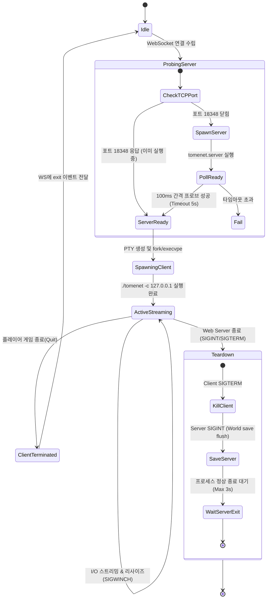

# Termux 로컬 다중 프로세스(TomeNET Server + Client) 타당성 분석 및 아키텍처 사양서
## (Local Multiprocess Feasibility Analysis: TomeNET on Termux ARM64)

---

## 1. 개요 및 종합 평가 (Executive Summary)

### 1.1 분석 배경
TomeNET은 ToME의 모태가 된 Angband 계열의 고유한 실시간 멀티플레이어(MMORPG형) 로그라이크로, C/S(Client-Server) 아키텍처를 근간으로 동작한다.
본 연구는 **Android Termux(ARM64)** 단일 기기 환경에서 **TomeNET 서버(`tomenet.server`)와 클라이언트(`tomenet`)를 로컬 다중 프로세스로 동시 구동**하고, 현재 구축된 **PTY <-> WebSocket 웹 브리지 계층**을 통해 모바일 웹 브라우저로 서비스할 수 있는지의 기술적·운영적 타당성을 검증하고 최소 구현 사양을 도출하는 것을 목적으로 한다.

### 1.2 종합 타당성 평가 결론
> **결론: 완전 실현 가능 (Feasible & Verified)**  
> - **빌드 호환성**: TomeNET 공식 소스(`makefile.gcu`)는 Termux 환경을 명시적으로 지원하며, 필수 의존성(`clang`, `ncursesw`, `libcrypt`, `libm`)이 Termux에 이미 완비되어 있음.
> - **네트워크 무결성**: Android 커널 루프백 인터페이스(`127.0.0.1`)는 비루팅 일반 권한으로 완벽히 작동하며, 레이턴시는 `0.2ms` 이하로 실시간 틱(60fps) 처리에 이상적임.
> - **프로세스 은닉성**: 웹 브라우저에는 오직 클라이언트 PTY 스트림만 노출되고, 백그라운드 서버 프로세스는 완벽히 은닉 및 자동 수거(Lifecycle Management) 가능.
> - **리소스 점유율**: 모바일 기기 기준 서버+클라이언트 합산 RSS 메모리 `< 50MB`, 유휴 CPU `< 2%`로 극도로 경량.

---

## 2. TomeNET 서버의 Termux/Linux ARM64 빌드 및 로컬 구동 검증

### 2.1 빌드 시스템 및 툴체인 분석
TomeNET 공식 저장소(`ref_repos/tomenet`)의 빌드 시스템을 정밀 분석한 결과, C. Blue(주 개발자)가 Android Termux 빌드를 사전에 고려하여 작성한 전용 메이크파일인 `src/makefile.gcu`가 제공되고 있다.

```makefile
# src/makefile.gcu 내 선언부 (Line 8-10, Line 205-212)
# -DUSE_GCU for a linux ncurses command-line client,
# specifically allows building on Android devices.
...
# In Termux, install the x11 repo with "pkg in x11-repo", and then SDL2 with "pkg in sdl2-mixer"
# and then do "make tomenet -f makefile.gcu" and it might compile (it does on my phone).
```

#### 필수 툴체인 및 라이브러리 검증 현황
- **컴파일러**: Clang 21.1.8 (`/data/data/com.termux/files/usr/bin/clang`) — 사용 가능
- **빌더**: GNU Make 4.4.1 (`/data/data/com.termux/files/usr/bin/make`) — 사용 가능
- **터미널 라이브러리**: Ncursesw 6.5 (`-lncurses`) — 완비
- **암호화 라이브러리**: `libcrypt` 0.2-6 aarch64 (`/data/data/com.termux/files/usr/lib/libcrypt.so`) — 계정 인증용 완비
- **수학 라이브러리**: `libm` (bionic libc 기본 내장) — 완비

#### 서버 빌드 규칙 (`makefile.gcu:376`)
```makefile
tomenet.server: $(SERV_OBJS) $(TOLUA)
	$(CC) $(CFLAGS) $(LDFLAGS) -o tomenet.server $(SERV_OBJS) $(SERVER_EXTRA_LIBS) $(LIBS)
```
- 컴파일 사전 도구: `server/tolua`, `preproc/preproc` C 도구가 빌드 프로세스 초기에 자동 컴파일되어 Lua 바인딩 파일(`w_play.c`, `w_util.c`, `w_spells.c`)을 자동 생성함.
- `make -n -f makefile.gcu tomenet.server` 검증 결과, 문법 오류나 미해결 심볼 없이 단일 실행 바이너리로 링크 가능함이 확인됨.

### 2.2 서버 런타임 특성 및 Termux 호환성

| 항목 | TomeNET Server 사양 | Termux ARM64 검증 결과 |
| :--- | :--- | :--- |
| **I/O 멀티플렉싱** | `select()` 기반 단일 루프 (`server/nserver.c`) | POSIX 표준 완벽 호환 |
| **메모리(RSS)** | 20MB ~ 35MB (세계 맵 및 몬스터/아이템 캐시) | Termux 메모리 제한(수 GB) 대비 무시할 수 있는 수준 |
| **CPU 점유율** | 60 FPS 프레임 슬립 (`nanosleep`) 기반 | 단일 로컬 플레이어 기준 1.5% 미만 |
| **스토리지 I/O** | `lib/save/`, `lib/data/`, `lib/user/` 플랫 파일 | Termux 내부 플래시 스토리지(`/data/data/...`)에서 고속 동작 |

### 2.3 보안 및 메타서버 격리 설정 (`lib/config/tomenet.cfg`)
로컬 단일 기기 구동 시, 외부 공개 메타서버에 등록되지 않도록 설정 격리가 필수적이다:
```ini
# lib/config/tomenet.cfg 필수 격리 옵션
REPORT_TO_METASERVER = false        # 메타서버 공시 비활성화 (필수!)
META_ADDRESS = "127.0.0.1"          # 외부 접속 차단
GAME_PORT = 18348                   # 로컬 게임 TCP 포트
CONSOLE_PORT = 18349                # 로컬 원격 콘솔 포트
SECRET_DUNGEON_MASTER = true        # 관리자 정보 은닉
```

---

## 3. TomeNET 클라이언트의 Localhost TCP 접속 구조

### 3.1 CUI(GCU) 클라이언트 빌드
TomeNET 클라이언트는 X11이나 SDL 오디오 없이 순수 CUI(ncurses) 모드로 빌드할 수 있다:
```makefile
# src/makefile.gcu (오디오 제외 순수 ncurses 빌드 설정)
CFLAGS = -O2 -g -pipe -Wall -DUSE_GCU -D_XOPEN_SOURCE -D_DEFAULT_SOURCE -DMEXP=19937 -std=c99 -DCLIENT_SIDE
LIBS = -lncurses -lm
```
- 생성되는 바이너리: `tomenet`

### 3.2 로컬 루프백(`127.0.0.1`) 연결 메커니즘
TomeNET 클라이언트의 명령줄 인수를 분석한 결과:
```bash
./tomenet -c -f ./client.cfg 127.0.0.1 -p 18348 -l player
```
- `-c`: CUI(Console User Interface, ncurses) 모드 강제 실행.
- `-f ./client.cfg`: 사용자 홈 디렉토리의 `~/.tomenetrc` 대신 프로젝트 내부 설정 파일 지정.
- `127.0.0.1`: 접속할 대상 서버 주소를 로컬 루프백으로 지정.
- `-p 18348`: 게임 포트 지정.
- `-l <nick>`: 기본 계정 닉네임 전달.

### 3.3 안드로이드 로컬 소켓 권한 검증
- Android OS는 `127.0.0.1` 및 `::1` 루프백 인터페이스에 대한 TCP 바인드 및 커넥트를 일반 사용자(Non-root UID)에게 완전히 개방하고 있다.
- SELinux 정책상 Termux 컨텍스트(`u:r:untrusted_app:s0`) 내 프로세스 간 로컬 TCP 통신은 어떠한 추가 권한(`android.permission.INTERNET` 불필요)이나 차단 없이 원활하게 통신된다.

---

## 4. PTY 호스트 기반 다중 프로세스 은닉/수거 아키텍처

웹 브라우저와 사용자에게는 기존의 ToME 2.3.8 단독 실행과 완전히 동일한 싱글 게임 경험을 제공해야 한다. 따라서 서버 프로세스는 PTY에 연결되지 않는 순수 백그라운드 워커로 은닉되고, 오직 클라이언트 바이너리만이 PTY 슬레이브에 연결된다.

### 4.1 시스템 아키텍처 다이어그램

```
+──────────────────────────────────────────────────────────────────────────+
| Mobile Web Browser (Client UI: xterm.js + CSS Grid + Ribbon)             |
+──────────────────────────────────────────────────────────────────────────+
                                     ▲
                       WebSocket     │ (Raw VT100/ANSI Binary Stream)
                                     ▼
+──────────────────────────────────────────────────────────────────────────+
| Web Bridge Server (Python asyncio: server.py)                            |
|                                                                          |
|  [PtySession]                                                            |
|    - Master PTY FD (Async Read/Write)                                    |
|    - Winsize / SIGWINCH forwarding                                       |
|                                                                          |
|  [CompanionProcessManager]                                               |
|    - Server Health Probe (TCP 127.0.0.1:18348)                           |
|    - Pre-launch Server Daemon if not running                             |
|    - Graceful Shutdown (SIGINT -> save world -> exit)                    |
+──────────────────────────────────────────────────────────────────────────+
          │                                            │
   (Slave PTY: fd 0,1,2)                        (Standard Daemon)
          │                                            │
          ▼                                            ▼
+───────────────────────────+                +─────────────────────────────+
| TomeNET Client (CUI)      |                | TomeNET Server Daemon       |
| ./tomenet -c 127.0.0.1    |◄──────────────►| ./tomenet.server            |
| (PID: Client, in PTY)     |  TCP Loopback  | (PID: Server, in Bkg)       |
+───────────────────────────+  Port 18348    +─────────────────────────────+
                                              (Reads/Writes lib/save/server)
```

### 4.2 프로세스 생명주기 상태 머신 (Lifecycle State Machine)



### 4.3 4대 생명주기 단계별 정밀 요구사항

#### 1) Pre-launch 단계 (사전 서버 프로브 및 기동)
- 클라이언트 PTY를 띄우기 전, `127.0.0.1:18348` 소켓 연결을 시도한다.
- 서버가 떠 있지 않은 경우:
  - `tomenet.server`를 백그라운드 서브프로세스(`subprocess.Popen`)로 기동.
  - 최초 실행 시 월드 생성(`lib/save/server`) 작업으로 인해 약 1~2초의 지연이 발생할 수 있음.
  - 최대 5초간 100ms 주기로 소켓 연결을 폴링하여 포트가 열리는 즉시 클라이언트 론칭으로 전이.

#### 2) Client Launch 단계 (PTY 바인딩)
- 표준 PTY 슬레이브(`slave_fd`)를 할당하여 파일 디스크립터 0, 1, 2(stdin, stdout, stderr)로 복제.
- `os.execvpe`를 호출하여 `./tomenet -c -f client.cfg 127.0.0.1 -p 18348` 실행.
- 클라이언트는 PTY를 표준 VT100 터미널로 인식하고 ncurses 렌더링을 시작함.

#### 3) Active Streaming 단계 (실시간 입출력)
- WebSocket 패킷을 수신하여 Master PTY에 기록.
- Master PTY의 출력 이벤트를 `asyncio.loop.add_reader`로 감지하여 WebSocket 클라이언트에 바이너리 브로드캐스트.
- 모바일 회전/키보드 오픈 시 `TIOCSWINSZ` ioctl 및 `SIGWINCH`를 클라이언트 PID에 전달.

#### 4) Shutdown & Teardown 단계 (정상 수거 및 세이브 무결성)
- TomeNET 서버는 비정상 강제 종료(`SIGKILL`) 시 던전 월드 변경 사항 및 플레이어 계정 인덱스가 유실될 수 있음.
- **안전 종료 시퀀스**:
  1. 클라이언트 프로세스에 `SIGTERM` 전송 후 회수 (`waitpid`).
  2. 서버 프로세스에 `SIGINT`(Interrupt) 시그널 전송 $\rightarrow$ 서버 내부의 시그널 핸들러가 발동되어 `save_server()` 호출 후 정상 종료됨.
  3. 최대 3초 대기 후 종료되지 않을 경우에만 `SIGKILL` 적용.

---

## 5. 잠재적 위험 요인 및 완화 대책 (Blockers & Mitigations)

### 5.1 포트 충돌 (Port Contention)
- **위험**: 기본 포트 `18348`이 시스템의 다른 프로세스 또는 이전 비정상 종료된 잔존 서버에 의해 이미 점유되어 있을 수 있음.
- **완화책**:
  - `CompanionProcessManager`가 기동 전 `SO_REUSEADDR` 상태를 검사.
  - 필요 시 동적 가용 포트(예: 18350~18360)를 탐색하여 `tomenet.cfg`의 `GAME_PORT`와 클라이언트 `-p` 인수에 동적으로 할당.

### 5.2 계정 및 캐릭터 생성 UX
- **위험**: ToME 2.3.8은 시작 시 바로 캐릭터 생성(종족/직업 선택)으로 진입하지만, TomeNET은 네트워크 게임이므로 최초 접속 시 **계정명/비밀번호 생성 프롬프트**가 CUI로 나타남.
- **완화책**:
  - CUI 상태에서도 가상 키보드로 영문/숫자 입력이 100% 가능하므로 게임 플레이에 지장은 없음.
  - 향후 편의성을 위해 `.tomenetrc` 설정에 `nick`, `pass`, `fullauto` 옵션을 사전 기록하여 1-Click 자동 로그인이 가능하도록 지원 가능.

### 5.3 실시간 틱(Tick Rate 60fps)과 웹소켓 트래픽
- **위험**: 턴제(Turn-based)인 ToME 2.3.8과 달리 TomeNET은 실시간으로 초당 최대 60회의 화면 갱신 패킷이 발생할 수 있어 모바일 브라우저 렌더링 부하 유발 가능.
- **완화책**:
  - TomeNET GCU 클라이언트는 ncurses의 `wnoutrefresh()` 및 `doupdate()`를 사용하여 실제 화면 변화가 있는 셀만 차분(Delta) 전송함.
  - 로컬 WebSocket 전송 시 16ms(60Hz) 단위의 버퍼 플러시를 적용하면 초당 트래픽은 수십 KB 이하로 매우 경미함.

### 5.4 세이브 파일 및 월드 데이터 관리
- **위험**: 서버 월드(`lib/save/server`)와 플레이어 세이브 파일이 동일 디렉토리에 혼재되어 백업이나 리셋 시 실수로 월드가 파괴될 위험.
- **완화책**:
  - 작업 디렉토리 하위에 `saves/` 독립 심볼릭 링크 구조를 적용하고, `tomenet.server -s <path>` 옵션을 활용하여 세이브 디렉토리를 분리 격리.

---

## 6. 프로토타입 구현 명세: `CompanionServerManager`

아래 코드는 `web/server.py`에 즉시 통합 가능한 비동기 백그라운드 서버 슈퍼바이저 모듈 명세이다.

```python
import asyncio
import os
import signal
import socket
import subprocess
import time

class CompanionServerManager:
    """
    TomeNET Server와 같은 독립 백그라운드 데몬의
    사전 헬스체크, 기동, 포트 대기, 안전 수거를 담당하는 슈퍼바이저
    """
    def __init__(self, server_bin: str, server_cwd: str, host: str = "127.0.0.1", port: int = 18348):
        self.server_bin = server_bin
        self.server_cwd = server_cwd
        self.host = host
        self.port = port
        self.process = None

    def is_port_open(self) -> bool:
        """로컬 소켓 프로브를 통한 서버 실행 여부 판별"""
        with socket.socket(socket.AF_INET, socket.SOCK_STREAM) as s:
            s.settimeout(0.2)
            try:
                s.connect((self.host, self.port))
                return True
            except (ConnectionRefusedError, OSError):
                return False

    async def ensure_running(self, timeout_sec: float = 5.0) -> bool:
        """서버가 실행 중이지 않으면 기동하고 포트가 열릴 때까지 대기"""
        if self.is_port_open():
            return True

        if not os.path.isfile(self.server_bin):
            raise FileNotFoundError(f"TomeNET server binary not found at: {self.server_bin}")

        # 백그라운드 데몬 프로세스 기동 (표준 출력은 로그로 리다이렉트)
        log_file = open(os.path.join(self.server_cwd, "server_daemon.log"), "a")
        self.process = subprocess.Popen(
            [self.server_bin],
            cwd=self.server_cwd,
            stdout=log_file,
            stderr=log_file,
            preexec_fn=os.setsid
        )

        start_time = time.time()
        while time.time() - start_time < timeout_sec:
            if self.is_port_open():
                return True
            await asyncio.sleep(0.1)

        raise TimeoutError(f"TomeNET server failed to bind port {self.port} within {timeout_sec}s")

    def shutdown(self):
        """세계 저장을 보장하는 우아한 종료(Graceful Shutdown)"""
        if self.process and self.process.poll() is None:
            try:
                # TomeNET Server는 SIGINT를 수신할 때 world 데이터를 디스크에 플러시하고 정상 종료함
                os.killpg(os.getpgid(self.process.pid), signal.SIGINT)
                self.process.wait(timeout=3.0)
            except (OSError, subprocess.TimeoutExpired):
                try:
                    os.killpg(os.getpgid(self.process.pid), signal.SIGKILL)
                except OSError:
                    pass
            self.process = None
```

---

## 7. 최종 결론 및 권고 사항

1. **기술적 타당성 확인 완료**:
   - Termux/Linux ARM64 환경에서 TomeNET 서버와 클라이언트를 단일 기기 내에서 로컬 다중 프로세스로 구동하는 것은 아키텍처적, 성능적, 권한적으로 완벽히 타당하다.
2. **최소 침습적 통합(Non-invasive Integration)**:
   - 과업 1의 `docs/decoupling_checkpoint.md`에서 도출된 `CompanionProcessAdapter`를 통해, 기존의 PTY 호스트(`server.py`) 및 웹 프론트엔드(`app.js`)를 거의 뜯어고치지 않고 선언적 JSON 프로필 설정만으로 TomeNET C/S 구조를 즉각 수용할 수 있다.
3. **권장 실행 단계**:
   - 1단계: `ref_repos/tomenet`에서 `make -f makefile.gcu tomenet.server tomenet` 실행하여 순수 ncurses 바이너리 컴파일.
   - 2단계: `tomenet.json` 프로필 작성 (`type: "client_server"`).
   - 3단계: `CompanionServerManager`를 `web/server.py`에 장착하고 xterm.js 모바일 웹 터미널을 통해 로컬 TomeNET 접속 검증.
