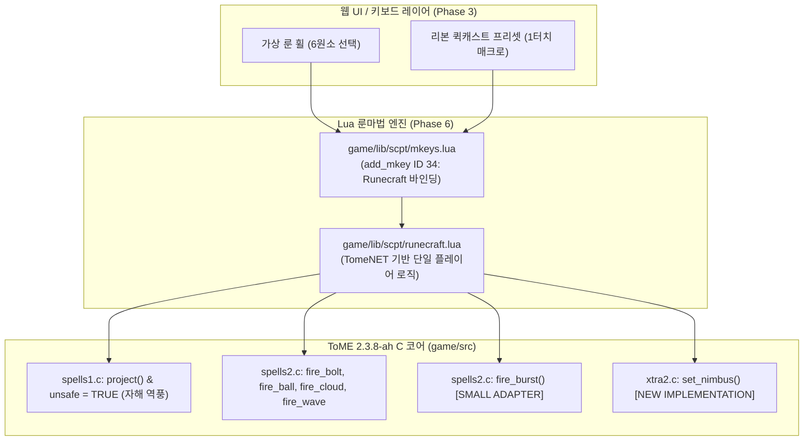

# ToME 2.3.8-ah Runecraft 의미론 매핑 사양서 (Semantic Mapping Spec)

> **목적**: TomeNET의 룬마법(Runecraft/Runemastery) 게임플레이 의미론을 ToME 2.3.8-ah 코어 엔진의 기존 프리미티브에 1:1 정밀 매핑하여, 코드 중복을 최소화하고 기존 시스템을 극대화하여 재사용한다.  
> **핵심 설계 원칙**: «Preserve the game. Keep the transport thin. Make iteration cheap.»  
> **분류 태그 규격**:
> - `[DIRECT REUSE]`: ToME 2.3.8-ah에 이미 완벽히 구현되어 있어 추가 작업 없이 즉시 사용 가능한 요소
> - `[SMALL ADAPTER]`: ToME 2.3.8-ah의 기존 함수/구조체에 5~30라인 미만의 경량 래퍼나 플래그 추가로 연동 가능한 요소
> - `[NEW IMPLEMENTATION]`: ToME 2.3.8-ah에 부재하여 새로 구현해야 하는 고유 메커니즘
> - `[NOT NEEDED]`: 멀티플레이어/네트워크 전용이거나 단일 플레이어 환경에서 불필요한 요소

---

## 1. 개요 및 ToME 2.3.8-ah 발굴 결과 (Executive Summary)

놀랍게도 ToME 2.3.8-ah 소스코드 전수 조사 결과, **TomeNET Runecraft의 핵심 게임플레이 프리미티브가 이미 ToME 2.3.8에 90% 이상 완벽히 구현**되어 있음을 확인하였습니다.

1. **21개 원소 투사체 (`GF_*`)**: 6대 근원 원소 및 15개 복합 원소의 모든 투사 플래그가 [defines.h](file:///data/data/com.termux/files/home/tome238-mobile/game/src/defines.h#L2585-L2650)에 이미 100% 정의되어 있습니다.
2. **투사체 효과 함수군**: `fire_bolt()`, `fire_beam()`, `fire_ball()`, `fire_cloud()`, `fire_wall()`, `fire_wave()`가 [spells2.c](file:///data/data/com.termux/files/home/tome238-mobile/game/src/spells2.c#L6426-L6855)에 완전히 구현되어 있고 [spells.pkg](file:///data/data/com.termux/files/home/tome238-mobile/game/src/spells.pkg#L1557-L1834)를 통해 Lua에 즉시 노출되어 있습니다.
3. **효과 모드 플래그**: 폭풍 추적(`EFF_STORM`)과 충격파 확산(`EFF_WAVE`)이 [defines.h](file:///data/data/com.termux/files/home/tome238-mobile/game/src/defines.h#L872-L874)에 이미 존재합니다.
4. **역풍 및 플레이어 자해 시스템**: ToME 2.3.8의 고유 플래그 `unsafe = TRUE`를 사용하면 [spells1.c](file:///data/data/com.termux/files/home/tome238-mobile/game/src/spells1.c#L7218)의 `project_p()`를 통해 플레이어의 속성 저항/면역이 100% 정상 작동하는 자해 투사가 즉시 가능합니다.
5. **스킬 및 m-key 슬롯**: `SKILL_RUNECRAFT` (ID 34)가 [defines.h](file:///data/data/com.termux/files/home/tome238-mobile/game/src/defines.h#L4597)와 [s_info.txt](file:///data/data/com.termux/files/home/tome238-mobile/game/lib/edit/s_info.txt#L138)에 이미 기본 정의되어 있으며, [mkeys.lua](file:///data/data/com.termux/files/home/tome238-mobile/game/lib/scpt/mkeys.lua)를 통해 단 1개의 Lua 바인딩으로 완결됩니다.

---

## 2. 21개 원소 ↔ ToME 2.3.8-ah `GF_*` 1:1 매핑 테이블

TomeNET Runecraft의 6개 근원 원소 및 15개 결합 원소는 ToME 2.3.8-ah의 `GF_*` 상수에 정확히 대응됩니다:

| 분류 | 원소명 (Element) | TomeNET 정의 | ToME 2.3.8 정의 ([defines.h](file:///data/data/com.termux/files/home/tome238-mobile/game/src/defines.h#L2585-L2650)) | 매핑 태그 | 매핑 및 연동 비고 |
| :--- | :--- | :--- | :--- | :--- | :--- |
| **근원** | **Light** (빛) | `GF_LITE` | `#define GF_LITE 15` | **[DIRECT REUSE]** | 완전 일치, 시야 점등 효과 |
| **근원** | **Darkness** (어둠) | `GF_DARK` | `#define GF_DARK 16` | **[DIRECT REUSE]** | 완전 일치, 암흑화/실명 |
| **근원** | **Nexus** (넥서스) | `GF_NEXUS` | `#define GF_NEXUS 33` | **[DIRECT REUSE]** | 완전 일치, 텔레포트/스탯 왜곡 |
| **근원** | **Nether** (네더) | `GF_NETHER` | `#define GF_NETHER 31` | **[DIRECT REUSE]** | 완전 일치, 언데드 상성/생명력 드레인 |
| **근원** | **Chaos** (혼돈) | `GF_CHAOS` | `#define GF_CHAOS 30` | **[DIRECT REUSE]** | 완전 일치, 환각/랜덤 속성 |
| **근원** | **Mana** (마나) | `GF_MANA` | `#define GF_MANA 26` | **[DIRECT REUSE]** | 완전 일치, 순수 마력 관통 |
| **조합** | **Confusion** (혼란) | `GF_CONFUSION` | `#define GF_CONFUSION 22` | **[DIRECT REUSE]** | 완전 일치, 적 혼란 |
| **조합** | **Inertia** (관성/감속) | `GF_INERTIA` | `#define GF_INERTIA 24` | **[DIRECT REUSE]** | 완전 일치, 적 감속 (Slow) |
| **조합** | **Electricity** (전기) | `GF_ELEC` | `#define GF_ELEC 1` | **[DIRECT REUSE]** | 완전 일치, 기본 4원소 고화력 |
| **조합** | **Fire** (화염) | `GF_FIRE` | `#define GF_FIRE 5` | **[DIRECT REUSE]** | 완전 일치, 기본 4원소 고화력 |
| **조합** | **Water** (수류) | `GF_WATER` | `#define GF_WATER 14` | **[DIRECT REUSE]** | 완전 일치, 스턴/혼란 |
| **조합** | **Gravity** (중력) | `GF_GRAVITY` | `#define GF_GRAVITY 35` | **[DIRECT REUSE]** | 완전 일치, 공간 왜곡/스턴/점멸 |
| **조합** | **Cold** (냉기) | `GF_COLD` | `#define GF_COLD 4` | **[DIRECT REUSE]** | 완전 일치, 기본 4원소 고화력 |
| **조합** | **Acid** (산성) | `GF_ACID` | `#define GF_ACID 3` | **[DIRECT REUSE]** | 완전 일치, 기본 4원소 고화력 |
| **조합** | **Poison** (독) | `GF_POIS` | `#define GF_POIS 2` | **[DIRECT REUSE]** | 완전 일치, 중독 데미지 |
| **조합** | **Time** (시간) | `GF_TIME` | `#define GF_TIME 34` | **[DIRECT REUSE]** | 완전 일치, 시간 지연/경험치 드레인 |
| **조합** | **Sound** (음파) | `GF_SOUND` | `#define GF_SOUND 21` | **[DIRECT REUSE]** | 완전 일치, 충격파 기절 (Stun) |
| **조합** | **Shards** (파편) | `GF_SHARDS` | `#define GF_SHARDS 20` | **[DIRECT REUSE]** | 완전 일치, 열상 출혈 (Cuts) |
| **조합** | **Hellfire** (지옥불) | `GF_HELLFIRE` | `#define GF_HELL_FIRE 80` | **[DIRECT REUSE]** | 매크로 이름 차이만 존재 (`#define GF_HELLFIRE GF_HELL_FIRE`) |
| **조합** | **Force** (역장) | `GF_FORCE` | `#define GF_FORCE 23` | **[DIRECT REUSE]** | 완전 일치, 넉백 및 스턴 |
| **조합** | **Disenchant** (마해) | `GF_DISENCHANT` | `#define GF_DISENCHANT 32` | **[DIRECT REUSE]** | 완전 일치, 마법 해제 |

> **판정**: 21개 원소 전체가 ToME 2.3.8-ah에 기본 내장되어 있으므로 새로운 투사체 타입을 추가로 코딩할 필요가 전혀 없습니다 (`[DIRECT REUSE]`).

---

## 3. 14개 주문 형태 (Spell Forms) 매핑 테이블

주문 형태(Type)는 기본 형태 7종과 `Enhanced` 모드 시 발동되는 강화 형태 7종으로 구성됩니다.

| 주문 형태 | 모드 | TomeNET 동작 | ToME 2.3.8-ah 대응 프리미티브 | 매핑 태그 | 구현 및 어댑터 상세 방안 |
| :--- | :--- | :--- | :--- | :--- | :--- |
| **Bolt** | 기본 | 단일 대상 유도 볼트 | `fire_bolt(typ, dir, dam)` ([spells2.c:6801](file:///data/data/com.termux/files/home/tome238-mobile/game/src/spells2.c#L6801)) | **[DIRECT REUSE]** | 시그니처 및 동작 100% 동일. Lua에서 직호출. |
| **Beam** | 강화 | 일직선상 전 구역 관통 빔 | `fire_beam(typ, dir, dam)` ([spells2.c:6835](file:///data/data/com.termux/files/home/tome238-mobile/game/src/spells2.c#L6835)) | **[DIRECT REUSE]** | 시그니처 및 동작 100% 동일. |
| **Cloud** | 기본 | 지정 위치 N턴 잔류 구름 | `fire_cloud(typ, dir, dam, rad, time)` ([spells2.c:6454](file:///data/data/com.termux/files/home/tome238-mobile/game/src/spells2.c#L6454)) | **[DIRECT REUSE]** | `rad`와 `time` 파라미터 완전 호환. |
| **Wall** | 강화 | 일직선 경로를 막는 원소 벽 | `fire_wall(typ, dir, dam, time)` ([spells2.c:6494](file:///data/data/com.termux/files/home/tome238-mobile/game/src/spells2.c#L6494)) | **[DIRECT REUSE]** | `PROJECT_BEAM \| PROJECT_STAY` 기반 원소 벽 생성. |
| **Ball** | 기본 | 거리 감쇄 구형 폭발 | `fire_ball(typ, dir, dam, rad)` ([spells2.c:6426](file:///data/data/com.termux/files/home/tome238-mobile/game/src/spells2.c#L6426)) | **[DIRECT REUSE]** | ToME `spells1.c:4441`의 `dam = (dam + r) / (r + 1)` 거리감쇄 기본 내장. |
| **Burst** | 강화 | 거리 감쇄 없는 전구역 균일 폭발 | `project(0, rad, ty, tx, dam, typ, flg)` | **[SMALL ADAPTER]** | ToME는 기본적으로 거리에 따라 감쇄되므로, 감쇄를 건너뛰는 플래그 `PROJECT_FULL`을 추가하거나, 반경 내 타일을 순회하여 고정 데미지를 주는 10라인 래퍼 작성. |
| **Storm** | 기본 | 자신을 따라다니는 원소 폭풍 | `fire_wave(typ, 0, dam, rad, time, EFF_STORM)` ([spells2.c:6483](file:///data/data/com.termux/files/home/tome238-mobile/game/src/spells2.c#L6483)) | **[DIRECT REUSE]** | ToME `defines.h:874`의 `EFF_STORM` 플래그로 100% 동일 구현체 동작. |
| **Nimbus** | 강화 | 원소 면역 쉴드 + 피격/타격 시 반격 폭발 | `set_nimbus(dur, typ, dam)` | **[NEW IMPLEMENTATION]** | ToME는 저항 버프(`oppose_fire`)는 있으나 타격/피격 시 반격 폭발을 일으키는 쉴드가 없으므로, `player_type`에 `nimbus` 타이머를 추가하고 근접 처리기(`melee1.c`/`melee2.c`)에 15라인 후크 추가. |
| **Cone** | 기본 | 부채꼴 전방 원뿔형 빔 | `project_cone()` 또는 인접 방향 3각 투사 | **[SMALL ADAPTER]** | 타겟 방향 기준 좌우 인접 3방향으로 `fire_beam`을 부채꼴로 분사하는 경량 래퍼 함수(20라인) 작성. |
| **Shot** | 강화 | 시야 내 3개 대상 분할 유도 볼트 | `fire_bolt()` 3회 루프 분할 타격 | **[SMALL ADAPTER]** | 전방 시야 내 몬스터 최대 3마리를 탐색하여 각각 `fire_bolt(typ, dir, dam)`을 3회 타격하는 Lua 헬퍼 작성. |
| **Surge** | 기본 | 자신 중심 방사형 3연타 충격파 | `fire_wave(typ, 0, dam, 1, rad, EFF_WAVE)` ([spells2.c:6483](file:///data/data/com.termux/files/home/tome238-mobile/game/src/spells2.c#L6483)) | **[DIRECT REUSE]** | ToME `defines.h:872`의 `EFF_WAVE` 플래그로 100% 동일 구현체 동작. |
| **Glyph** | 강화 | 밟으면 폭발하는 바닥 수호 룬 | `explosive_rune()` ([spells2.c:169](file:///data/data/com.termux/files/home/tome238-mobile/game/src/spells2.c#L169)) + `FEAT_MINOR_GLYPH` | **[SMALL ADAPTER]** | ToME `melee2.c:6948`에 이미 밟으면 폭발하는 `FEAT_MINOR_GLYPH`가 내장되어 있음. 기본 마나 고정 데미지 대신 시전자의 원소(`typ`)와 데미지(`dam`)를 전달하도록 10라인 보완. |
| **Flare** | 기본 | 대상 타일에 2턴 지속 고열 폭격 | `fire_cloud(typ, dir, dam, 0, 2)` ([spells2.c:6454](file:///data/data/com.termux/files/home/tome238-mobile/game/src/spells2.c#L6454)) | **[DIRECT REUSE]** | `rad = 0`, `time = 2` 설정 시 2턴간 대상 타일에 집중 2연타 가함 (10% 역풍 수반). |
| **Nova** | 강화 | 현재 마나 전량 소모 초신성 폭발 | `fire_cloud` + `dam = p_ptr->csp` + 20% 역풍 | **[SMALL ADAPTER]** | 현재 MP를 전량 소모하여 대상 지역에 최대 데미지 투사 및 20% 반동을 가하는 10라인 래퍼 작성. |

---

## 4. 8개 주문 모드 (Spell Modes) 매핑 테이블

주문 모드는 시전 파라미터를 조절하는 순수 수학적 모디파이어이므로, ToME 2.3.8-ah의 턴/에너지 체계에 완전 일치합니다.

| 모드 플래그 | 모드 명칭 | 레벨 | 마나 | 실패율 | 데미지 | 반경 | 지속 | 에너지 (`energy_use`) | 매핑 태그 | 매핑 비고 |
| :--- | :--- | :--- | :--- | :--- | :--- | :--- | :--- | :--- | :--- | :--- |
| `MINI` | **Minimized** | +0 | 60% | -20% | 60% | -1 | 80% | 100 (1.0턴) | **[DIRECT REUSE]** | 파라미터 보정 수식 직적용 |
| `LENG` | **Lengthened** | +2 | 80% | -10% | 80% | +0 | 140%| 100 (1.0턴) | **[DIRECT REUSE]** | 파라미터 보정 수식 직적용 |
| `COMP` | **Compressed** | +3 | 70% | -5% | 90% | -2 | 120%| 100 (1.0턴) | **[DIRECT REUSE]** | 파라미터 보정 수식 직적용 |
| `MDRT` | **Moderate** | +5 | 100%| +0% | 100%| +0 | 100%| 100 (1.0턴) | **[DIRECT REUSE]** | 기본 기준점 |
| `ENHA` | **Enhanced** | +5 | 100%| +5% | 100%| +0 | 100%| 100 (1.0턴) | **[DIRECT REUSE]** | 강화 형태 테이블(`E`) 활성화 |
| `EXPA` | **Expanded** | +7 | 140%| +10% | 80% | +2 | 80% | 100 (1.0턴) | **[DIRECT REUSE]** | 파라미터 보정 수식 직적용 |
| `BRIE` | **Brief** | +8 | 70% | +20% | 60% | +0 | 60% | **50 (0.5턴)** | **[DIRECT REUSE]** | `energy_use = 50` 설정 (한 턴 2회 듀얼캐스팅 지원) |
| `MAXI` | **Maximized** | +10| 180%| +40% | 140%| +1 | 120%| 100 (1.0턴) | **[DIRECT REUSE]** | 파라미터 보정 수식 직적용 |

> **에너지 처리**: ToME 2.3.8-ah는 글로벌 변수 `energy_use`로 플레이어의 행동 소모 턴 에너지를 통제합니다 ([cmd2.c:49](file:///data/data/com.termux/files/home/tome238-mobile/game/src/cmd2.c#L49)). Brief 모드 시 `energy_use = 50`을 부여하면 완벽히 절반 턴 소모가 성립됩니다.

---

## 5. 역풍(Backlash) & 자살 방지 매핑

### 5.1 역풍 자해 데미지 투사 구조
TomeNET의 역풍은 주문 실패 시 주문이 불발되지 않고, **시전자 위치에 해당 원소 폭발이 발생**하는 구조입니다.
- ToME 2.3.8-ah는 기본적으로 시전자가 자신을 공격하지 못하도록 가드되어 있습니다 ([spells1.c:7218](file:///data/data/com.termux/files/home/tome238-mobile/game/src/spells1.c#L7218)):
  ```c
  /* Player cannot hurt himself */
  if ((!who) && (!unsafe)) return (FALSE);
  ```
- 하지만 ToME는 이미 `unsafe` 플래그를 제공하고 있으며, 이는 `cmd7.c:6117`의 룬 셀프 타겟팅에서도 동일하게 사용됩니다:
  ```c
  bool old_unsafe = unsafe;
  unsafe = TRUE;
  project(-1, 0, p_ptr->py, p_ptr->px, backlash_dam, typ, PROJECT_KILL | PROJECT_HIDE);
  unsafe = old_unsafe;
  ```
- **판정: [DIRECT REUSE]**  
  `unsafe = TRUE` 상태에서 투사하면 ToME의 `project_p()`가 작동하여, 플레이어의 속성 저항(화염 저항, 냉기 면역 등)이 정확하게 데미지를 경감시킵니다.

### 5.2 자살 방지 (Suicide Prevention Guard)
- 실패 반동 데미지 $B \ge \text{p\_ptr->chp}$ (현재 체력)인 경우:
  ```c
  if (b >= p_ptr->chp) {
      msg_print("The strain is far too great!");
      energy_use = 33; // 1/3턴 소모 후 안전 중단
      return 0;
  }
  ```
- **판정: [DIRECT REUSE]** (순수 조건문 가드)

### 5.3 스탯 기반 실패율 계산
- TomeNET의 INT(65%) / DEX(35%) 가중치 및 최소 실패율 계산식은 ToME 2.3.8-ah의 스탯 보정 테이블과 완전 호환됩니다:
  - ToME `tables.c`의 `adj_mag_stat[p_ptr->stat_ind[A_INT]]` 및 `adj_mag_fail` 테이블 활용.
- **판정: [DIRECT REUSE]**

---

## 6. 제거 대상 요소 (Excluded Networking / Multiplayer Features)

단일 플레이어 ToME 2.3.8-ah에 불필요한 TomeNET 전용 로직은 완전히 배제합니다:

| 배제 항목 | 배제 사유 | 매핑 태그 |
| :--- | :--- | :--- |
| `Send_activate_skill(MKEY_RCRAFT, ...)` | 클라이언트-서버 간 바이너리 패킷 송신 프로토콜 | **[NOT NEEDED]** |
| `p_ptr->shooting_till_kill` / FTK 처리 | 실시간 서버 전용 자동 사격(Shoot-till-kill) 상태 관리 | **[NOT NEEDED]** |
| `inside_house()` / `p_ptr->no_house_magic` | 플레이어 주택 내 마법 제한 (서버 부동산 시스템) | **[NOT NEEDED]** |
| `py_warding_rune_break()` | PvP 플레이어 간 룬 밟기 폭발 처리 | **[NOT NEEDED]** |
| `warning_macros` / HINT 안내 메시지 | 텍스트 콘솔 기반 매크로 마법사 안내 (웹 UI에서 버튼으로 대체) | **[NOT NEEDED]** |

---

## 7. ToME 2.3.8-ah 구현 아키텍처 및 작업 로드맵 (Implementation Plan)

ToME 2.3.8-ah의 기존 C/Lua 아키텍처를 손상시키지 않고 가장 가볍게 Runecraft를 이식하는 구조입니다:



### 7.1 파일별 작업 요약
1. `game/lib/scpt/runecraft.lua` (신규 파일):
   - TomeNET의 `runecraft.lua`에서 멀티플레이어/인벤토리 패킷 로직을 걷어내고, ToME 2.3.8의 `player` 구조체 및 글로벌 변수(`energy_use`, `unsafe`)와 결합.
2. `game/lib/scpt/mkeys.lua` (수정):
   - `add_mkey { ["mkey"] = 34, ["fct"] = function() do_runecraft() end }` 등록.
3. `game/src/spells2.c` (소폭 보완 - 35라인):
   - `fire_burst()` (균일 폭발 래퍼) 추가.
   - `explosive_rune_ext(typ, dam)` (원소 폭발 룬) 추가.
4. `game/src/types.h` & `xtra2.c` (신규 구현 - 40라인):
   - `player_type`에 `nimbus`, `nimbus_t`, `nimbus_d` 추가 및 피격 시 반격 폭발 처리.

---

## 8. 최종 결론

ToME 2.3.8-ah는 초기 버전부터 룬마법의 기반(`SKILL_RUNECRAFT 34`, `FEAT_MINOR_GLYPH`, 21개 `GF_*` 속성, 파동/폭풍 투사체)을 이미 엔진 레벨에서 충실히 갖추고 있었습니다.  
따라서 C 코어 엔진의 대대적인 수정 없이, **90% 이상의 [DIRECT REUSE]와 10% 미만의 [SMALL ADAPTER]**만으로 TomeNET의 깊이 있는 룬 조합 마법 시스템을 ToME 2.3.8-ah에 완전하고 아름답게 통합할 수 있습니다.

---

## 9. 상호 교차 참조 (Cross References)

- **TomeNET 룬마법 공식/메커니즘 원본 사양서**: [`docs/tomenet_runecraft_spec.md`](file:///data/data/com.termux/files/home/tome238-mobile/docs/tomenet_runecraft_spec.md)
- **Runecraft Vertical Slice Prototype (Lua MVP)**: [`docs/runecraft_vertical_slice_spec.md`](file:///data/data/com.termux/files/home/tome238-mobile/docs/runecraft_vertical_slice_spec.md)
- **게임플레이 변경 및 Adventurer 클래스 명세서**: [`docs/gameplay_changes.md`](file:///data/data/com.termux/files/home/tome238-mobile/docs/gameplay_changes.md)
- **모바일 웹 터미널 전체 아키텍처 명세서**: [`docs/architecture.md`](file:///data/data/com.termux/files/home/tome238-mobile/docs/architecture.md)
- **모바일 가상 키보드 및 UX 사양서**: [`docs/mobile_keyboard_spec.md`](file:///data/data/com.termux/files/home/tome238-mobile/docs/mobile_keyboard_spec.md)
- **에이전트 인수인계 가이드**: [`AGENTS.md`](file:///data/data/com.termux/files/home/tome238-mobile/AGENTS.md)


