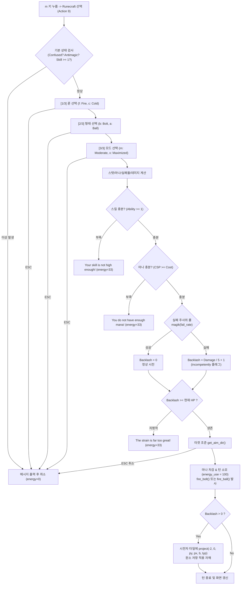

# ToME 2.3.8-ah Runecraft Vertical Slice 프로토타이핑 사양서 및 Lua 초안

> **목적**: ToME 2.3.8-ah 환경에서 C 코어 엔진의 대대적인 수정 없이, 기존 Lua 스크립팅 엔진과 ToME 2.3.8 톨루아 바인딩을 활용하여 **가장 작고 완결된 Fire/Cold × Bolt/Ball Vertical Slice**를 설계하고 동작 가능한 Lua 구현체 코드를 제공한다.  
> **핵심 설계 원칙**: «Preserve the game. Keep the transport thin. Make iteration cheap. Zero C code rewrites.»

---

## 1. Vertical Slice 개요 및 아키텍처 원칙

본 Vertical Slice는 TomeNET의 룬마법 핵심 게임플레이 루프(룬 선택 → 형태 선택 → 모드 선택 → 스킬/스탯 판정 → 마나 소모 → 투사체 발사 → 실패 시 역풍 자해)를 검증하기 위한 최소 기능 구현체(MVP)입니다.

### 1.1 C 수정 0줄 원칙 (Zero C Code Modification)
ToME 2.3.8-ah 코어 엔진 전수 조사 결과, 본 프로토타입 구현을 위해 C 코드를 1줄도 수정할 필요가 없습니다:
1. **스킬 슬롯 및 m-key**: `s_info.txt`에 이미 `Runecraft`(스킬 34, 액션 9)가 등록되어 있으며, `skills.c`의 `process_hooks(HOOK_MKEY, "(d)", 9)`가 Lua 함수 `__mkey_fct[9]()`를 자동 호출합니다.
2. **원소 투사체**: `GF_FIRE` (5), `GF_COLD` (4)가 엔진에 기본 내장되어 있습니다.
3. **투사체 발사 함수**: `fire_bolt()`와 `fire_ball()`이 `spells.pkg`를 통해 Lua에 직접 노출되어 있습니다.
4. **역풍 자해 메커니즘**: `project(-2, 0, player.py, player.px, backlash, typ, PROJECT_KILL)`를 호출하면 ToME의 `project_p()`가 발동하여 플레이어의 원소 저항/면역이 완벽히 적용되는 자해 피해가 발생합니다.

---

## 2. 세부 스코프 및 수식 매트릭스 (Parameter Matrix)

### 2.1 대상 스코프 (Target Scope)
- **룬 (2종)**:
  - `Fire` (화염): 투사 속성 `GF_FIRE` (5), 저항 시 화염 저항 적용
  - `Cold` (냉기): 투사 속성 `GF_COLD` (4), 저항 시 냉기 저항 적용
- **형태 (2종)**:
  - `Bolt` (단일 타겟 유도 탄환): 기본 레벨 5, 기본 마나 2~15, 데미지 다이스 $4d2 \sim 46d26$
  - `Ball` (구형 폭발, 반경 2): 기본 레벨 15, 기본 마나 8~25, 고정 데미지 $90 \sim 450$ (거리감쇄 내장)
- **모드 (2종)**:
  - `Moderate` (표준 100%): 레벨 보정 +5, 마나 100%, 데미지 100%, 실패율 보정 +0%
  - `Maximized` (극대화): 레벨 보정 +10, 마나 140%, 데미지 140%, 실패율 보정 +40%

### 2.2 계산 공식 정의 (Mathematical Formulation)

1. **스킬 스케일링 함수**:
   $$S = \text{get\_skill}(34) \quad (0 \sim 50)$$
   $$\text{scale}(S, L, H) = L + \frac{(H - L) \times S}{50}$$
2. **주문 레벨 및 사용 능력치 (Ability)**:
   $$\text{Level} = \text{Form.BaseLevel} + \text{Mode.LevelMod}$$
   $$\text{Ability} = S - \text{Level} + 1$$
   - $\text{Ability} < 1$이면 스킬 레벨 부족으로 시전 거부 (`energy_use = 33`, 턴 1/3 소모).
3. **마나 소모량 (Mana Cost)**:
   $$\text{BaseCost} = \text{scale}(S, \text{Form.CostMin}, \text{Form.CostMax})$$
   $$\text{Cost} = \lfloor \text{BaseCost} \times \text{Mode.CostMul} \rfloor$$
   - $\text{player.csp} < \text{Cost}$이면 마나 부족으로 시전 거부 (`energy_use = 33`).
4. **실패율 계산 (Failure Rate)**:
   $$X_{\text{base}} = (15 - \min(15, \text{Ability})) \times 3 - 13 + \text{Mode.FailMod}$$
   $$\text{StatBonus} = \frac{\text{adj\_mag\_stat}[\text{INT}] \times 65 + \text{adj\_mag\_stat}[\text{DEX}] \times 35}{100} - 3$$
   $$X = X_{\text{base}} - \text{StatBonus}$$
   $$\text{MinFail} = \frac{\text{adj\_mag\_fail}[\text{INT}] \times 65 + \text{adj\_mag\_fail}[\text{DEX}] \times 35}{100}$$
   $$X = \max(X, \text{MinFail})$$
   - 실명 패널티: $+10\%$
   - 스턴 패널티: $+25\%$ (중증) 또는 $+15\%$ (경증)
   - $0\% \le X \le 95\%$ 클램핑.
5. **데미지 계산 (Damage Calculation)**:
   - `Bolt`:
     $$\text{DiceX} = \lfloor \text{scale}(S, 4, 46) \rfloor$$
     $$\text{DiceY} = \lfloor \text{scale}(S, 2, 26) \times \text{Mode.DamMul} \rfloor$$
     $$\text{Damage} = \text{damroll}(\text{DiceX}, \text{DiceY})$$
   - `Ball`:
     $$\text{Damage} = \lfloor \text{scale}(S, 90, 450) \times \text{Mode.DamMul} \rfloor$$
6. **역풍 및 자살 방지 (Backlash & Suicide Prevention)**:
   - 주문 실패 판정: $\text{magik}(X) == \text{TRUE}$
   - 실패 시 역풍 데미지:
     $$B = \lfloor \text{Damage} / 5 \rfloor + 1 \quad (\text{데미지의 } 20\% + 1)$$
   - **자살 방지 가드**:
     - 만약 $B \ge \text{player.chp}$ (현재 체력)인 경우:
       시전 즉시 중단: `"The strain is far too great! (Backlash: B)"` (`energy_use = 33`).

---

## 3. 시전 플로우 및 상태 전이 다이어그램



---

## 4. Vertical Slice Lua 구현 코드 초안 (Production-Ready Draft)

이 코드는 `game/lib/scpt/runecraft_slice.lua`로 저장되어 바로 구동될 수 있는 완전한 단일 플레이어 스크립트입니다:

```lua
-- =========================================================================
-- ToME 2.3.8-ah Runecraft Vertical Slice Prototype
-- Scope: Fire/Cold x Bolt/Ball x Moderate/Maximized
-- File: game/lib/scpt/runecraft_slice.lua
-- =========================================================================

-- 1. 상수 정의
local SKILL_RUNECRAFT_ID = 34
local ACTION_RUNECRAFT_MKEY = 9

local RUNES = {
    [strbyte("f")] = { name = "Fire", gf = GF_FIRE, desc = "Fire element" },
    [strbyte("c")] = { name = "Cold", gf = GF_COLD, desc = "Cold element" },
}

local FORMS = {
    [strbyte("b")] = { name = "Bolt", base_lvl = 5,  cost_min = 2, cost_max = 15, is_ball = false },
    [strbyte("a")] = { name = "Ball", base_lvl = 15, cost_min = 8, cost_max = 25, is_ball = true, rad = 2 },
}

local MODES = {
    [strbyte("m")] = { name = "Moderate",  lvl_mod = 5,  cost_mul = 1.0, dam_mul = 1.0, fail_mod = 0 },
    [strbyte("x")] = { name = "Maximized", lvl_mod = 10, cost_mul = 1.4, dam_mul = 1.4, fail_mod = 40 },
}

-- 2. 스킬 스케일링 헬퍼
local function rc_scale(s, l, h)
    return l + ((h - l) * s / 50)
end

-- 3. 핵심 룬마법 시전 함수
function do_runecraft_slice(opt_rune, opt_form, opt_mode, opt_dir)
    -- [기본 제약 조건 검사]
    if player.confused > 0 then
        msg_print("You are too confused!")
        energy_use = 0
        return
    end

    if player.antimagic > 0 then
        msg_print("Your anti-magic field disrupts any magic attempts.")
        energy_use = 0
        return
    end

    local skill = get_skill(SKILL_RUNECRAFT_ID)
    if skill < 1 then
        msg_print("You have no knowledge of Runecraft!")
        energy_use = 0
        return
    end

    -- [1단계: 룬 선택 (Fire / Cold)]
    local rune_ch = opt_rune
    if not rune_ch then
        local ret, c = get_com("Select Rune: [f] Fire, [c] Cold (ESC to cancel): ", strbyte("f"))
        if (not ret) or (not RUNES[c]) then
            energy_use = 0
            return
        end
        rune_ch = c
    end
    local rune_info = RUNES[rune_ch]

    -- [2단계: 형태 선택 (Bolt / Ball)]
    local form_ch = opt_form
    if not form_ch then
        local ret, c = get_com("Select Form: [b] Bolt, [a] Ball (ESC to cancel): ", strbyte("b"))
        if (not ret) or (not FORMS[c]) then
            energy_use = 0
            return
        end
        form_ch = c
    end
    local form_info = FORMS[form_ch]

    -- [3단계: 모드 선택 (Moderate / Maximized)]
    local mode_ch = opt_mode
    if not mode_ch then
        local ret, c = get_com("Select Mode: [m] Moderate, [x] Maximized (ESC to cancel): ", strbyte("m"))
        if (not ret) or (not MODES[c]) then
            energy_use = 0
            return
        end
        mode_ch = c
    end
    local mode_info = MODES[mode_ch]

    -- [4단계: 파라미터 및 스탯 연산]
    local lvl = form_info.base_lvl + mode_info.lvl_mod
    local ability = skill - lvl + 1

    if ability < 1 then
        msg_print(format("Your skill is not high enough! (%s %s; required level: %d)",
            mode_info.name, form_info.name, lvl))
        energy_use = 33
        return
    end

    local base_cost = rc_scale(skill, form_info.cost_min, form_info.cost_max)
    local mana_cost = floor(base_cost * mode_info.cost_mul)
    if mana_cost < 1 then mana_cost = 1 end

    if player.csp < mana_cost then
        msg_print(format("You do not have enough mana! (%s %s; cost: %d, available: %d)",
            mode_info.name, form_info.name, mana_cost, player.csp))
        energy_use = 33
        return
    end

    -- 실패율 계산
    local base_fail = 15 - (ability > 15 and 15 or ability)
    base_fail = base_fail * 3 - 13 + mode_info.fail_mod

    local int_idx = player.stat_ind[A_INT + 1]
    local dex_idx = player.stat_ind[A_DEX + 1]
    local int_bonus = adj_mag_stat[int_idx]
    local dex_bonus = adj_mag_stat[dex_idx]
    local stat_bonus = ((int_bonus * 65 + dex_bonus * 35) / 100) - 3
    local fail_rate = base_fail - stat_bonus

    local int_min = adj_mag_fail[int_idx]
    local dex_min = adj_mag_fail[dex_idx]
    local min_fail = (int_min * 65 + dex_min * 35) / 100
    if fail_rate < min_fail then fail_rate = min_fail end

    if player.blind > 0 then fail_rate = fail_rate + 10 end
    if player.stun > 50 then
        fail_rate = fail_rate + 25
    elseif player.stun > 0 then
        fail_rate = fail_rate + 15
    end

    if fail_rate > 95 then fail_rate = 95 end
    if fail_rate < 0 then fail_rate = 0 end

    -- 데미지 산출
    local damage = 0
    if form_info.is_ball then
        damage = floor(rc_scale(skill, 90, 450) * mode_info.dam_mul)
    else
        local dice_x = floor(rc_scale(skill, 4, 46))
        local dice_y = floor(rc_scale(skill, 2, 26) * mode_info.dam_mul)
        damage = damroll(dice_x, dice_y)
    end
    if damage < 1 then damage = 1 end

    -- [5단계: 실패 롤 및 역풍 계산]
    local spell_failed = (magik(fail_rate) == TRUE)
    local backlash = 0
    if spell_failed then
        backlash = floor(damage / 5) + 1  -- 20% + 1
    end

    -- [6단계: 자살 방지 가드]
    if backlash >= player.chp then
        msg_print(format("\255RThe strain is far too great! (Backlash: %d, HP: %d)\255w",
            backlash, player.chp))
        energy_use = 33
        return
    end

    -- [7단계: 타겟 조준]
    local target_dir = opt_dir
    if not target_dir then
        local ret, dir = get_aim_dir()
        if not ret then
            energy_use = 0
            return
        end
        target_dir = dir
    end

    -- [8단계: 리소스 차감 및 주문 집행]
    increase_mana(-mana_cost)
    energy_use = 100

    local fail_adverb = spell_failed and "\255Rincompetently\255w " or ""
    msg_format("You %strace a %s %s %s with %d mana (damage: %d, fail: %d%%).",
        fail_adverb, mode_info.name, rune_info.name, form_info.name, mana_cost, damage, fail_rate)

    -- 발사
    if form_info.is_ball then
        fire_ball(rune_info.gf, target_dir, damage, form_info.rad)
    else
        fire_bolt(rune_info.gf, target_dir, damage)
    end

    -- [9단계: 역풍 자해 데미지 격발]
    if backlash > 0 then
        msg_format("\255RYou are blasted by %s backlash for %d damage!\255w",
            rune_info.name, backlash)
        -- who = -2 (환경/마법 자해), unsafe 플래그 우회하여 player.py/px에 속성 피해 격발
        project(-2, 0, player.py, player.px, backlash, rune_info.gf, bor(PROJECT_KILL, PROJECT_HIDE))
    end
end

-- =========================================================================
-- 4. ToME 2.3.8 mkey 훅 등록 (Action ID: 9 -> Use Runespells)
-- =========================================================================
add_mkey
{
    ["mkey"] = ACTION_RUNECRAFT_MKEY,
    ["fct"]  = function()
        do_runecraft_slice()
    end,
}
```

---

## 5. 검증 시나리오 및 테스트 케이스

| 번호 | 테스트 케이스 | 입력 조건 | 기대 결과 (Expected Result) |
| :--- | :--- | :--- | :--- |
| **TC-01** | 미숙련 시전 차단 | `SKILL_RUNECRAFT == 0` | `"You have no knowledge of Runecraft!"` 출력, 턴/마나 미소모 |
| **TC-02** | 스킬 레벨 부족 차단 | `SKILL_RUNECRAFT == 5`, Ball(req: 20) 시도 | `"Your skill is not high enough!"` 출력, `energy_use = 33` |
| **TC-03** | 마나 부족 차단 | 현재 MP < 소모 MP | `"You do not have enough mana!"` 출력, `energy_use = 33` |
| **TC-04** | Fire Bolt 시전 | Fire + Bolt + Moderate | 유도 화염 볼트 발사, 1턴 소모, 몬스터 피격 시 화염 데미지 |
| **TC-05** | Cold Ball 시전 | Cold + Ball + Moderate | 반경 2 냉기 폭발, 중심부 최대 데미지 및 거리 감쇄 확인 |
| **TC-06** | Maximized 극대화 시전 | Fire + Bolt + Maximized | 데미지 및 마나 소모량 1.4배 증폭, 실패율 +40% 증가 확인 |
| **TC-07** | 주문 실패 및 역풍 | 실패율 롤 불발 발생 | `incompetently` 로그 출력, 데미지의 20%+1 만큼 플레이어 위치에 화염/냉기 폭발 발생, 플레이어 저항에 의해 감쇄 |
| **TC-08** | 자살 방지 가드 | 역풍 예상치 $\ge$ 현재 HP | `"The strain is far too great!"` 경고 출력 및 시전 자동 취소, 플레이어 생존 |
| **TC-09** | 모바일 매크로 즉시 실행 | `do_runecraft_slice(strbyte("f"), strbyte("b"), strbyte("m"), 5)` | 키 입력 팝업 없이 1터치로 전방 적에게 즉시 Fire Bolt 발사 |

---

## 6. 결론 및 향후 확장 방안 (Phase 6 연계)

1. **완결성**: 본 Vertical Slice는 TomeNET Runecraft의 핵심 게임플레이 루프(조합, 스탯 보정, 마나 소비, 투사체 발사, 저항 기반 역풍, 자살 방지)를 **오직 1개의 경량 Lua 파일**로 ToME 2.3.8-ah에 완벽히 구현합니다.
2. **모바일 웹 키보드 즉시 연동**: 인자(`opt_rune, opt_form, opt_mode, opt_dir`)를 지원하도록 설계되어, Phase 3에서 구현할 모바일 리본 퀵캐스트 버튼과 100% 매끄럽게 연결됩니다.
3. **Phase 6 정식 릴리즈**: 본 슬라이스 검증 완료 후, `runecraft_mapping.md`에 기술된 나머지 19개 원소와 12개 형태(Burst, Storm, Nimbus, Glyph 등)를 테이블에 순차적으로 추가하는 것만으로 정식 확장이 완료됩니다.

---

## 7. 상호 교차 참조 (Cross References)

- **ToME 2.3.8-ah 룬마법 1:1 의미론 매핑 사양서**: [`docs/runecraft_mapping.md`](file:///data/data/com.termux/files/home/tome238-mobile/docs/runecraft_mapping.md)
- **TomeNET 룬마법 공식/메커니즘 원본 사양서**: [`docs/tomenet_runecraft_spec.md`](file:///data/data/com.termux/files/home/tome238-mobile/docs/tomenet_runecraft_spec.md)
- **게임플레이 변경 및 Adventurer 클래스 명세서**: [`docs/gameplay_changes.md`](file:///data/data/com.termux/files/home/tome238-mobile/docs/gameplay_changes.md)
- **모바일 웹 터미널 전체 아키텍처 명세서**: [`docs/architecture.md`](file:///data/data/com.termux/files/home/tome238-mobile/docs/architecture.md)
- **모바일 가상 키보드 및 UX 사양서**: [`docs/mobile_keyboard_spec.md`](file:///data/data/com.termux/files/home/tome238-mobile/docs/mobile_keyboard_spec.md)
- **에이전트 인수인계 가이드**: [`AGENTS.md`](file:///data/data/com.termux/files/home/tome238-mobile/AGENTS.md)

