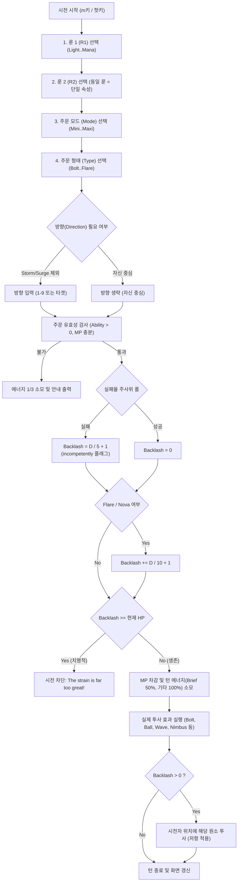

# TomeNET Runecraft (룬마법) 게임플레이 의미론 사양서 (Gameplay Semantics Spec)

> **목적**: ToME 2.3.8 모바일 이식 프로젝트(Phase 6) 대비 TomeNET 공식 리포지토리(`TomenetGame/tomenet`) 기반 Runecraft/Runemastery 핵심 게임플레이 로직 완전 발굴 및 단일 플레이어 의미론 규격화.  
> **원칙**: 멀티플레이어/네트워크 패킷 로직 철저 배제, 순수 턴제 로그라이크 게임플레이 규칙과 수학 공식 추출.

---

## 1. 개요 및 아키텍처 위치 (Archaeology Overview)

TomeNET의 룬마법 시스템은 마법서(Spellbook)나 주문 스크롤을 들고 다닐 필요 없이, 시전자의 기억과 원소 친화력(스킬)을 조합하여 마나를 소모해 직접 룬을 허공에 그리는(Trace) 동적 마법 조합 시스템입니다.

### 1.1 핵심 소스 파일 위치
- [runecraft.lua](file:///data/data/com.termux/files/home/ref_repos/tomenet/lib/scpt/runecraft.lua): 룬마법의 모든 비트마스크, 원소/형태/모드 테이블, 데미지/마나/실패율/역풍 공식 및 시전 효과 구현체 (핵심 엔진)
- [runecraft.c](file:///data/data/com.termux/files/home/ref_repos/tomenet/src/server/runecraft.c): 물리적 룬 장비 인챈트(`rune_enchant`), 바닥 폭발 룬 표식(`warding_rune`, `warding_rune_break`) C 구현체
- [cmd5.c](file:///data/data/com.termux/files/home/ref_repos/tomenet/src/server/cmd5.c#L1958-L2020): `cast_rune_spell()` - C에서 파라미터 유효성 검사 및 Lua 시전 함수 호출
- [c-spell.c](file:///data/data/com.termux/files/home/ref_repos/tomenet/src/client/c-spell.c#L1862-L1935): `do_runecraft()` - 클라이언트 룬/모드/타입 다단계 대화형 인터페이스 및 매크로 생성기
- [defines.h](file:///data/data/com.termux/files/home/ref_repos/tomenet/src/common/defines.h#L9571-L9593): 룬 ID 및 스킬 상수 매크로 정의
- [TomeNET-Guide.txt](file:///data/data/com.termux/files/home/ref_repos/tomenet/TomeNET-Guide.txt#L25606-L26140): 게임 내 공식 가이드 (7.8b Runes & Runemastery, 7.8c Runespell Tables)

---

## 2. 비트마스크 주문 인코딩 구조 (Spell Bitmask Architecture)

TomeNET 룬 주문은 32비트 무부호 정수(`u32b u`) 1개로 모든 조합이 완결됩니다.

| 비트 범위 | 마스크 명칭 | 의미 (Semantic) | 값 범위 |
| :--- | :--- | :--- | :--- |
| `0..7` (`0x000000FF`) | **R1** | 첫 번째 원소 룬 (Primary Rune) | `1, 2, 4, 8, 16, 32` |
| `8..15` (`0x0000FF00`) | **R2** | 두 번째 원소 룬 (Secondary Rune) | `(1..32) << 8` |
| `16..23` (`0x00FF0000`) | **MODE** | 주문 모드/모디파이어 (Modifier) | `(1..128) << 16` |
| `24..31` (`0xFF000000`) | **TYPE** | 주문 형태/타입 (Spell Form) | `(1..64) << 24` |

- **단일 원소 시전**: R1과 R2에 동일한 룬을 지정 (예: `LITE | (LITE << 8)`).
- **복합 원소 시전**: 서로 다른 두 룬을 지정 (예: `LITE | (CHAO << 8)` -> Fire).
- **유효성 검사**: 해밍 가중치(Hamming Weight, 세트된 비트 수)가 정확히 4여야 하며, 각 필드가 0이 아니어야 유효한 주문으로 인정됩니다.

---

## 3. 원소 룬 및 조합 체계 (Elemental Runes & Combinations)

기본 원소 룬 6종류(근원 룬)와 이들의 조합(15가지 쌍)으로 총 21가지 원소 마법 투사가 결정됩니다.

### 3.1 6대 근원 룬 (Fundamental Runes)

| 비트값 (Bit) | 룬 명칭 (Rune) | 대응 스킬 (Skill ID) | 기본 투사체 (GF Type) | 상대 가중치 (Weight) | 색상 코드 | 특수 효과 (Special Effect) |
| :--- | :--- | :--- | :--- | :--- | :--- | :--- |
| `0x01` (`1<<0`) | **Light** (빛) | `SKILL_R_LITE` (96) | `GF_LITE` | 400 | White (`L`) | 실명 (Blindness), 광원 점등 |
| `0x02` (`1<<1`) | **Darkness** (어둠) | `SKILL_R_DARK` (97) | `GF_DARK` | 550 | Dark Gray (`A`) | 암흑화, 실명 유발 |
| `0x04` (`1<<2`) | **Nexus** (넥서스) | `SKILL_R_NEXU` (98) | `GF_NEXUS` | 250 | Light Dark (`x`) | 텔레포트, 스탯 셔플 |
| `0x08` (`1<<3`) | **Nether** (황천/네더) | `SKILL_R_NETH` (99) | `GF_NETHER` | 550 | Light Green (`n`) | 언데드 특화, 경험치 드레인 |
| `0x10` (`1<<4`) | **Chaos** (혼돈) | `SKILL_R_CHAO` (100) | `GF_CHAOS` | 600 | Violet (`m`) | 환각, 랜덤 상태이상 |
| `0x20` (`1<<5`) | **Mana** (마나) | `SKILL_R_MANA` (101) | `GF_MANA` | 600 | Light Blue (`N`) | 순수 마력 (무속성 관통) |

### 3.2 복합 원소 조합 규칙 (15 Pairwise Combinations)

두 룬의 비트 OR 조합(`bor(R1, R2)`)으로 발현되는 원소입니다:

| R1 | R2 | 결합 원소 (Element) | 투사체 (GF Type) | 가중치 (Weight) | 상태이상 및 부가 효과 |
| :--- | :--- | :--- | :--- | :--- | :--- |
| Light | Darkness | **Confusion** (혼란) | `GF_CONFUSION` | 400 | 적 혼란 |
| Light | Nexus | **Inertia** (관성/감속) | `GF_INERTIA` | 200 | 적 감속 (Slow) |
| Light | Nether | **Electricity** (전기) | `GF_ELEC` | **1200** | 고데미지, 민첩 드레인 |
| Light | Chaos | **Fire** (화염) | `GF_FIRE` | **1200** | 고데미지, 힘 드레인 |
| Light | Mana | **Water** (수류) | `GF_WATER` | 300 | 스턴, 혼란, 세척 |
| Darkness | Nexus | **Gravity** (중력) | `GF_GRAVITY` | 150 | 공간왜곡, 스턴, 텔레포트 |
| Darkness | Nether | **Cold** (냉기) | `GF_COLD` | **1200** | 고데미지, 힘 드레인, 포션 동결 |
| Darkness | Chaos | **Acid** (산성) | `GF_ACID` | **1200** | 고데미지, 장비 부식, 매력 드레인 |
| Darkness | Mana | **Poison** (독) | `GF_POIS` | 800 | 지속 독 데미지 |
| Nexus | Nether | **Time** (시간) | `GF_TIME` | 150 | 시간 지연, 스탯/레벨 드레인 |
| Nexus | Chaos | **Sound** (음파) | `GF_SOUND` | 400 | 적 충격 기절 (Stun) |
| Nexus | Mana | **Shards** (파편) | `GF_SHARDS` | 400 | 적 출혈상처 (Cuts/Bleeding) |
| Nether | Chaos | **Hellfire** (지옥불) | `GF_HELLFIRE` | 400 | 선 성향 극상성 관통 데미지 |
| Nether | Mana | **Force** (역장) | `GF_FORCE` | 250 | 넉백 및 강한 스턴 |
| Chaos | Mana | **Disenchant** (마해) | `GF_DISENCHANT`| 500 | 마법 취소/해제 (Cancellation) |

> **가중치(Weight) 의미**: 4대 기본원소(Fire, Cold, Elec, Acid)는 가중치 1200으로 최고 데미지를 내며, 유틸리티/희귀 원소(Gravity, Time, Inertia)는 150~200으로 낮은 데미지 대신 강력한 디버프를 동반합니다.

---

## 4. 주문 모드 (Spell Modes / Modifiers)

모드는 룬마법의 시전 비용, 실패율, 데미지, 범위, 지속시간, 소모 에너지를 증폭하거나 조절하는 수정자입니다.

| 플래그 | 모드 명칭 | 레벨 보정 | 마나 비용 배율 | 실패율 보정 | 데미지 배율 | 반경 보정 | 지속시간 배율 | 턴 에너지 배율 |
| :--- | :--- | :--- | :--- | :--- | :--- | :--- | :--- | :--- |
| `MINI` (`1<<16`) | **Minimized** | +0 | 60% (`6/10`) | -20% | 60% (`6/10`) | -1 | 80% (`8/10`) | 100% (1턴) |
| `LENG` (`1<<17`) | **Lengthened** | +2 | 80% (`8/10`) | -10% | 80% (`8/10`) | +0 | 140% (`14/10`)| 100% (1턴) |
| `COMP` (`1<<18`) | **Compressed** | +3 | 70% (`7/10`) | -5% | 90% (`9/10`) | -2 | 120% (`12/10`)| 100% (1턴) |
| `MDRT` (`1<<19`) | **Moderate** | +5 | 100% (`10/10`)| +0% | 100% (`10/10`)| +0 | 100% (`10/10`)| 100% (1턴) |
| `ENHA` (`1<<20`) | **Enhanced** | +5 | 100% (`10/10`)| +5% | 100% (`10/10`)| +0 | 100% (`10/10`)| 100% (1턴) |
| `EXPA` (`1<<21`) | **Expanded** | +7 | 140% (`14/10`)| +10% | 80% (`8/10`) | +2 | 80% (`8/10`) | 100% (1턴) |
| `BRIE` (`1<<22`) | **Brief** | +8 | 70% (`7/10`) | +20% | 60% (`6/10`) | +0 | 60% (`6/10`) | **50% (0.5턴)** |
| `MAXI` (`1<<23`) | **Maximized** | +10| 180% (`18/10`)| +40% | 140% (`14/10`)| +1 | 120% (`12/10`)| 100% (1턴) |

- `Enhanced` 모드를 선택하면 주문의 형태(Type)가 **강화 형태(Enhanced Form)**로 자동 전환됩니다.
- `Brief` 모드는 시전 에너지가 50%로 줄어들어 **한 턴에 2연속 시전(Dual-cast)**이 가능해지는 강력한 전투 모드입니다.

---

## 5. 주문 형태 (Spell Types & Enhanced Forms)

주문 형태는 기본 형태(`T`)와 `Enhanced` 모드 결합 시 활성화되는 강화 형태(`E`)가 존재합니다.

### 5.1 기본 형태 테이블 (`T`)

| 플래그 | 형태명 (Type) | 요구 레벨 | 마나(Min/Max) | 다이스 (Min/Max) | 반경 (Min/Max) | 지속 턴 (Min/Max) | 투사 설명 |
| :--- | :--- | :--- | :--- | :--- | :--- | :--- | :--- |
| `BOLT` (`1<<24`) | **Bolt** | 5 | 2 ~ 15 | 4d2 ~ 46d26 | 0 | 0 | 단일 대상 유도 볼트 |
| `CLOU` (`1<<25`) | **Cloud** | 10 | 4 ~ 20 | 고정 3 ~ 75 | 2 ~ 2 | 3 ~ 7 | 지정 위치 잔류 구름 |
| `BALL` (`1<<26`) | **Ball** | 15 | 8 ~ 25 | 고정 90 ~ 450| 3 ~ 3 | 0 | 거리감쇄 구형 폭발 |
| `STRM` (`1<<27`) | **Storm** | 20 | 16 ~ 30 | 고정 20 ~ 135| 1 ~ 1 | 7 ~ 27 | 자신 주위를 따라다니는 폭풍 |
| `CONE` (`1<<28`) | **Cone** | 25 | 16 ~ 40 | 4d2 ~ 46d26 | 3 ~ 3 | 0 | 전방 부채꼴 원뿔형 빔 |
| `SURG` (`1<<29`) | **Surge** | 30 | 24 ~ 50 | 고정 30 ~ 240| 7 ~ 13 | 0 | 자신 중심 방사형 3연타 충격파 |
| `FLAR` (`1<<30`) | **Flare** | 35 | 25 ~ 25 | 4d2 ~ 46d26 | 0 | 2 ~ 2 | 2연타 초고열 폭격 (기본 10% 역풍) |

### 5.2 강화 형태 테이블 (`E` - Enhanced Form)

| 플래그 | 형태명 (Enhanced) | 요구 레벨 | 마나(Min/Max) | 다이스 (Min/Max) | 반경 (Min/Max) | 지속 턴 (Min/Max) | 투사 설명 |
| :--- | :--- | :--- | :--- | :--- | :--- | :--- | :--- |
| `BOLT` | **Beam** (관통 빔) | 10 | 4 ~ 20 | 4d2 ~ 46d26 | 0 | 0 | 직선상 모든 적을 관통 |
| `CLOU` | **Wall** (원소 장벽) | 15 | 6 ~ 30 | 고정 20 ~ 135| 0 | 8 ~ 20 | 직선 경로를 차단하는 원소 벽 |
| `BALL` | **Burst** (균일 폭발) | 20 | 16 ~ 40 | 고정 90 ~ 450| 2 ~ 2 | 0 | 거리감쇄 없는 전 구역 균일 폭발 |
| `STRM` | **Nimbus** (원소 후광) | 25 | 25 ~ 25 | 고정 16 ~ 40 | 1 ~ 1 | 30 ~ 75 | **원소 면역 쉴드 + 근접/원거리 반격 폭발** |
| `CONE` | **Shot** (3연발 산탄) | 30 | 6 ~ 42 | 4d2 ~ 46d15 | 9 ~ 9 | 0 | 3개의 유도 볼트 분할 타격 |
| `SURG` | **Glyph** (폭발 룬) | 35 | 40 ~ 40 | 4d2 ~ 25d20 | 1 ~ 1 | 0 | 바닥에 밟으면 폭발하는 수호 룬 설치 |
| `FLAR` | **Nova** (초신성/전탄) | 40 | 99 ~ 99 | 현재 전 마나 소모 | 0 | 7 ~ 7 | **현재 MP 전량 데미지 환산 (기본 20% 역풍)** |

---

## 6. 수학적 계산 공식 (Mathematical Formulations)

### 6.1 스킬 스케일링 (Skill Scaling)
주문에 사용된 두 원소 스킬 중 **더 낮은 스킬 레벨**이 주문의 기준 스킬 $S$가 됩니다:
$$S = \min(\text{Skill}(R_1), \text{Skill}(R_2)) \quad (0.000 \sim 50.000)$$

보간 함수:
$$\text{scale}(S, L, H) = L + \frac{(H - L) \times S}{50}$$
- $L$: 최소 파라미터 (스킬 0일 때)
- $H$: 최대 파라미터 (스킬 50일 때)

주문 레벨(Spell Level) 및 사용 능력치(Ability):
$$\text{Level}(u) = \text{Mode.Level} + \text{Type.Level}$$
$$\text{Ability}(S, u) = S - \text{Level}(u) + 1$$
- $\text{Ability} \le 0$이면 스킬 부족으로 시전 불가.

### 6.2 마나 소모량 (Mana Cost)
$$\text{Cost} = \text{scale}(S, \text{Type.CostMin}, \text{Type.CostMax}) \times \frac{\text{Mode.CostFactor}}{10}$$

### 6.3 주문 실패율 (Failure Rate)
1. 기초 실패율 계산:
   $$X = 15 - \min(15, \text{Ability})$$
   $$X_{\text{base}} = X \times 3 - 13 + \text{Mode.FailMod}$$
2. 지능(INT)과 민첩(DEX) 스탯 보정:
   $$\text{StatBonus} = \frac{\text{adj\_mag\_stat}[\text{INT}] \times 65 + \text{adj\_mag\_stat}[\text{DEX}] \times 35}{100} - 3$$
   $$X_{\text{stat}} = X_{\text{base}} - \text{StatBonus}$$
3. 스탯별 최소 실패율(Min Fail Rate) 하한 적용:
   $$\text{MinFail} = \frac{\text{adj\_mag\_fail}[\text{INT}] \times 65 + \text{adj\_mag\_fail}[\text{DEX}] \times 35}{100}$$
   $$X = \max(X_{\text{stat}}, \text{MinFail})$$
4. 상태이상 페널티:
   - 실명(Blind): $+10\%$ (룬마법은 실명 상태에서도 시전 가능하나 페널티 부여)
   - 스턴(Stun > 50): $+25\%$
   - 경미한 스턴(Stun $\le$ 50): $+15\%$
5. 최종 캡: 최대 95%로 클램핑. 마나가 부족하거나 Ability < 1이면 무조건 100%.

### 6.4 데미지 계산식 (Damage Formulation)
원소 가중치 $W$ 보정:
$$W = \begin{cases} P[\text{Element}].\text{Weight} & \text{if } P[\text{Element}].\text{Weight} < 600 \\ \frac{P[\text{Element}].\text{Weight} \times 33 + 600 \times 67}{100} & \text{otherwise} \end{cases}$$

다이스 및 고정 데미지 스케일링:
$$\text{DiceX} = \text{scale}\left(S, \text{Type.DiceMin}, \frac{\text{Type.DiceMax} \times W}{600}\right)$$
$$\text{DiceY} = \text{scale}\left(S, \text{Type.DamMin}, \frac{\text{Type.DamMax} \times \text{Mode.DamFactor}}{10}\right)$$
$$\text{FixedDam} = \text{scale}\left(S, \text{Type.DamMin}, \frac{\text{Type.DamMax} \times W}{600} \times \frac{\text{Mode.DamFactor}}{10}\right)$$
- 최종 데미지 $D = \max(\text{FixedDam}, \text{DiceRoll}(\text{DiceX}, \text{DiceY}))$.

### 6.5 실패 역풍 및 반동 데미지 (Backlash Mechanics)
룬마법은 주문 실패 시 주문이 취소되는 대신, **시전자에게 직접 원소 역풍 폭발(Backlash Explosion)이 발생**합니다.

1. **실패 역풍 (Failure Backlash)**:
   - 시전 실패 판정 시:
     $$B = \left\lfloor\frac{D}{5}\right\rfloor + 1 \quad (\text{데미지의 } 20\% + 1)$$
   - 메시지: `incompetently` (붉은색) 접두어가 붙어 시전됨.
2. **Flare / Nova 추가 역풍**:
   - Flare는 성공/실패 여부와 무관하게 고유 반동이 누적됨:
     $$B = B + \left\lfloor\frac{D}{10}\right\rfloor + 1 \quad (+10\%)$$
   - Nova(초신성)는 현재 마나 전량을 $D$로 취급하며, 추가 반동 $+10\%$ (실패 시 총 $30\%$) 누적.
3. **자살 방지 가드 (Suicide Prevention)**:
   - 계산된 반동 데미지 $B \ge \text{Player.CHP}$ (현재 체력)인 경우:
     - 시전 즉시 중단: `"The strain is far too great! (backlash: B)"`
     - 턴 에너지 $e/3$만 소모하고 생존 보장.
4. **역풍 데미지 투사 (Resistance Interaction)**:
   - 반동 데미지는 플레이어의 현재 타일에 해당 마법의 원소 투사(`PP[2]`)로 발생:
     `project(PROJECTOR_RUNE, 0, py, px, B, Element, ...)`
   - **따라서 플레이어가 해당 속성의 저항/면역(Fire, Cold 등)을 보유하고 있으면 역풍 데미지가 크게 감소하거나 무효화됩니다.**

---

## 7. 캐스팅 플로우 및 턴 상태머신 (Casting Flow & Turn State Machine)

---

## 8. 물리적 룬 및 장비 각인 (Sigil Enchantment Semantics)

던전 채굴(Digging)이나 몬스터 드랍으로 획득하는 물리적 룬 아이템(TVal 107)은 스킬 레벨 40 이상일 때 착용 장비에 영구 속성 각인(Sigil)을 새길 수 있습니다.

1. **착용 부위**: 무기, 방패, 갑옷, 망토, 투구, 장갑, 장화 (최대 7개 장비).
2. **원소별 유일성**: 동일 원소의 각인은 전신 장비 중 단 1개만 유지 가능.
3. **각인 효과 생성 알고리즘 (`object1.c:1342-1845`)**:
   - 각인 시 시드 `sseed = Rand_value * 1103515245 + 12345 + turn`를 생성해 장비에 저장.
   - 각인된 원소에 따라 저항, 스탯 보너스, 면역, 슬레이(Slay), 반사(Reflection) 풀에서 결정.
   - 이미 해당 장비에 존재하는 옵션은 제외되며, 하위 옵션이 상위 옵션(예: 화염 저항 -> 화염 면역)으로 업그레이드됨.
   - 장비를 벗거나 판매하면 각인은 즉시 소멸(`o_ptr->sigil = 0`).

---

## 9. ToME 2.3.8 모바일 이식 적용 방안 (Phase 6 Recommendations)

1. **가상 룬 휠 / 조합 패드 (Mobile Rune Wheel UI)**:
   - 터치스크린 특성을 살려 6개 원소 아이콘 휠에서 2개를 터치하고, 모드/타입 슬라이더를 조작하는 직관적인 조합 UI 설계.
2. **매크로 슬롯 저장 (Quick-Cast Preset)**:
   - 자주 쓰는 조합(예: `Fire Ball`, `Inertia Bolt`, `Cold Burst`)을 JSON 기반 프리셋으로 터치 리본 핫키에 즉시 등록 가능하도록 연계.
3. **역풍 경고 인디케이터**:
   - 현재 HP와 예상 실패 역풍 데미지를 실시간 비교하여, 위험 시 버튼 테두리를 붉은색으로 점멸시키는 모바일 전용 시각 보조 제공.
